This guide shows you how to publish a Quarto website on GitHub Pages. The basic idea is simple: you render the website locally and push it to GitHub. From there, you configure GitHub Pages to serve it.

**Already comfortable with Git and GitHub?** Make sure your project is in a Git repo and pushed to GitHub, then skip ahead to [Step 4: Enable GitHub Pages](#step-4-enable-github-pages).

## Requirements

To follow along, you will need:

- Git installed on your computer
- A GitHub account connected to your local Git installation
- A local Quarto website project that you can render

### New to Git and GitHub?

The easiest way to get started is with the [GitHub Desktop](https://desktop.github.com/) app. It gives you a visual interface for Git so you don't have to use the command line.

To install and set it up, follow Part 1 and Part 2 of this [official guide](https://docs.github.com/en/desktop/installing-and-authenticating-to-github-desktop/setting-up-github-desktop).

## Step 1: Render your website to `docs`

By default, Quarto renders your website into a folder called `_site`. GitHub Pages needs the output to be in a folder called `docs` instead. To change this, open your `_quarto.yml` file and add the `output-dir` option under `project`:

```yaml
project:
  type: website
  output-dir: docs
```

After adding this, re-render your website. You should now see a `docs` folder in your project directory. If you still have the old `_site` folder, you can delete it.

## Step 2: Initialize a Git repository {#step-2-initialize-a-git-repository}

*If your project is already a Git repository, skip to [Step 3](#step-3-publish-to-github).*

Open GitHub Desktop and go to **File > Add local repository**.

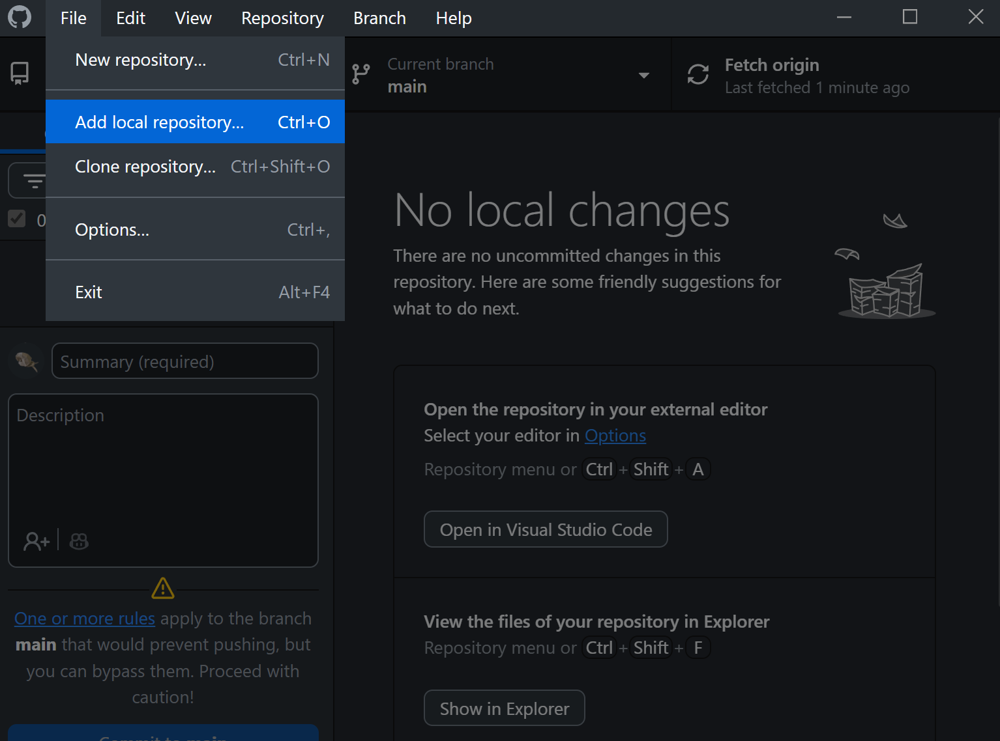

Browse to your website project folder using the **Choose...** button. GitHub Desktop will show a warning that the folder is not a Git repository yet. Click the **create a repository** link.

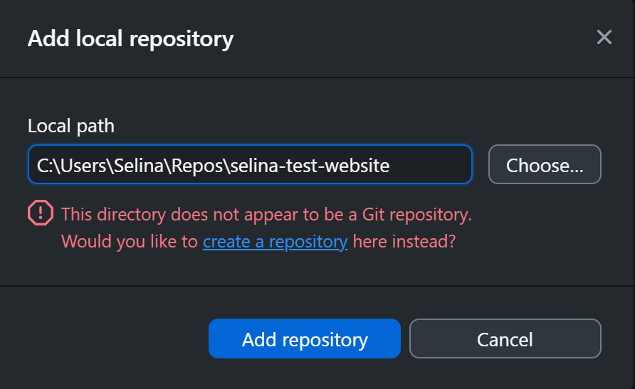

In the dialog that opens:

- Double-check that the **Local path** at the bottom points to your website project folder
- Optionally select a **License** (e.g. MIT License)
- Click **Create repository**

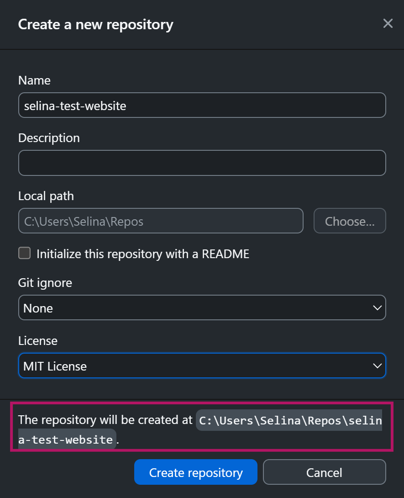

Your project is now a local Git repository.

## Step 3: Publish to GitHub {#step-3-publish-to-github}

*If your project is already on GitHub, skip to [Step 4](#step-4-enable-github-pages).*

Back in GitHub Desktop, make sure the correct repository is selected in the top left. Then click the **Publish repository** button.

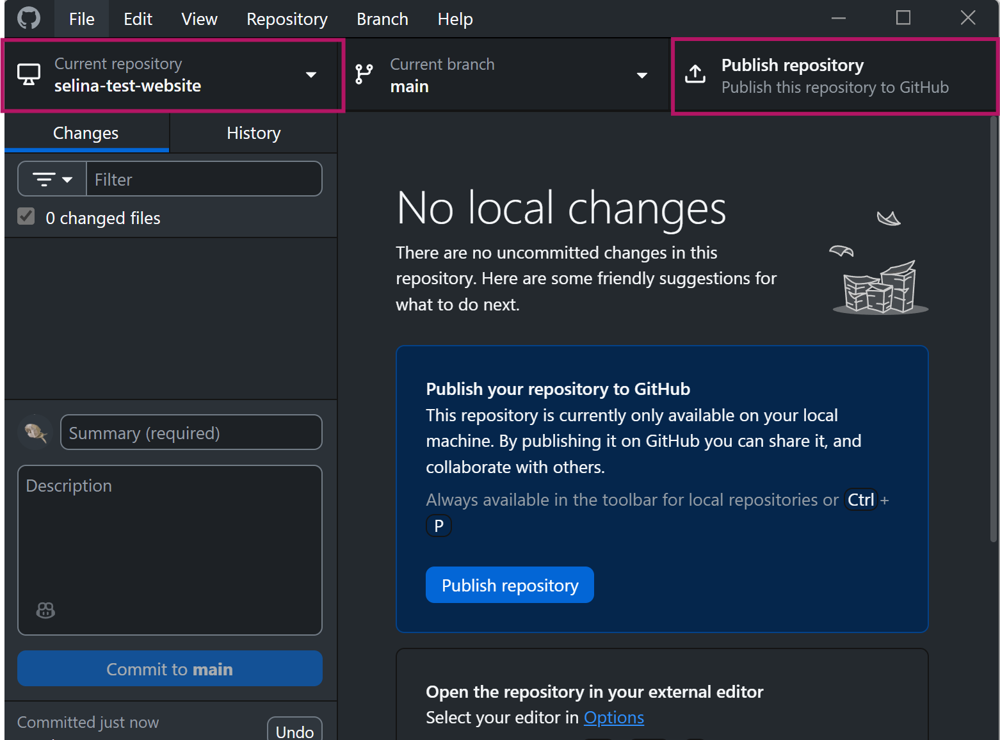

In the dialog, choose a name for your repository and decide whether it should be public or private.

::: {.callout-note}
## GitHub Pages and private repositories
On a free GitHub account, GitHub Pages only works with **public** repositories. If you want to keep your repository private and still use GitHub Pages, you need a paid GitHub plan (GitHub Pro or GitHub Team). For most use cases, a public repository works just fine.
:::

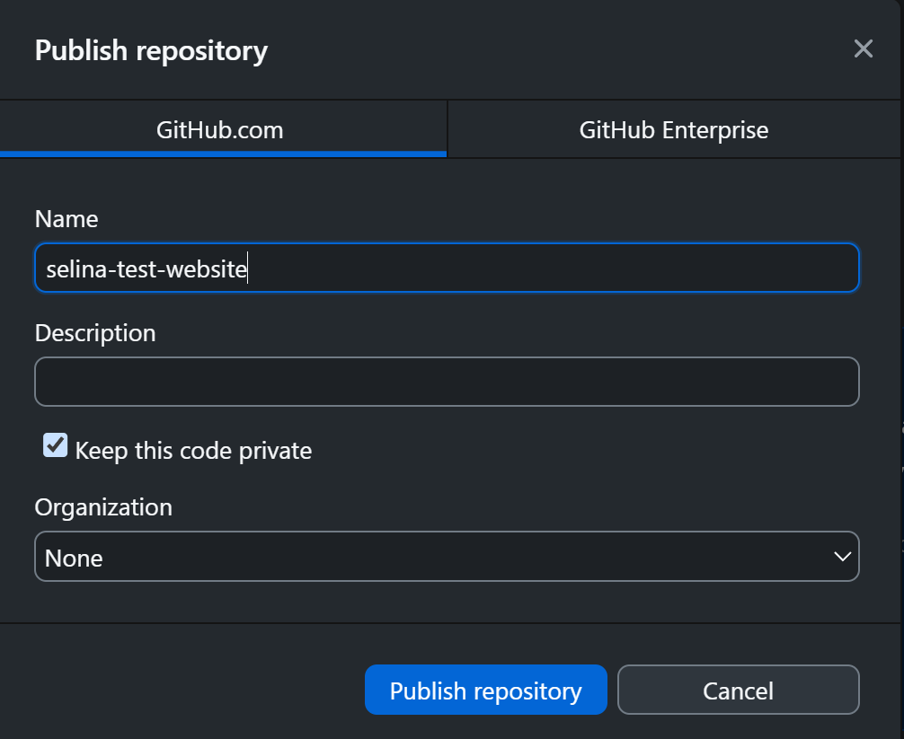

Click **Publish repository**. Your project is now on GitHub. To verify, go to **Repository > View on GitHub** in the menu bar.

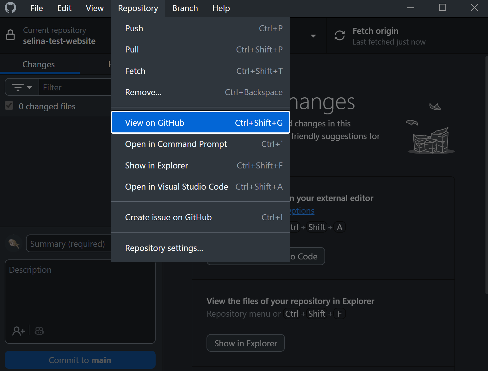

## Step 4: Enable GitHub Pages {#step-4-enable-github-pages}

Open your repository on GitHub in your browser. Check that the `docs` folder is there, then click on **Settings** in the top menu bar.

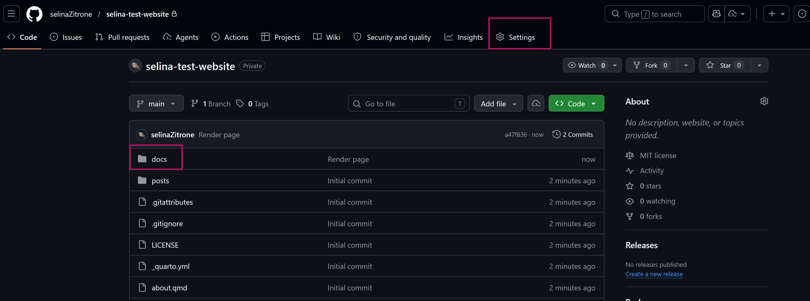

In the left sidebar, click **Pages**. Under "Build and deployment", configure the following:

- Set **Branch** to `main`
- Set the folder to `/docs`
- Click **Save**

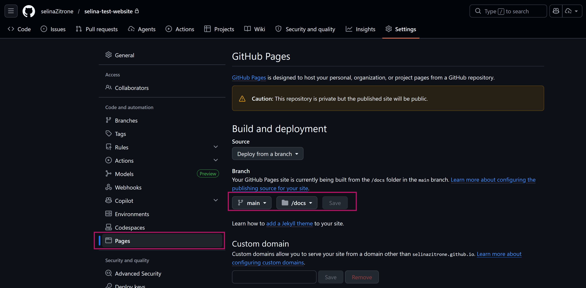

GitHub will now build and deploy your site. Navigate back to the main page of your repository by clicking the repository name at the top.

After a minute or two, your website will be live at:

```
https://yourusername.github.io/your-repo-name/
```

You can also find the link in the **Deployments** section in the right sidebar of your repository page.

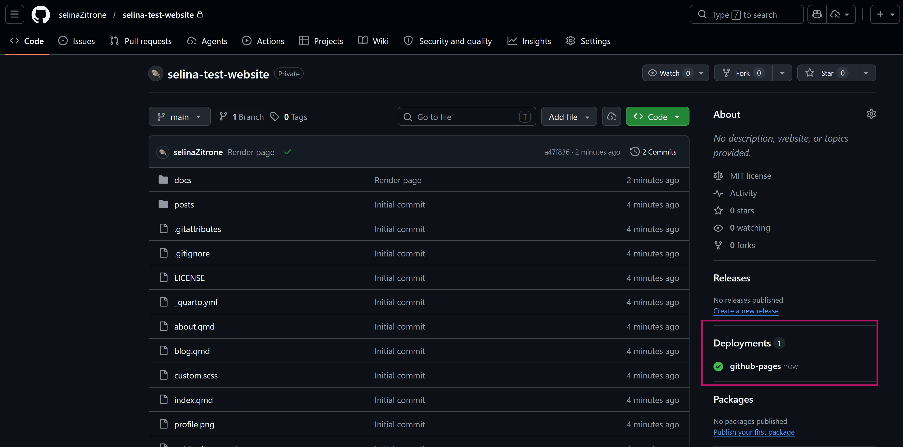

## Step 5: Update your website

Whenever you make changes to your website, the workflow is:

1. Edit your `.qmd` files locally
2. Re-render the website in Quarto
3. Open GitHub Desktop - you should see the changed files in the **Changes** tab
4. Write a short summary describing what you changed and click **Commit to main**

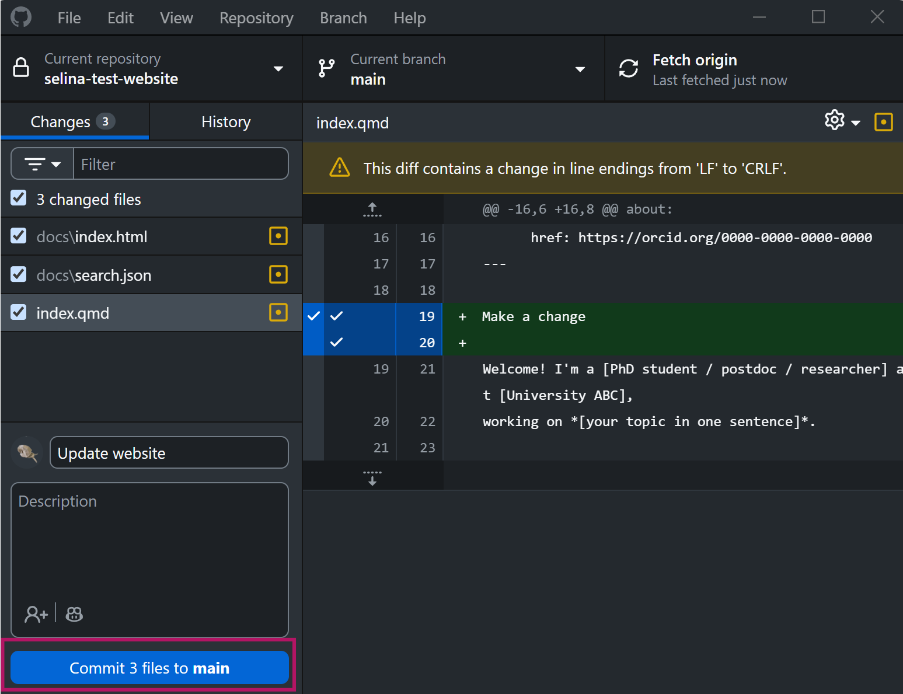

5. Click **Push origin** to push the changes to GitHub

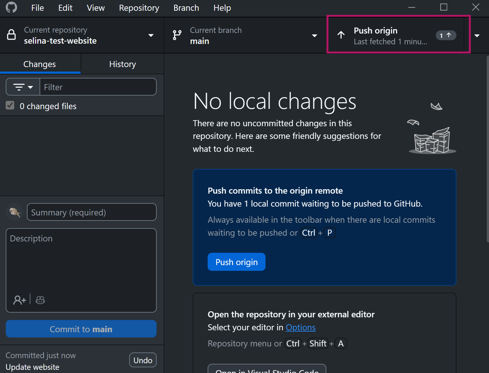

GitHub Pages will automatically pick up the new files and update your website. This usually takes 1-2 minutes.
