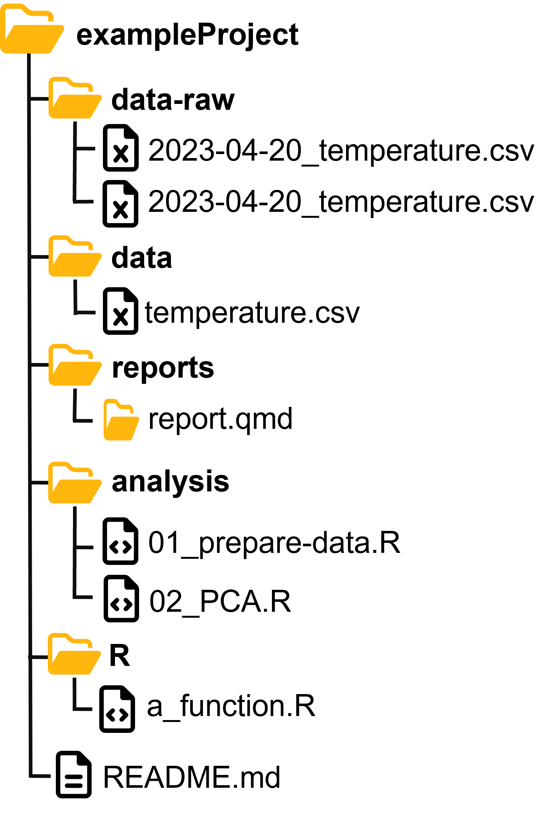
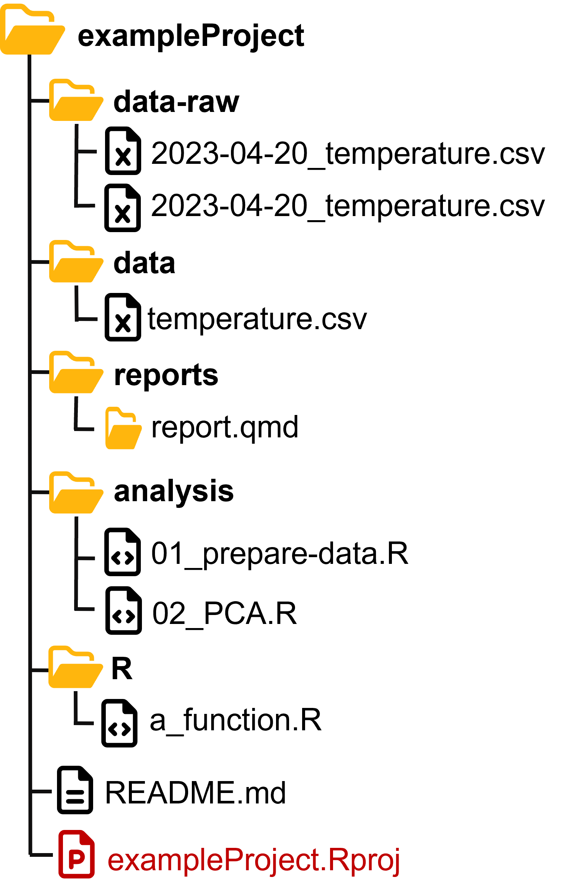
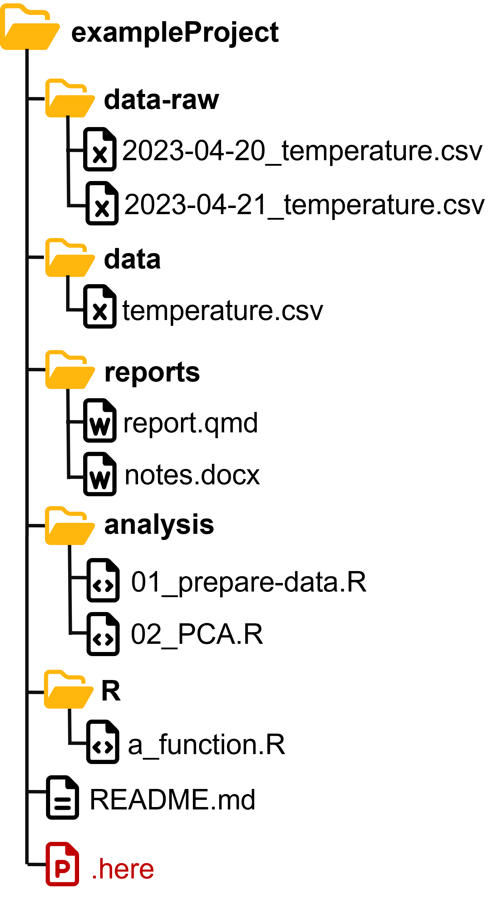
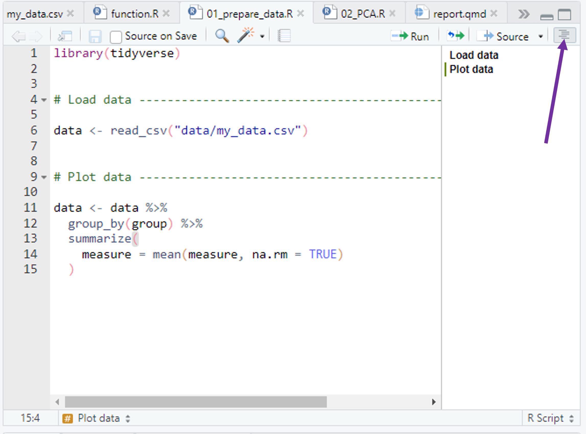
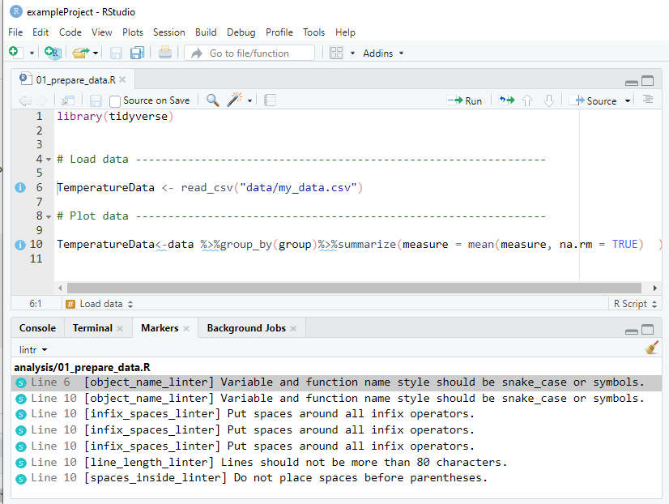
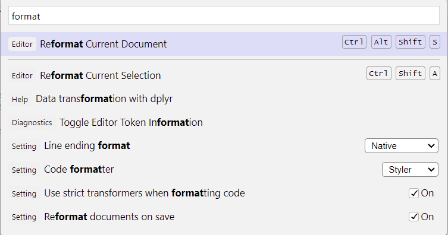
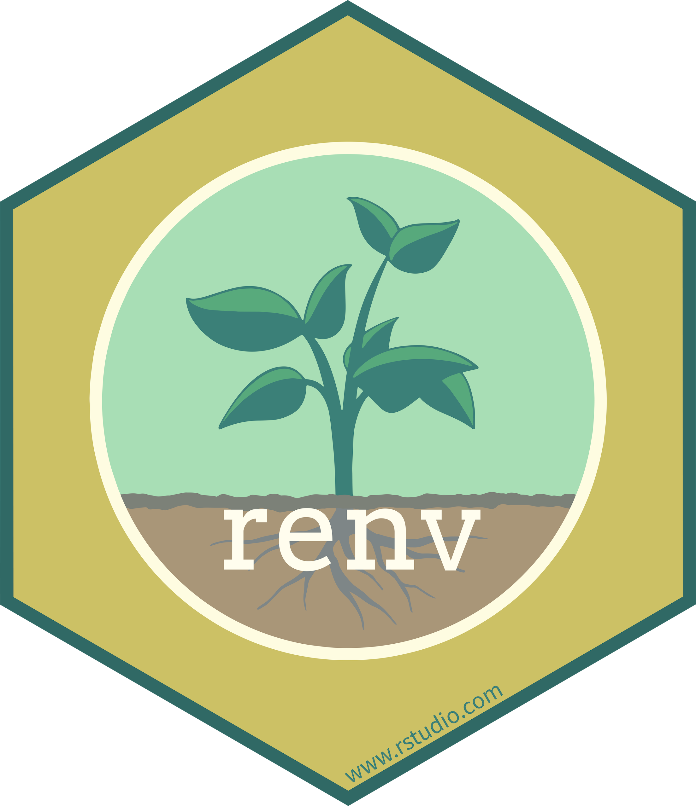

## What is this lecture series?

### Scientific workflows: Tools and Tips :hammer_and_wrench:

::: nonincremental

:date: Every 3rd Thursday :clock4: 4-5 p.m. :round_pushpin: Webex

-   One topic from the world of scientific workflows
-   Material provided [online](https://selinazitrone.github.io/tools_and_tips/)
-   If you don't want to miss a lecture
    -   [Subscribe to the mailing list](https://lists.fu-berlin.de/listinfo/toolsAndTips)

:::

## The problem

. . .

, CC BY 4.0](images/2023_04_20_what_they_forgot_to_teach_you/02_kitchen_chaos.png){fig-alt="A frustrated looking little monster in front of a very disorganized cooking area, with smoke and fire coming from a pot surrounded by a mess of bowls, utensils, and scattered ingredients."}

## The problem with messy projects

. . .

<br>

:wrench: **Maintainability** Can I understand, update and fix my own code?
<br><br>

. . .

:arrows_counterclockwise: **Reproducibility** Can someone else reproduce my results?
<br><br>

. . .

🏋 **Reliability** Will my code work in the future?
<br><br>

. . .

:gear: **Reusability** Can someone else actually use my code?

## Today

Learn how to keep the kitchen clean.

- Basic tips for **reproducible** and **maintainable** data analysis projects
  - Project organization
  - Coding
  - Dependency management

## The reproducibility mindset

- Imagine how someone else will see the project for the first time. 
<br><br>

. . .

Will they be able to understand and use your project? 

. . .

<br><br>

:::{.callout-tip}
## Practical reproducibility check

Send your project to a colleague and ask them **understand** and **run** the code your analysis.

:::


# First things first: <br>:file_folder: Organizing projects

## Have a solid project structure

::: {.columns}

::: {.column width="60%"}

- **Self-contained** projects: code, data, reports, etc. in one place
- Separate things into folders
- Always include a `README` file
- Use standard templates (see e.g. the [`template` R package](https://github.com/Pakillo/template))


:::

::: {.column width="35%"}



:::

:::

## Name your files properly

Your collaborators and your future self will love you for this.

. . .

### Principles [^1]

File names should be

  1. Machine readable
  2. Human readable
  3. Working with default file ordering
  
[^1]: From [this talk](https://speakerdeck.com/jennybc/how-to-name-files) by J. Bryan

## 1. Machine readable file names

Names should allow for easy **searching**, **grouping** and **extracting information** 
from file names.

. . .

- No space & special characters
- Use consistent separators

. . .

#### Bad examples :x:

:page_facing_up: `2023-04-20 temperature göttingen.csv ` <br>
:page_facing_up: `2023-04-20 rainfall göttingen.csv ` <br>

::: {.fragment}

#### Good examples :heavy_check_mark: 

:page_facing_up: `2023-04-20_temperature-goettingen.csv ` <br>
:page_facing_up: `2023-04-20_rainfall-goettingen.csv ` <br>

:::

## 2. Human readable file names

Names shoud be **informative** and reveal the **file content**.

- Use separators to make it readable

. . .

#### Bad examples :x:

:page_facing_up: `01preparedataforanalysis.R` <br>
:page_facing_up: `01firstscript.R` <br>

::: {.fragment}

#### Good examples :heavy_check_mark: 

:page_facing_up: `01_prepare-data-for-analysis.R` <br>
:page_facing_up: `01_lm-temperature-trend.R` <br>

:::

## 3. Default ordering

If you order your files by name, the ordering should make sense:

- (Almost) always put something numeric first
  - Left-padded numbers (`01`, `02`, ...)
  - Dates in `YYYY-MM-DD` format

. . .

#### Chronological order

:page_facing_up: `2023-04-20_temperature-goettingen.csv ` <br>
:page_facing_up: `2023-04-21_temperature-goettingen.csv ` <br>

:::: {.fragment}

#### Logical order

:page_facing_up: `01_prepare-data.R` <br>
:page_facing_up: `02_lm-temperature-trend.R` <br>

:::

# :computer: Let's start coding

## Use save paths

To read and write files, you need to tell R where to find them. 
<br><br>

. . .

Common workflow: <br><br>

Set **working directory** with `setwd()`, then read files from there: 

```r
# set the project root as working directory
setwd("C:/Users/Selina/path/that/only/I/have")

# read my data using a path relative to the working directory
temperature <- read_csv("data/temperature.csv")
```

. . .

This is **not reproducible!** Your computer at exactly this time is the only one that has this working directory.

## Use save paths

. . .

:::{.columns}

:::{.column width="60%"}

:::{.fragment}

Option 1: Use **RStudio projects**

:::


- Project root is automatically the working directory
- No need to use `setwd()` manually
- Read and write files with relative paths:

:::{.fragment}

```{r}
read_csv("data/temperature.csv")
```

:::

:::

:::{.column width="40%"}



:::

:::

## Create an RStudio Project

. . .

::: {.fragment}

### From scratch:

::: {.nonincremental}

1. `File -> New Project -> New Directory -> New Project`
2. Enter a directory name (this will be the name of your project)
3. Choose the directory where the project should be initiated
4. `Create Project`

:::
:::

::: {.fragment}

### Associate an existing folder with an RStudio Project:

::: {.nonincremental}


1. `File -> New Project -> Existing Directory`
2. Choose your project folder
3. `Create Project`

:::
:::

## Use save paths

:::{.columns}

:::{.column width="60%"}

:::{.fragment}

Option 2: Use the [**`here` package**](https://here.r-lib.org/)

:::

- Build your paths using the `here` function 

:::{.fragment}

```{r}
# use here::here
library(here)
read_csv(here("data", "temperature.csv"))
# or
read_csv(here("data/temperature.csv"))
```

:::

- Reasonable heuristics to find project files
- Looks for `*.Rproj`, `.here`, `.git`, ...
- My recommendation: **always** use `here`
  - with `*.Rproj` OR with `.here`
  - works in all cases

:::

:::{.column width="40%"}



:::

:::

## Write well-structured and consistent code

, CC BY 4.0](images/2023_04_20_what_they_forgot_to_teach_you/17_beatuiful_code.png)

- This is not about reproducibility, but about **readability** and **maintainability**
- Follow standards for consistent and readable code
  - For R: [tidyverse style guide](https://style.tidyverse.org/index.html) defines code organization, syntax standards, ...

## How to structure your scripts

. . .

::: {.columns}

::: {.column width="50%"}

- Use a standardized header 
- Initialize at the top
  - `library()` calls
  - global options
  - source additional code
- Read all external data in one place
- Why?
  - fail fast
  - change code in one place

:::

::: {.column width="50%"}


```{r example-structure-1}
# Purpose: Create Figure 2 showing the relationship
# between body mass and bill length
# Authors: Selina Baldauf, Jane Doe, Jon Doe

# load libraries ---------------------------------
library(tidyverse)
library(vegan)

# Set global options -----------------------------
# Plot themes and colors
theme_set(theme_minimal())
custom_colors <- c("cyan4", "darkorange", "purple")

# Source additional code -------------------------
source("R/my_cool_function.R")

# Read data --------------------------------------
temperature <- read_csv("data/temperature.csv")
rainfall <- read_csv("data/rainfall.csv")
```

:::
:::

## How to structure your scripts

- Use headers to break up your file into sections

. . .

```{r code-section}
# Load data ---------------------------------------------------------------

input_data <- read_csv(input_file)

# Plot data ---------------------------------------------------------------

ggplot(input_data, aes(x = x, y = y)) +
  geom_point()
```

- Insert a section label with comment + at least 4 `####` or `----`
  - RStudio keyboard shortcut: `Ctrl/Cmd + Shift + R`

## How to structure your scripts

- Navigate sections in the file outline

. . .

{width="80%"}


## Use a consistent coding style - naming

Have a **naming convention** for variables and functions and stick to it

. . .

- Concise and descriptive (nouns for variables, verbs for functions)
- Consistent capitalization: Use `snake_case` for longer variable names
- Avoid conflicts with existing R functions and packages

. . .

```{r object-names-snake}
# Good
day_one

clean_data()


# Bad
dayone
first_day_of_the_month
dm1

f1()

```

## Use a consistent coding style - spacing

. . .

::: {.nonincremental}

- Always put spaces after a comma

:::

```{r spaces-comma}
# Good
x[, 1]

# Bad
x[,1]
x[ , 1]
```

## Use a consistent coding style - spacing

::: {.nonincremental}

- Always put spaces after a comma
- No spaces around parentheses for normal function calls

:::

```{r spaces-parenthesis}
# Good
mean(x, na.rm = TRUE)

# Bad
mean( x, na.rm = TRUE )
mean (x, na.rm = TRUE)
```

## Use a consistent coding style - spacing

::: {.nonincremental}

- Always put spaces after a comma
- No spaces around parentheses for normal function calls
- Spaces around most operators (`<-`, `==`, `+`, etc.)

:::

```{r spaces-operators}
# Good
height <- (feet * 12) + inches
mean(x, na.rm = TRUE)

# Bad
height<-feet*12+inches
mean(x, na.rm=TRUE)
```


## Use a consistent coding style - spacing

::: {.nonincremental}

- Always put spaces after a comma
- No spaces around parentheses for normal function calls
- Spaces around most operators (`<-`, `==`, `+`, etc.)
- Spaces before pipes (`|>`, `%>%`) and `+` in ggplot followed by new line

:::

```{r spaces-pipes}
# Good
iris|>group_by(Species)|>summarize_if(is.numeric, mean)|>ungroup()

# Bad
iris |>
  group_by(Species) |>
  summarize_all(mean) |>
  ungroup()
```

## Use a consistent coding style - spacing

::: {.nonincremental}

- Always put spaces after a comma
- No spaces around parentheses for normal function calls
- Spaces around most operators (`<-`, `==`, `+`, etc.)
- Spaces before pipes (`|>`, `%>%`) and `+` in ggplot followed by new line

:::

```{r spaces-gglot}
# Good
ggplot(aes(x = Sepal.Width, y = Sepal.Length, color = Species))+geom_point()

# Bad
ggplot(aes(x = Sepal.Width, y = Sepal.Length, color = Species)) +
  geom_point()
```

## Use a consistent coding style - width

::: {.nonincremental}

- Always put spaces after a comma
- No spaces around parentheses for normal function calls
- Spaces around most operators (`<-`, `==`, `+`, etc.)
- Spaces before pipes (`|>`, `%>%`) and `+` in ggplot followed by new line
- Limit your line width to 80 characters.

:::


```{r linewidth-ggplot}
# Bad
iris |> group_by(Species) |> summarise(Sepal.Length = mean(Sepal.Length), Sepal.Width = mean(Sepal.Width), Species = n_distinct(Species))

# Good
iris |>
  group_by(Species) |>
  summarise(
    Sepal.Length = mean(Sepal.Length),
    Sepal.Width = mean(Sepal.Width),
    Species = n_distinct(Species)
  )
```

## Use a consistent coding style

Do I really have to remember all of this?

. . .

Luckily, no! R and RStudio provide some nice helpers

## Coding style helpers - `{lintr}`

The [`lintr` package](https://github.com/jimhester/lintr) analyses your code files or entire project and tells you what to fix.

. . .

```{r}
# install the package before you can use it
install.packages("lintr")
# lint specific file
lintr::lint(filename = "analysis/01_prepare_data.R")
# lint a directory (by default the whole project)
lintr::lint_dir()
```

## Coding style helpers - `lintr`

{fig-align="center"}

## Coding style helpers - Auto-formatting

IDEs offer auto-formatting tools.

- Auto-format your scripts on save and let the IDE do the job

- RStudio: Open command palette (`Tools` -> `Show command palette`), search for "format" -> "Reformat documents on save"

:::{.fragment}

{width="60%" fig-align="center"}

:::

## Modularize long scripts

One huge script is **hard to maintain**

- Break down long scripts into logical units
- Write scripts that do one thing, e.g.
  - `01_prepare-data.R`: Read raw data and prepare it for analysis
  - `02_run-models.R`: Run statistical analysis
  - `03_make-figures.R`: Create manuscript figures
- Call these scripts sequentially
- Use `source()` to source R scripts in other scripts

:::{.fragment}

```r
# source data preparation in other scripts
source("01_prepare-data.R")
```

:::

## Modularize long scripts

Write a main **workflow script** that calls scripts in the right order.

- Often called `make.R`, `run.R` or `main.R`

:::{.fragment}

```r
# Prepare the data
source("01_prepare-data.R")
# Run all statistical models
source("02_run-models.R")
# Create manuscript figures
source("03_make-figures.R")
```

:::

- Gives a nice overview of your workflow
- Very user-friendly: No need to run scripts separately and in the right order

## Don't repeat yourself (DRY)

. . .

Example: Same data preparation code for multiple data sets

```{r}
#| eval: false
# Read the data
my_data1 <- readr::read_csv("data/data1.csv")
my_data2 <- readr::read_csv("data/data2.csv")
# Clean and summarize data
my_data1 <- my_data1 |>
  summarize(
    height = mean(height),
    biomass = mean(biomass),
    .by = c(country, species)
  )
my_data2 <- my_data2 |>
  summarize(
    height = mean(height),
    biomass = mean(biomass),
    .by = c(country, species)
  )
```

. . .

What's the **problem**?

- What if you need to update the code preparation?
- Bloats the script 

## Don't repeat yourself (DRY)

**Solution**: If you notice that you copy-paste code - write a **function**

::: {.columns}

::: {.column width="50%"}

:::{.fragment}

Function in `R/prepare_data.R`:

```{r}
prepare_data <- function(file_path) {
  # Read the data
  my_data <- read_csv(filepath)
  # Clean and summarize data
  my_data <- my_data |>
    summarize(
      height = mean(height),
      biomass = mean(biomass),
      .by = c(country, species)
    )
  # Return the cleaned data from the function
  return(my_data)
}
```

:::

:::

::: {.column width="50%"}

:::{.fragment}

Source and use the `prepare_data` function in all scripts where it is needed

```r
# Source the function
source("R/prepare_data.R")

# Use the function to read and prepare the data
my_data1 <- prepare_data("data/data1.csv")
my_data2 <- prepare_data("data/data2.csv")
```

:::

:::

:::

# 🧩 Manage dependencies

## Manage dependencies manually

. . .

Add the output of `devtools::session_info()` to your `README`

```{r session-info}
#| eval: true
#| 
devtools::session_info()
```

## Manage dependencies with `{renv}`

::: {.columns}

::: {.column width="80%"}

**Idea**: Have a **project-local environment** with all packages needed by the project
  
- Keep log of the packages and versions you use
- Restore the local project library on other machines

:::

::: {.column width="20%"}

{fig-align="right"}

:::
:::

. . .

**Why this is useful?**

- Code will still work even if packages upgrade
- Collaborators can recreate your local project library with one function
- Explicit dependency file states all dependencies

. . .  

Check out the [renv website](https://rstudio.github.io/renv/articles/renv.html) for more information

## Manage dependencies with `{renv}`

```{r}
# Get started
install.packages("renv")
```

. . .

Very simple to use and integrate into your project workflow:

```{r}
# Step 1: initialize a project level R library
renv::init()
# Step 2: save the current status of your library to a lock file
renv::snapshot()
# Step 3: restore state of your project from renv.lock
renv::restore()
```

- Others only need to install the `renv` package, then they can also
call `renv::restore()`

# Conclusion

## Take aways

- So many tips and guidelines 😵‍💫
- Prioritize progress over perfection
  - Implement simple things first (e.g. format on save)
  - Other guidelines will become habits over time
- Plan ahead

## Clean projects and workflows ...

... help you to write robust and reproducible code.

, CC BY 4.0](images/2023_04_20_what_they_forgot_to_teach_you/03_kitchen_clean.png){fig-alt="An organized kitchen with sections labeled \"tools\", \"report\" and \"files\", while a monster in a chef's hat stirs in a bowl labeled \"code.\""}

## Outlook

Of course there is much that I left out:

:::{.nonincremental}

- Proper documentation
- Version control with Git
- Containerization (e.g. Docker) for full reproducibility
- Using R packages to build a research compendium
- ...

:::

. . . 

But this is for another time

## Next lecture

#### Topic t.b.a.

:date: 19th June :clock4: 4-5 p.m. :round_pushpin: Webex

:::{.nonincremental}

- For topic suggestions and/or feedback [send me an email](mailto:selina.baldauf@fu-berlin.de)

- [Subscribe to the mailing list](https://lists.fu-berlin.de/listinfo/toolsAndTips)

:::

# Thank you for your attention :) 
Questions?

# References

:::{.nonincremental}

- [What they forgot to teach you about R book](https://rstats.wtf/) by Jenny Bryan and Jim Hester
- [Blogpost](https://www.tidyverse.org/blog/2017/12/workflow-vs-script/) by Jenny Bryan on good project-oriented workflows
- [R best practice blogpost](https://kdestasio.github.io/post/r_best_practices/) by Krista L. DeStasio
- [Book about coding style for R](https://style.tidyverse.org/): The tidyverse style guide
- [The Turing way book](https://the-turing-way.netlify.app/index.html) General concepts and things to think about regarding reproducible research

- [renv package website](https://rstudio.github.io/renv/articles/renv.html)
- [lintr package website](https://lintr.r-lib.org/)

:::