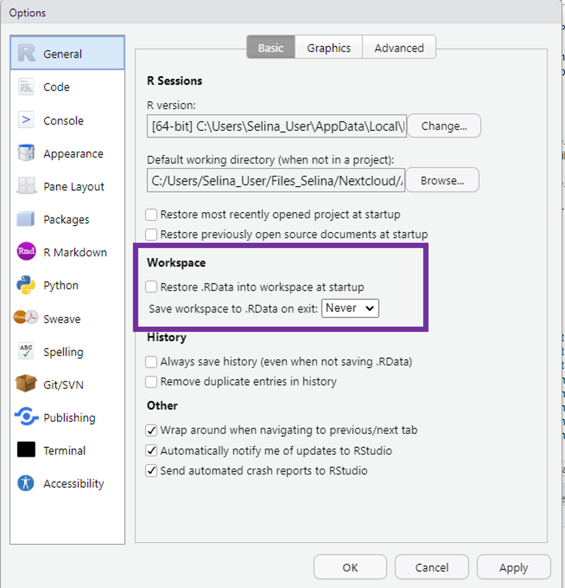
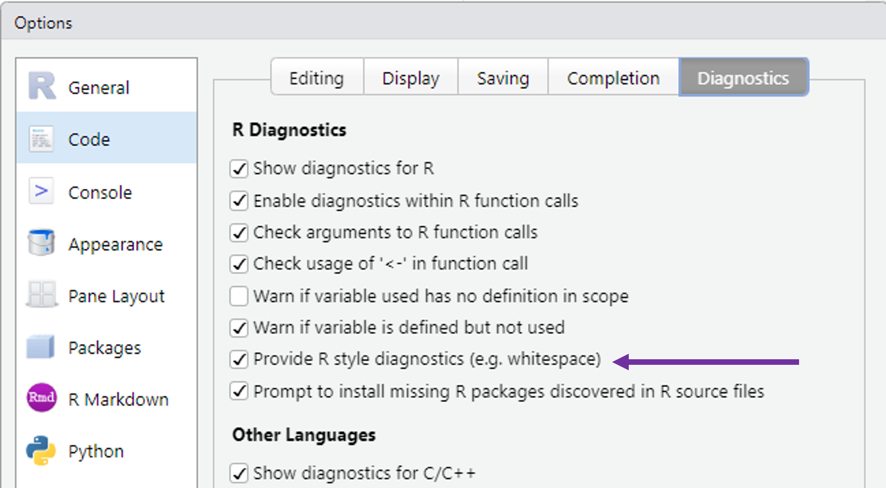
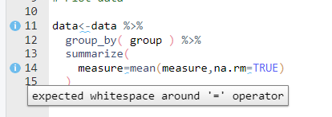

## What is this lecture series?

### Scientific workflows: Tools and Tips :hammer_and_wrench:

::: nonincremental

:date: Every 3rd Thursday :clock4: 4-5 p.m. :round_pushpin: Webex

-   One topic from the world of scientific workflows
-   Material provided [online](https://selinazitrone.github.io/tools_and_tips/)
-   If you don't want to miss a lecture
    -   [Subscribe to the mailing list](https://lists.fu-berlin.de/listinfo/toolsAndTips)

:::

## In teaching: Focus on data analysis but less on workflow

, CC BY 4.0](images/2023_04_20_what_they_forgot_to_teach_you/18_course_content.png){fig-alt="An exasperated teacher holding a box that says \"Another important thing\" walks towards a box labeled \"course content\", where different unruly topics labeled \"essential\", \"core\" etc. are leaping out and running away." width="80%"}

## The problem it creates

Messy projects and workflows creep in overtime!
  
, CC BY 4.0](images/2023_04_20_what_they_forgot_to_teach_you/02_kitchen_chaos.png){fig-alt="A frustrated looking little monster in front of a very disorganized cooking area, with smoke and fire coming from a pot surrounded by a mess of bowls, utensils, and scattered ingredients."}

## The problem with messy projects

:wrench: **Maintainability**: Can I understand, update and fix my own code?

. . .

:arrows_counterclockwise: **Reproducibility**: Can someone else reproduce my results?

. . .

🏋 **Reliability**: Will my code work in the future?

. . .

:gear: **Reusability**: Can someone else actually use my code?

## Today

Learn how to keep the kitchen clean.

- Basic tips for reproducible and maintainable data analysis projects
- This is beneficial because it will
  - save you from headaches
  - makes it easy to publish

## The reproducibility mindset

While writing code, imagine how someone else (or you from two years in the future) will see the project for the first time. Will they be able to understand and use your project? The goal of writing reproducible code is to ensure that the answer to this question is “yes.” You can also practically test this by sending your project to a colleague and asking them to try to understand and run the code by themselves.

# 1. Organizing projects for reproducibility

## Have a solid project structure

::: {.columns}

::: {.column width="60%"}

- Self-contained projects
  - All your code, data, reports, etc. in one place
- Use project structure the IDE provides
  - RStudio: RStudio projects
  - VS Code/Positron: Workspaces
- Advantages:
  - Easy to navigate
  - Sharable
  - Project root as working directory
:::

::: {.column width="35%"}

```
exampleProject
|- data-raw
|- data-clean
|- figs
|- reports   
|- analysis  
|   |- 01_clean_data.R
|   |- 02_PCA.R
|- functions
|   |- read_all_data.R
|- README.md
```

:::

:::

## Create an R Studio Project

. . .

::: {.fragment}

### From scratch:

::: {.nonincremental}

1. `File -> New Project -> New Directory -> New Project`
2. Enter a directory name (this will be the name of your project)
3. Choose the directory where the project should be initiated
4. `Create Project`

:::
:::

::: {.fragment}

### Associate an existing folder with an R Studio Project:

::: {.nonincremental}


1. `File -> New Project -> Existing Directory`
2. Choose your project folder
3. `Create Project`

:::
:::


## Set up your project

. . .

R Studio offers a lot of settings and options. 

So have a :coffee: and check out `Tools -> Global Options` and all the other buttons.

- [R Studio cheat sheet](https://raw.githubusercontent.com/rstudio/cheatsheets/master/rstudio-ide.pdf) that explains all the buttons
- Update R Studio from time to time to get new settings (`Help -> Check for Updates`)

## Set up your project

R Studio offers a lot of settings and options.

::: {.columns}

::: {.column width="60%"}

Most important setting for reproducibility:

- Never save or restore your work space as `.Rdata` -> You always want to start working with a clean slate

:::

::: {.column width="35%"}

::: {.fragment}

:::
:::
:::

## Name your files properly

Your collaborators and your future self will love you for this.

. . .

### Principles [^1]

File names should be

  1. Machine readable
  2. Human readable
  3. Working with default file ordering
  
[^1]: From [this talk](https://speakerdeck.com/jennybc/how-to-name-files) by J. Bryan

## 1. Machine readable file names

Names should allow for easy **searching**, **grouping** and **extracting information** 
from file names.

. . .

- No space & special characters
- Use consistent separators

. . .

#### Bad examples :x:

:page_facing_up: `2023-04-20 temperature göttingen.csv ` <br>
:page_facing_up: `2023-04-20 rainfall göttingen.csv ` <br>

::: {.fragment}

#### Good examples :heavy_check_mark: 

:page_facing_up: `2023-04-20_temperature-goettingen.csv ` <br>
:page_facing_up: `2023-04-20_rainfall-goettingen.csv ` <br>

:::

## 2. Human readable file names

Names shoud be **informative** and reveal the **file content**.

- Use separators to make it readable

. . .

#### Bad examples :x:

:page_facing_up: `01preparedataforanalysis.R` <br>
:page_facing_up: `01firstscript.R` <br>

::: {.fragment}

#### Good examples :heavy_check_mark: 

:page_facing_up: `01_prepare-data-for-analysis.R` <br>
:page_facing_up: `01_lm-temperature-trend.R` <br>

:::

## 3. Default ordering

If you order your files by name, the ordering should make sense:

- (Almost) always put something numeric first
  - Left-padded numbers (`01`, `02`, ...)
  - Dates in `YYYY-MM-DD` format

. . .

#### Chronological order

:page_facing_up: `2023-04-20_temperature-goettingen.csv ` <br>
:page_facing_up: `2023-04-21_temperature-goettingen.csv ` <br>

:::: {.fragment}

#### Logical order

:page_facing_up: `01_prepare-data.R` <br>
:page_facing_up: `02_lm-temperature-trend.R` <br>

:::

# Let's start coding

## Use save paths

To read and write files, you need to tell R where to find them. 

. . .

Common workflow: set **working directory** with `setwd()`, then read files from there. But to this [Jenny Bryan said](https://www.tidyverse.org/blog/2017/12/workflow-vs-script/):

. . .

> If the first line of your R script is <br>
  `setwd("C:\Users\jenny\path\that\only\I\have")` <br>
  I will come into your office and SET YOUR COMPUTER ON FIRE :fire:.
  
. . .

#### Why?

This is **100% not reproducible**: Your computer at exactly this time is (probably) the only one in the world that has this working directory

. . .

Avoid `setwd()` if it is possible in any way!

## Avoid `setwd()`

. . .

Use R Studio projects

  - Project root is automatically the working directory
  - Give your project to a friend at it will work on their machine as well

. . .

Instead of

```{r}
# my unique path from hell with white space and special characters
setwd("C:/Users/Selina's PC/My Projects/Göttingen Temperatures/temperatures")

read_csv("data/2023-04-20_temperature_goettingen.csv")
```

. . .

You just need
  
```{r}
read_csv("data/2023-04-20_temperature_goettingen.csv")
```

. . .

If you don't use R Studio Projects, have a look at the [`{here}` package](https://here.r-lib.org/) for reproducible paths

## Write well-structured and readable code

, CC BY 4.0](images/2023_04_20_what_they_forgot_to_teach_you/17_beatuiful_code.png)

- Goal: Write code that others (i.e. future you) can understand
- Follow standards for readable and maintainable code
  - For R: [tidyverse style guide](https://style.tidyverse.org/index.html) defines code organization, syntax standards, ...

## Structure your scripts

. . .

::: {.columns}

::: {.column width="50%"}
::: {.nonincremental}

- Use a standardized header 
- Initialize at the top
  - `library()` calls
  - global options
  - source additional code
- read all external data at once
:::
:::

::: {.column width="50%"}


```{r example-structure-1}
# Purpose: Create Figure 2 showing the relationship between
# body mass and bill length
# Authors: Selina Baldauf, Jane Doe, Jon Doe

# load all libraries first
library(tidyverse)
library(vegan)

# Set global variables
# Plot themes and colors
theme_set(theme_minimal())
custom_colors <- c("cyan4", "darkorange", "purple")
# File paths
input_file <- "data/results.csv"

# Source additional code
source("R/my_cool_function.R")

# read all input data
input_data <- read_csv(input_file)
```

:::
:::

## Structure your scripts

- Use headers to break up your file into sections

. . .

```{r code-section}
# Load data ---------------------------------------------------------------

input_data <- read_csv(input_file)

# Plot data ---------------------------------------------------------------

ggplot(input_data, aes(x = x, y = y)) +
  geom_point()
```

- Insert a section label with
  - RStudio keyboard shortcut: `Ctrl/Cmd + Shift`
  - Comment that followed by at least 4 `####` or `----`
- Navigate sections in the file outline

. . .

{width="80%"}


## Modularize your Code

**Split your scripts**: One huge script is hard to maintain

- Write multiple files that are called sequentially, e.g.
  - `01_prepare-data.R`: Read raw data and prepare it for analysis
  - `02_run-models.R`: Run statistical analysis
  - `03_make-figures.R`: Create manuscript figures
- Use `source()` to source R scripts in other scripts

. . .

E.g. in `02_run-models.R`:
```r
# run all the code in 01_prepare-data.R
source("analysis/01_prepare-data.R")
```

## Modularize your Code

**Split your scripts**: One huge script is hard to maintain

- Use a main workflow script that calls other scripts sequentially

. . .

Include a `make.R` script in your project

```r
# Prepare the data
source("01_prepare-data.R")
# Run all statistical models
source("02_run-models.R")
# Create manuscript figures
source("03_make-figures.R")
```

## Modularize your

**Use R functions** to follow DRY principle (Don't Repeat Yourself)

- Idea: If you notice that you copy-paste code - write a function instead
- Use `source()` to source the function in other scripts

. . .

Basic structure of a function in R

```r
my_function <- function(input) {
  # Do something with input
  output <- input * 2
  # retrun output
  return(output)
}

# Call function
my_function(5)
```

## Function example

Same data preparation code for multiple data sets

::: {.columns}

::: {.column width="50%"}

```r
# Read the data
my_data1 <- readr::read_csv("data/data1.csv")
# Clean and summarize data
my_data1 <- my_data1 |>
	# remove some columns
	select(-meta)
	# calculate summary statistics
	summarize(
		height = mean(height),
		biomass = mean(biomass),
		.by = c(country, species)
	)
```

:::

::: {.column width="50%"}

:::{.fragment}

```{r}
prepare_data <- function(file_path) {
  my_data <- readr::read_csv(filepath)
  # Clean and summarize data
  my_data <- my_data |>
    select(-meta) |>
    summarize(
      height = mean(height),
      biomass = mean(biomass),
      .by = c(country, species)
    )
  # Return the cleaned data from the function
  return(my_data)
}
```

:::

:::

:::

## Function example

Same data preparation code for multiple data sets

Use the `prepare_data` function in all scripts where it is needed

```r
# load the function
source("functions/prepare_data.R")

# Use the function to read and prepare the data for this script
my_data1 <- prepare_data("data/data1.csv")
```

## Use a consistent coding style

Have a **naming convention** for variables and functions and stick to it

. . .

- Concise and descriptive (nouns for variables, verbs for functions)
- Consistent capitalization: Use `snake_case` for longer variable names
- Avoid conflicts with existing R functions and packages

. . .

```{r object-names-snake}
# Good
day_one

clean_data()


# Bad
dayone
first_day_of_the_month
dm1

f1()

```

## Use a consistent coding style

. . .

::: {.nonincremental}

- Always put spaces after a comma

:::

```{r spaces-comma}
# Good
x[, 1]

# Bad
x[, 1]
x[, 1]
x[, 1]
```

## Coding style - Spacing

::: {.nonincremental}

- Always put spaces after a comma
- No spaces around parentheses for normal function calls

:::

```{r spaces-parenthesis}
# Good
mean(x, na.rm = TRUE)

# Bad
mean(x, na.rm = TRUE)
mean(x, na.rm = TRUE)
```

## Coding style - Spacing

::: {.nonincremental}

- Always put spaces after a comma
- No spaces around parentheses for normal function calls
- Spaces around most operators (`<-`, `==`, `+`, etc.)

:::

```{r spaces-operators}
# Good
height <- (feet * 12) + inches
mean(x, na.rm = TRUE)

# Bad
height <- feet * 12 + inches
mean(x, na.rm = TRUE)
```


## Coding style - Spacing

::: {.nonincremental}

- Always put spaces after a comma
- No spaces around parentheses for normal function calls
- Spaces around most operators (`<-`, `==`, `+`, etc.)
- Spaces before pipes (`|>`, `%>%`) followed by new line

:::

```{r spaces-pipes}
# Good
iris |>
  group_by(Species) |>
  summarize_if(is.numeric, mean) |>
  ungroup()

# Bad
iris |>
  group_by(Species) |>
  summarize_all(mean) |>
  ungroup()
```

## Coding style - Spacing

::: {.nonincremental}

- Always put spaces after a comma
- No spaces around parentheses for normal function calls
- Spaces around most operators (`<-`, `==`, `+`, etc.)
- Spaces before pipes (`|>`, `|>`) followed by new line
- Spaces before `+` in ggplot followed by new line

:::

```{r spaces-gglot}
# Good
ggplot(aes(x = Sepal.Width, y = Sepal.Length, color = Species)) +
  geom_point()

# Bad
ggplot(aes(x = Sepal.Width, y = Sepal.Length, color = Species)) +
  geom_point()
```

## Coding style - Line width

Try to limit your line width to 80 characters.

- You don't want to scroll to the right to read all code
- 80 characters can be displayed on most displays and programs
- Split your code into multiple lines if it is too long
  - See this grey vertical line in R Studio?

. . .

```{r linewidth-ggplot}
# Bad
iris |>
  group_by(Species) |>
  summarise(
    Sepal.Length = mean(Sepal.Length),
    Sepal.Width = mean(Sepal.Width),
    Species = n_distinct(Species)
  )

# Good
iris |>
  group_by(Species) |>
  summarise(
    Sepal.Length = mean(Sepal.Length),
    Sepal.Width = mean(Sepal.Width),
    Species = n_distinct(Species)
  )
```

## Coding style

Do I really have to remember all of this?

. . .

Luckily, no! R and R Studio provide some nice helpers

## Coding style helpers - R Studio

R Studio has style diagnostics that tell you where something is wrong

- `Tools -> Gloabl Options -> Code -> Diagnostics`

. . .

::: {.columns}

::: {.column width="65%"}



:::

::: {.column width="35%"}

:::

:::

## Coding style helpers - `{lintr}`

The [`lintr` package](https://github.com/jimhester/lintr) analyses your code files or entire project and tells you what to fix.

. . .

```{r}
# install the package before you can use it
install.packages("lintr")
# lint specific file
lintr::lint(filename = "analysis/01_prepare_data.R")
# lint a directory (by default the whole project)
lintr::lint_dir()
```

## Coding style helpers - `{lintr}`

{fig-align="center"}

## Coding style helpers - Auto-formatting

Most IDEs (e.g. RStudio, Positron, VS Code) offer auto-formatting tools.

- Turn on "Format at save" to automatically format your code when you save the script

- R Studio: Open the command palette (`Ctrl/Cmd + Shift + P`) and search for "Format"
  - Turn on "Reformat documents on save"
- VS Code/Positron: Search for "Format on save" and click the check-mark


# Manage dependencies

## Manage dependencies manually

Tell others which version of the software and packages you used.

Add the output of `devtools::session_info()` to your `README.md`

```{r session-info}
#| eval: true
devtools::session_info()
```

## Manage dependencies with `{renv}`

::: {.columns}

::: {.column width="80%"}

**Idea**: Have a **project-local environment** with all packages needed by the project
  
- Keep log of the packages and versions you use
- Restore the local project library on other machines

:::

::: {.column width="20%"}

{fig-align="right"}

:::
:::

. . .

**Why this is useful?**

- Code will still work even if packages upgrade
- Collaborators can recreate your local project library with one function
- Explicit dependency file states all dependencies

. . .  

Check out the [renv website](https://rstudio.github.io/renv/articles/renv.html) for more information

## Documentation

## Always add a README

- Document your project structure
- Tell others how to use your code
- Add contribution rules
  - Naming conventions
  - Coding style
  - ...

## Manage dependencies with `{renv}`

```{r}
# Get started
install.packages("renv")
```

. . .

Very simple to use and integrate into your project workflow:

```{r}
# Step 1: initialize a project level R library
renv::init()
# Step 2: save the current status of your library to a lock file
renv::snapshot()
# Step 3: restore state of your project from renv.lock
renv::restore()
```

- Your collaborators only need to install the `renv` package, then they can also
call `renv::restore()`
- When you create an R Studio project there is a check mark to initialize with `renv`

# Summary

## Clean projects and workflows ...

... allow you and others to work productively.

, CC BY 4.0](images/2023_04_20_what_they_forgot_to_teach_you/03_kitchen_clean.png){fig-alt="An organized kitchen with sections labeled \"tools\", \"report\" and \"files\", while a monster in a chef's hat stirs in a bowl labeled \"code.\""}

## Take aways

There are a lot of things that require minimal effort and that you can start to implement into your workflow NOW

1. Use R Studio projects -> Avoid `setwd()`!
2. Keep your projects clean
  - Sort your files into folders
  - Give your files meaningful names
3. Use `styler` to style your code automatically 
4. Use `lintr` and let R analyse your project
5. Consider `renv` for project local environments

## Outlook

Of course there is much more:

- Version control with Git
- Using R packages to build a research compendium
- Docker containers for full reproducibility
- ...

. . . 

But this is for another time

## Next lecture

. . .

#### Write reproducible documents with [Quarto](https://quarto.org/)

Quarto (the successor of rmarkdown) is a powerful tool that enables the seamless integration of code (R, Python, and more) and its output into a variety of formats such as reports, research papers, presentations, and more. This tool streamlines the process of creating reproducible workflows by eliminating the need to copy and paste figures, tables, or numbers. During this lecture, you'll learn the fundamentals of Quarto and explore practical use cases that you can implement in your data analysis workflow.

. . .

:date: 11th May :clock4: 4-5 p.m. :round_pushpin: Webex

- For topic suggestions and/or feedback [send me an email](mailto:selina.baldauf@fu-berlin.de)

- [Subscribe to the mailing list](https://lists.fu-berlin.de/listinfo/toolsAndTips)

# Thank you for your attention :) 
Questions?

# References

:::{.nonincremental}

- [What they forgot to teach you about R book](https://rstats.wtf/) by Jenny Bryan and Jim Hester
- [Blogpost](https://www.tidyverse.org/blog/2017/12/workflow-vs-script/) by Jenny Bryan on good project-oriented workflows
- [R best practice blogpost](https://kdestasio.github.io/post/r_best_practices/) by Krista L. DeStasio
- [Book about coding style for R](https://style.tidyverse.org/): The tidyverse style guide
- [The Turing way book](https://the-turing-way.netlify.app/index.html) General concepts and things to think about regarding reproducible research

- [renv package website](https://rstudio.github.io/renv/articles/renv.html)
- [styler package website](https://styler.r-lib.org/)
- [lintr package website](https://lintr.r-lib.org/)

:::