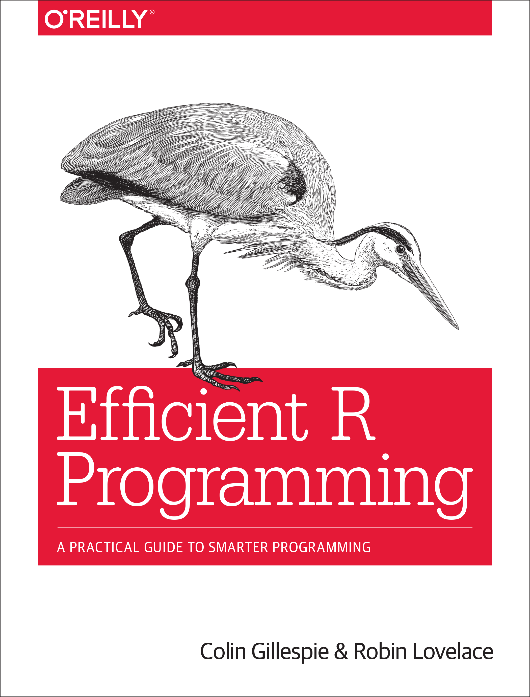
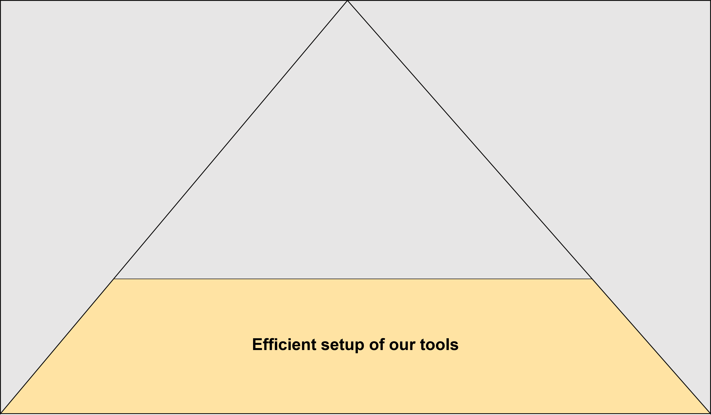
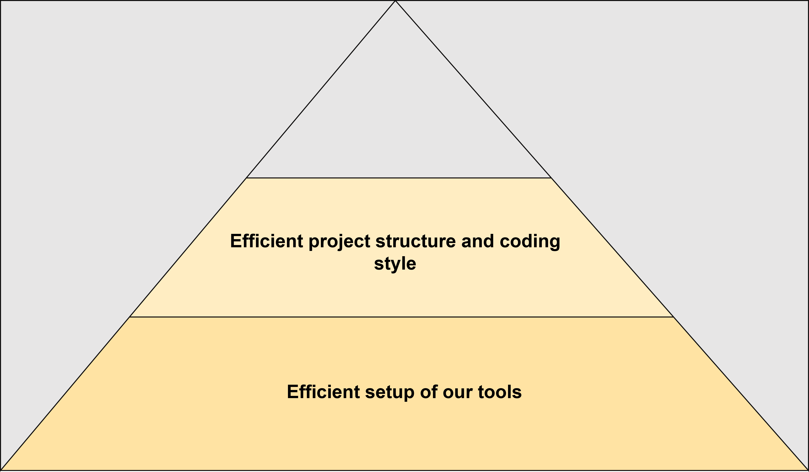
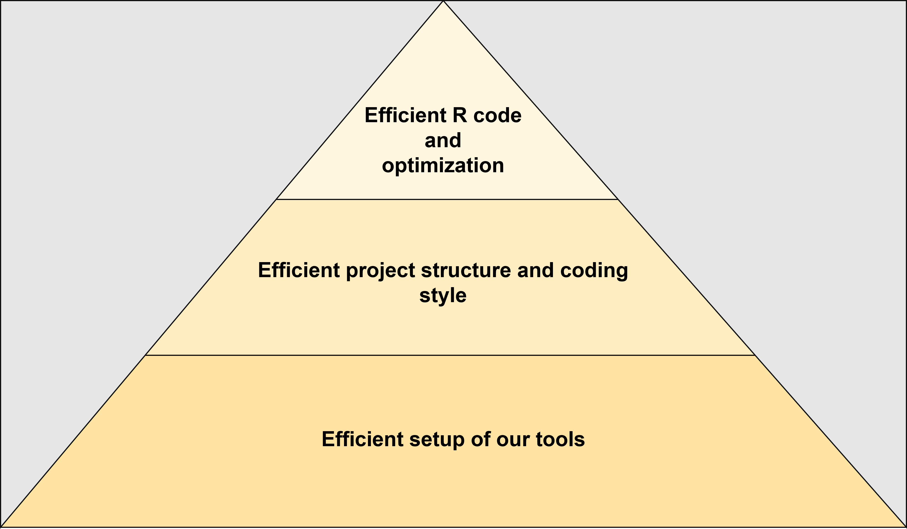
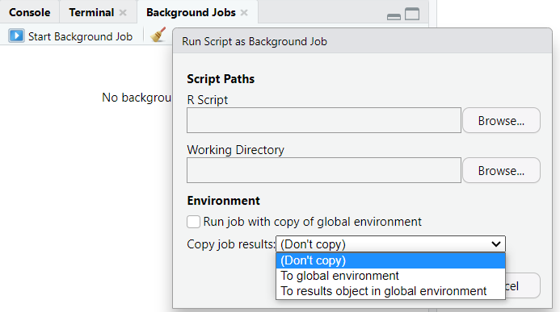
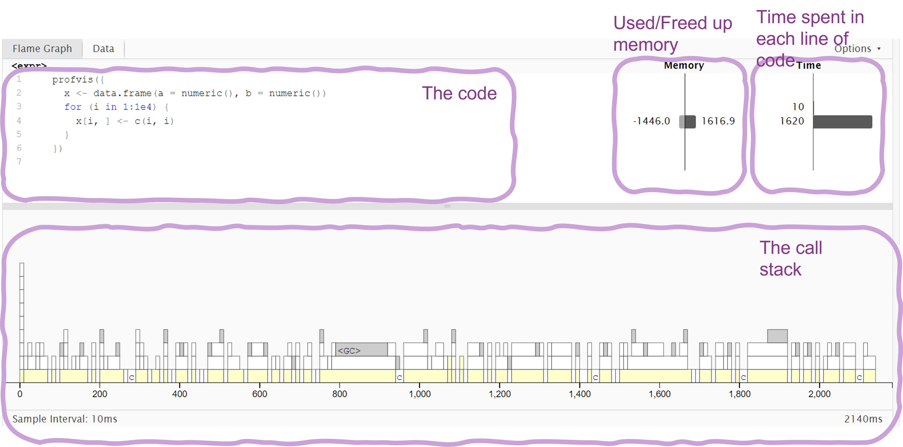
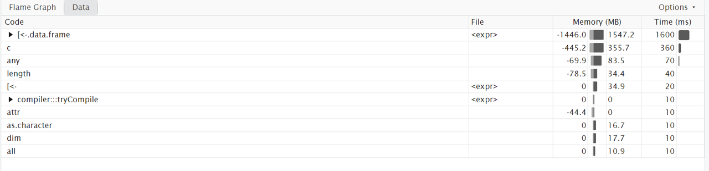
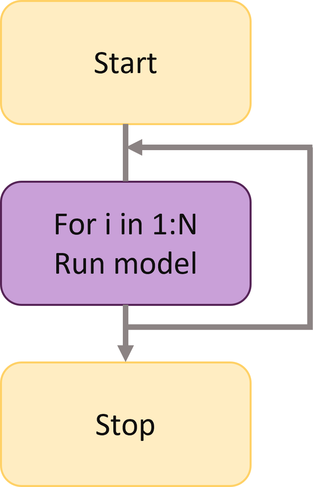
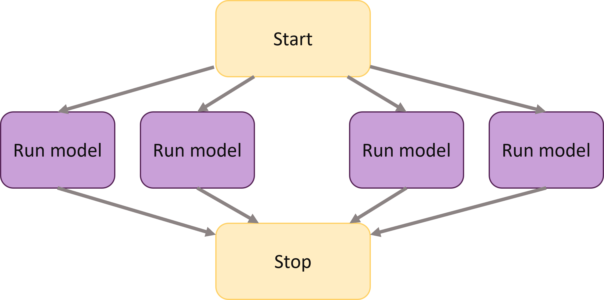

```{r}
#| label: setup
#| include: false
ggplot2::theme_set(ggplot2::theme_gray(base_size = 16))

# Set default options for readr functions
options(
  readr.show_col_types = FALSE,
  readr.show_progress = FALSE
)
```

## What is this lecture series?

### Scientific workflows: Tools and Tips :hammer_and_wrench:

::: nonincremental
:date: Every 3rd Thursday :clock4: 4-5 p.m. :round_pushpin: Webex

-   One topic from the world of scientific workflows
-   Material provided [online](https://selinazitrone.github.io/tools_and_tips/)
-   If you don't want to miss a lecture
    -   [Subscribe to the mailing list](https://lists.fu-berlin.de/listinfo/toolsAndTips)
:::

## Main reference

:::{.columns}

:::{.column width="50%"}

Efficient R book by Gillespie and Lovelace, read it [here](https://bookdown.org/csgillespie/efficientR/)

:::

:::{.column width="50%"}

{width=80%}

:::

:::

## What is efficiency?

$$
\textsf{efficiency} = \frac{\textsf{work done}}{\textsf{unit of effort}}
$$
<br>

:::{.columns}

:::{.column width="50%"}

:::{.fragment}

**Computational efficiency**

:::

:::{.fragment}

:computer: Computation time <br>
:floppy_disk: Memory usage

:::

:::

:::{.column width="50%"}

::: {.fragment}

**Programmer efficiency** 

🧍 How long does it take to

:::

- *write* code?
- *maintain* code?
- *read* and *understand* the code?

:::


:::

. . .

**Tradeoffs** and **Synergies** between these types of efficiencies

## Today

:::{.r-stack}

{width=70% fig-align="center" .fragment}

{width=70% fig-align="center" .fragment}

{width=70% fig-align="center" .fragment}


:::

. . .

**Principles** and **tools** to make R programming more efficient for the :computer:

. . .

Check out my talk ["Write R code that lasts"](https://selinazitrone.github.io/tools_and_tips/sessions/10_r-code-that-lasts.html) for basics

## Is R slow?

- R is slow compared to other programming languages (e.g. C++, Julia).
  - R is designed to make statistical programming & data analysis **easy** and **interactive**, not fast

- R is the not the most memory efficient language
  
- But: [R is fast and memory efficient enough]{.highlight-purple} for most tasks.

## Should I optimize?

. . .

> It’s easy to get caught up in trying to remove all bottlenecks. Don’t! **Your time is valuable** and is **better spent analysing your data**, not eliminating possible inefficiencies in your code. **Be pragmatic**: don’t spend hours of your time to save seconds of computer time.<br>
(Hadley Wickham in [Advanced R](https://adv-r.hadley.nz/perf-improve.html))

. . .

#### Think about

- How much time do I **save** vs **spend** with optimizing? 
- **How often** do I run the code?
- Trade-offs between **readability** and **efficiency**

## Should I optimize?

If your code is to slow for you, you can go through these steps:

1. Think if you can **run the code somewhere else**

- On a cluster (e.g. [FU Curta](https://www.fu-berlin.de/en/sites/high-performance-computing/Rechenressourcen/index.html))
- On your computer but in the background

## Run your code in the background

:::{.fragment}

Use RStudio **background jobs**

{width=50%}

:::

:::{.fragment}

Start your R script from the command line

```bash
Rscript my_script.R
```
:::

## Should I optimize?

If your code is to slow for you, you can go through these steps:

:::{.nonincremental}

1. Think if you can **run the code somewhere else**

:::

2. **Identify the critical** (slow) **parts** of your code
3. Then **optimize only the bottlenecks**

# Profiling and benchmarking

> Measure the speed and memory usage of your code

## Profiling R code

What are the speed & memory bottlenecks in my code?

- Use the [`profvis` package](https://rstudio.github.io/profvis/)

## Profiling R code

You can profile a section of code like this:

```{r eval=FALSE}
#| label: profvis
# install.packages("profvis")
library(profvis)

# Create a data frame with 150 columns and 400000 rows
df <- data.frame(matrix(rnorm(150 * 400000), nrow = 400000))

profvis({
  # Calculate mean of each column and put it in a vector
  means <- apply(df, 2, mean)

  # Subtract mean from each value in the table
  for (i in seq_along(means)) {
    df[, i] <- df[, i] - means[i]
  }
})
```

## Profiling R code

Profvis flame graph shows time and memory spent in each line of code.



## Profiling R code

Profvis data view for details on time spent in each function in the call stack.



## Profiling R code

You can also interactively profile code in RStudio:

::: {.nonincremental}

- Go to **Profile -> Start profiling**
- Now interactively run the code you want to profile
- Go to **Profile -> Stop profiling** to see the results

:::

## Profiling R code {visibility="hidden"}

If you have a longer program to profile, the best way is to:

- Wrap the program in a function
- Source the R script with the function
- Use `profvis` function on the sourced function

. . .

```{r}
#| label: profvis-source
#| eval: false
# source the analysis script in which
# the analysis is wrapped in a simple function
source("my_analysis.R")

# profile the analysis function
profvis(my_analysis())
```

## Benchmarking R code

Which version of the code is faster?

. . .

```{r}
#| label: create-f1-f2
# Fill a data frame in a loop
f1 <- function() {
  x <- data.frame(a = numeric(), b = numeric())
  for (i in 1:1e4) {
    x[i, ] <- c(i, i)
  }
}

# Fill a data frame directly with vectors
f2 <- function() {
  x <- data.frame(a = 1:1e4, b = 1:1e4)
}
```

## Benchmarking R code - the easy way

Use the `tictoc` package to get a quick overview of the time a section of code takes

```{r}
#| label: tic-toc
# install.packages("tictoc")
library(tictoc)

tic()
f1()
toc()

tic()
f2()
toc()
```

## Benchmarking R code

Use the `microbenchmark` package to compare the functions:

. . .

```{r}
#| label: benchmark-f1-f2
#| output-location: fragment
# install.packages("microbenchmark")
library(microbenchmark)

compare_functions <- microbenchmark(
  old = f1(),
  new = f2(),
  times = 10 # default is 100
)

compare_functions
```

## Benchmarking R code

We can look at benchmarking results using ggplot

```{r}
#| label: autoplot-compare-functions
#| eval: false
library(ggplot2)
autoplot(compare_functions)
```

```{r}
#| label: autoplot-compare-functions-2
#| fig-width: 8
#| fig-height: 4.5
#| echo: false
library(ggplot2)
autoplot(compare_functions) + theme_gray(base_size = 16)
```

# Optimize your code

:::{.nonincremental}

- Basic principles
- Data analysis bottlenecks
- Advanced optimization: Parallelization and C++
  
:::

# Basic principles

## Let R do as little as possible {visibility="hidden"}

Use fewer function calls and less complex functions

. . .

**Example**:  Calculate mean of every column in a data frame

. . .

```{r}
#| label: benchmark-colmeans-vs-apply
#| output-location: fragment
# A data frame with 1 million rows and 2 columns
x <- data.frame(a = rnorm(1e6), b = rnorm(1e6))

# Example to calculate the mean of each column
microbenchmark(
  apply = apply(x, 2, mean),
  colMeans = colMeans(x),
  times = 10
)
```

## Let R do as little as possible {visibility="hidden"}

Give R as much information as possible

**Example**: Don't let R guess column classes when reading a data frame:

. . .

```{r}
#| label: benchmark-guess-vs-know-classes
microbenchmark(
  guess_classes = read.csv(here::here("slides/data/ghg_ems.csv")),
  know_classes = read.csv(
    here::here("slides/data/ghg_ems.csv"),
    colClasses = c("character", "integer", rep("double", 5))
  ),
  times = 10
)
```

## Vectorize your code

- Vectors are central to R programming
- R is optimized for vectorized code
  - Implemented directly in C/Fortran
- Vector operations can often replace for-loops in R
- If there is a vectorized version of a function: Use it

## Vectorize your code

**Example**: Calculate the log of every value in a vector and sum up the result

. . .

```{r}
#| label: benchmark-vectorization
# A vector with 1 million values
x <- 1:1e6

microbenchmark(
  for_loop = {
    log_sum <- 0
    for (i in 1:length(x)) {
      log_sum <- log_sum + log(x[i])
    }
  },
  sum = sum(log(x)),
  times = 10
)
```

## Don't grow objects in a loop {visibility="hidden"}

If you know how big your object will be, pre-allocate it

- This avoids copying the object multiple times

. . .

**Example**: Fill up a data frame in a loop

```{r}
#| label: create-f1-f2-loop
# Fill up data frame in a loop
f1 <- function() {
  x <- data.frame(a = numeric(), b = numeric())
  for (i in 1:1e4) {
    x[i, ] <- c(i, i)
  }
}

# Fill up data frame in a loop but pre-allocate it
f2 <- function() {
  x <- data.frame(a = numeric(1e4), b = numeric(1e4))
  for (i in 1:1e4) {
    x[i, ] <- c(i, i)
  }
}

```

## Don't grow objects in a loop {visibility="hidden"}

If you know how big your object will be, pre-allocate it

:::{.nonincrmental}

- This avoids copying the object multiple times

:::

**Example**: Fill up a data frame in a loop

```{r}
#| label: benchmark-f1-f2-loop
microbenchmark(
  no_alloc = f1(),
  pre_alloc = f2(),
  times = 10
)
```


## Don't grow objects in a loop {visibility="hidden"}

Of course, here the even better version would be to fill the data frame directly with vectors:

```{r}
#| label: create-f3
f3 <- function() {
  x <- data.frame(a = 1:1e4, b = 1:1e4)
}

microbenchmark(
  no_alloc = f1(),
  pre_alloc = f2(),
  no_loop = f3(),
  times = 10
)
```

## For-loops in R

- For-loops are **relatively slow** and it is easy to make them even slower with bad design
- Often they are used when vectorized code would be better

- For loops can often be replaced, e.g. by
  - Functions from the apply family (e.g. `apply`, `lapply`, ...)
  - Vectorized functions (e.g. `sum`, `colMeans`, ...)
  - Vectorized functions from the [`purrr` package](https://purrr.tidyverse.org/) (e.g. `map`)
  
. . .

But: For loops are not necessarily bad, **sometimes** they are the **best solution** and **more readable** than vectorized code.

## Cache variables

If you use a value multiple times, store it in a variable to avoid re-calculation

. . .

**Example**: Calculate column means and normalize them by the standard deviation

. . .

```{r}
#| label: cache-variables
# A matrix with 1000 columns
x <- matrix(rnorm(10000), ncol = 1000)

microbenchmark(
  no_cache = apply(x, 2, function(i) mean(i) / sd(x)),
  cache = {
    sd_x <- sd(x)
    apply(x, 2, function(i) mean(i) / sd_x)
  }
)
```

# Efficient data analysis

## Efficient workflow

- Prepare the data to be clean and concise for analysis
- Save intermediate results
- Use the right packages

## Efficient workflow packages

- [`tidyverse` packages](https://www.tidyverse.org/) have C++ backend and often faster than base R
- [`data.table` package](https://rdatatable.gitlab.io/data.table/) is fast and memory efficient
  - Syntax is quite different from base R and `tidyverse`
- [`collapse` package](https://sebkrantz.github.io/collapse/index.html) for very fast data manipulation
  - Works together with both `tidyverse` and `data.table` workflows
  - Many functions similar to base R or `dplyr` just with prefix "f" (e.g. `fselect`, `fmean`, ...)
- [`arrow` package](https://arrow.apache.org/docs/r/) for efficient reading, processing and writing of large datasets (even larger than RAM)
  
## Read data

**Example:** Read csv data on worldwide emissions of greenhouse gases (~14000 rows, 7 cols).

- Base-R functions to read csv files are:
  - `read.table`
  - `read.csv`
- There are many alternatives to read data, e.g.:
  - `read_csv` from the `readr` package (tidyverse)
  - `fread` from the `data.table` package
  - `read_csv_arrow` from the `arrow` package

## Read data

Compare some alternative reading functions
  
```{r}
#| label: benchmark-reading-data
#| message: false
#| output-location: slide
file_path_csv <- here::here("slides/data/ghg_ems_large.csv")

compare_input <- microbenchmark::microbenchmark(
  read.csv = read.csv(file_path_csv),
  read_csv = readr::read_csv(file_path_csv),
  fread = data.table::fread(file_path_csv),
  read_csv_arrow = arrow::read_csv_arrow(file_path_csv),
  times = 10
)

autoplot(compare_input)
```


## Use plain text data

Reading plain text is faster than excel files

```{r}
#| label: benchmark-reading-excel
#| output-location: slide
file_path_xlsx <- here::here("slides/data/ghg_ems_large.xlsx")

compare_excel <- microbenchmark(
  read_csv = readr::read_csv(file_path_csv),
  read_excel = readxl::read_excel(file_path_xlsx),
  times = 10
)

autoplot(compare_excel)
```

## Write data

Use faster alternatives to `write.table` or `write.csv`

**Example:** Write a data frame with 1000 rows as csv or excel file.

. . .
  
```{r}
#| label: benchmark-writing-data
#| output-location: slide
# create an example with 10000 rows to export
df <- data.frame(
  x = rnorm(10000),
  y = rnorm(10000),
  z = rnorm(10000)
)

compare_output <- microbenchmark::microbenchmark(
  write.csv = write.csv(df, "df.csv"),
  write_csv = readr::write_csv(df, "df.csv"),
  fwrite = data.table::fwrite(df, "df.csv"),
  write_excel = writexl::write_xlsx(df, "df.xlsx"),
  write_csv_arrow = arrow::write_csv_arrow(df, "df.csv"),
  times = 10
)

autoplot(compare_output)
```

## Efficient data manipulation

**Example**: Summarize mean carbon emissions from Electricity by Country

```{r}
#| label: setup-summarize-by-group
library(data.table)
library(dplyr)
library(collapse)
```

## Efficient data manipulation

**Example**: Summarize mean carbon emissions from Electricity by Country

```{r}
#| label: load-ghg-ems
#| include: false
ghg_ems <- data.table::fread(here::here("slides/data/ghg_ems.csv"))
```

```{r}
#| label: functions-summarize-by-group
# 1. The data table way

# Convert the data to a data.table
setDT(ghg_ems)
summarize_dt <- function() {
  ghg_ems[, mean(Electricity, na.rm = TRUE), by = Country]
}

# 2. The dplyr way
summarize_dplyr <- function() {
  ghg_ems |>
    group_by(Country) |>
    summarize(mean_e = mean(Electricity, na.rm = TRUE))
}

# 3. The collapse way
summarize_collapse <- function() {
  ghg_ems |>
    fgroup_by(Country) |>
    fsummarise(mean_e = fmean(Electricity))
}
```

## Efficient data manipulation

**Example**: Summarize mean carbon emissions from Electricity by Country

```{r}
#| label: benchmark-summarizing-by-group
# compare the speed of all versions
microbenchmark(
  dplyr = summarize_dplyr(),
  data_table = summarize_dt(),
  collapse = summarize_collapse(),
  times = 10
)
```

## Efficient data manipulation

**Example**: Select columns Country, Year, Electricity, Transportation

```{r}
#| label: benchmark-selecting-columns
#| output-location: fragment
microbenchmark(
  dplyr = select(ghg_ems, Country, Year, Electricity, Transportation),
  data_table = ghg_ems[, .(Country, Electricity, Transportation)],
  collapse = fselect(ghg_ems, Country, Electricity, Transportation),
  times = 10
)
```

# Advanced optimization

> Parallelization and C++

## Parallelization

By default, R works on one core but CPUs have multiple cores

. . .

```{r}
#| label: find-available-cores
# Find out how many cores you have with the parallel package
# install.packages("parallel")
parallel::detectCores()
```

. . .

<br>

::::{.columns}

::: {.column width="50%"}

Sequential

{width="40%" fig-align="center"}

:::

::: {.column width="50%"}

:::{.fragment}

Parallel



:::

:::

::::

## Parallelization with the futureverse

- `future` is a framework to help you parallelize existing R code
  - Parallel versions of base R apply family
  - Parallel versions of `purrr` functions
  - Parallel versions of `foreach` loops
- Find more details [here](https://www.futureverse.org/)
- Find a tutorial for different use cases [here](https://henrikbengtsson.github.io/future-tutorial-user2022)

## A slow example

Let's create a very slow square root function

```{r}
#| label: slow-sqrt
slow_sqrt <- function(x) {
  Sys.sleep(1) # simulate 1 second of computation time
  sqrt(x)
}
```

## Parallel apply functions

To run the function on a vector of numbers we could use

:::{.columns}

:::{.column width="50%"}

**`lapply`** <br>

```{r}
#| label: lapply-slow-sqrt
#| message: false
# create a vector of 10 numbers
x <- 1:10
tic()
result <- lapply(x, slow_sqrt)
toc()
```

:::

:::{.column width="50%"}

:::{.fragment}

**`future_lapply`** <br>

```{r}
#| label: future-lapply-slow-sqrt
# Load future.apply package
library(future.apply)
# Plan parallel session with 6 cores
plan(multisession, workers = 6)

tic()
result <- future_lapply(x, slow_sqrt)
toc()
```

:::

:::

:::

. . .

Use `parallel::detectCores()` to find out how many cores you have.

## Parallel apply functions

Selected base R apply functions and their future versions:

```{r}
#| label: apply-functions-table
#| echo: false
# A data. frame with two columns: base and future.apply
# In the base column there are the base R functions and in the future.apply
# column there are the future versions of the functions
# The function names should be enclosed in backticks and then in quotation marks to be printed nicely
apply_functions <- data.frame(
  base = c(
    "`
lapply
`",
    "`
sapply
`",
    "`
vapply
`",
    "`
mapply
`",
    "`
tapply
`",
    "`
apply
`",
    "`
Map
`"
  ),
  future.apply = c(
    "`
future_lapply
`",
    "`
future_sapply
`",
    "`
future_vapply
`",
    "`
future_mapply
`",
    "`
future_tapply
`",
    "`
future_apply
`",
    "`
future_Map
`"
  )
)
# print the data frame apply_functions nicely in the quarto doc using knitr
# Apply striped design to the table
knitr::kable(apply_functions)
```

## Future `purrr` functions

- The [`furrr` package](https://furrr.futureverse.org/) offers parallel versions of [`purrr` functions](https://purrr.tidyverse.org/)

. . .

:::{.columns}

:::{.column width="50%"}

The **sequential** version

```{r}
#| label: purrr-slow-sqrt
library(purrr)

# the purrr version
tic()
z <- map(x, slow_sqrt)
toc()
```

:::

:::{.column width="50%"}

The **parallel** version

```{r}
#| label: furrr-slow-sqrt
library(furrr)

# the furrr version
tic()
z <- future_map(x, slow_sqrt)
toc()
```

:::

:::

## Parallel for loops

A normal for loop:

```{r}
#| label: for-loop-slow-sqrt
z <- list()
for (i in 1:10) {
  z[i] <- slow_sqrt(i)
}
```

. . .

Use `foreach` to write the same loop

```{r}
#| label: foreach-slow-sqrt
library(foreach)
z <- foreach(i = 1:10) %do%
  {
    slow_sqrt(i)
  }
```

## Parallel for loops

Use `doFuture` and `foreach` package to parallelize for loops

:::{.columns}

:::{.column width="50%"}

The **sequential** version

```{r}
#| label: foreach-slow-sqrt-sequential
library(foreach)

tic()
z <- foreach(i = 1:10) %do%
  {
    slow_sqrt(i)
  }
toc()
```

:::

:::{.column width="50%"}

The **parallel** version

:::{.fragment}

```{r}
#| label: foreach-slow-sqrt-parallel
library(doFuture)

tic()
z <- foreach(i = 1:10) %dofuture%
  {
    slow_sqrt(i)
  }
toc()
```

:::

:::

:::

## Close multisession

When you are done working in parallel, explicitly close your multisession:

```{r}
#| label: close-multisession
# close the multisession plan
plan(sequential)
```

## Replace slow code with C++

- Use the [`Rcpp` package](https://www.rcpp.org/) to re-write R functions in C++
 - `Rcpp` is also used internally by many R packages to make them faster
- Requirements: 
  - C++ compiler installed
  - Some knowledge of C++
  
- See [this book chapter](https://csgillespie.github.io/efficientR/performance.html#rcpp) and the [online documentation](https://www.rcpp.org/) for more info
 
## Rewrite a function in C++

**Example:** R function to calculate Fibonacci numbers

```{r}
#| label: fibonacci-r
# A function to calculate Fibonacci numbers
fibonacci_r <- function(n) {
  if (n < 2) {
    return(n)
  } else {
    return(fibonacci_r(n - 1) + fibonacci_r(n - 2))
  }
}
```

<br>

. . .

```{r}
#| label: fibonacci-r-30
# Calculate the 30th Fibonacci number
fibonacci_r(30)
```

## Rewrite a function in C++

Use `cppFunction` to rewrite the function in C++:

```{r}
#| label: fibonacci-cpp
library(Rcpp)

# Rewrite the fibonacci_r function in C++
fibonacci_cpp <- cppFunction(
  'int fibonacci_cpp(int n){
    if (n < 2){
      return(n);
    } else {
      return(fibonacci_cpp(n - 1) + fibonacci_cpp(n - 2));
    }
  }'
)
```

<br>

. . .

```{r}
#| label: fibonacci-cpp-30
# calculate the 30th Fibonacci number
fibonacci_cpp(30)
```

## Rewrite a function in C++

You can also source C++ functions from C++ scripts.

. . .

C++ script `fibonacci.cpp`:

```{cpp eval = FALSE}
#include "Rcpp.h"

// [[Rcpp::export]]
int fibonacci_cpp(const int x) {
   if (x < 2) return(x);
   return (fibonacci(x - 1)) + fibonacci(x - 2);
}
```

. . .

Then source the function in your R script using `sourceCpp`:

. . .

```{r eval=FALSE}
sourceCpp("fibonacci.cpp")

# Use the function in your R script like you are used to
fibonacci_cpp(30)
```


## How much faster is C++?

```{r}
#| label: benchmark-fibonacci
microbenchmark(
  r = fibonacci_r(30),
  rcpp = fibonacci_cpp(30),
  times = 10
)
```

# Summary

## Efficient R code and optimization

:::{.nonincremental}

- First: Can I run it somewhere else?
  - :wrench: Background job or cluster
- If not: Find bottlenecks in your code
  - :wrench: `profvis` package for profiling
  - :wrench: `microbenchmark` package for benchmarking
- Make the critical sections more efficient

:::

# Summary

:::{.columns}

:::{.column width="50%"}

> “Make it **work**, then make it **beautiful**, then if you really, really have to, make it **fast**. 90 percent of the time, if you make it beautiful, it will already be fast. So really, just make it beautiful!”
> 
> – Joe Armstrong

:::

::: {.column width="50%"}

{width=90%}
:::

:::

## Next lecture

#### Topic t.b.a.

<br>

:date: 17th July :clock4: 4-5 p.m. :round_pushpin: Webex

:bell: [Subscribe to the mailing list](https://lists.fu-berlin.de/listinfo/toolsAndTips)

:e-mail: For topic suggestions and/or feedback [send me an email](mailto:selina.baldauf@fu-berlin.de)

## Thank you for your attention :)
Questions?

# Appendix

## Cache function results

- Use the [`memoise` package](https://memoise.r-lib.org/)
- If functions are called many times with the same arguments
  - Avoids the recalculation
- Useful to e.g. improve the performance of a shiny app

## Cache function results

**Example**: Create a plot on a subset of the `iris` data set

```{r}
#| label: setup-memoise
# Example of using memoise to cache results
library(memoise)
library(ggplot2)

# Remove rows from plotting function
select_iris_species <- function(rows_to_remove) {
  iris_subset <- iris[-rows_to_remove, ]
  # Do a plot on the subset
  p <- ggplot(
    iris_subset,
    aes(x = Sepal.Length, y = Sepal.Width, color = Species)
  ) +
    geom_point()
}

# Version of the function with memoise
select_iris_species_mem <- memoise(select_iris_species)
```

## Cache function results

**Example**: Create a plot on a subset of the `iris` data set

```{r}
#| label: benchmark-iris-species
#| output-location: column
# Compare the two versions
result <- microbenchmark(
  no_cache = select_iris_species(10),
  cache = select_iris_species_mem(10)
)

autoplot(result)
```