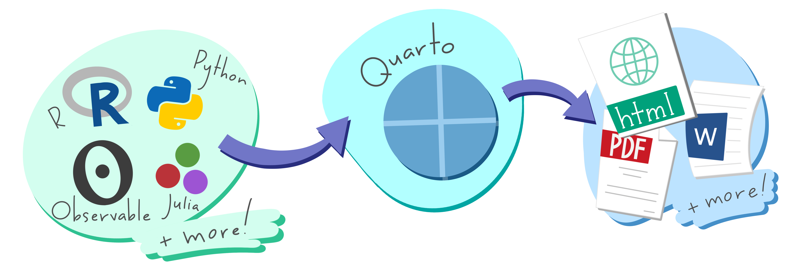
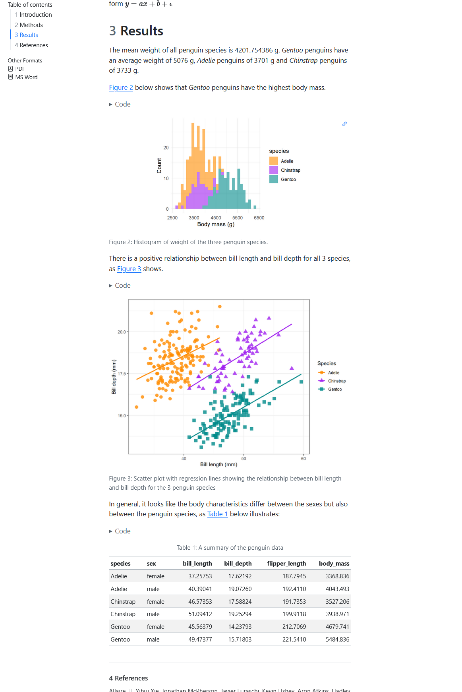
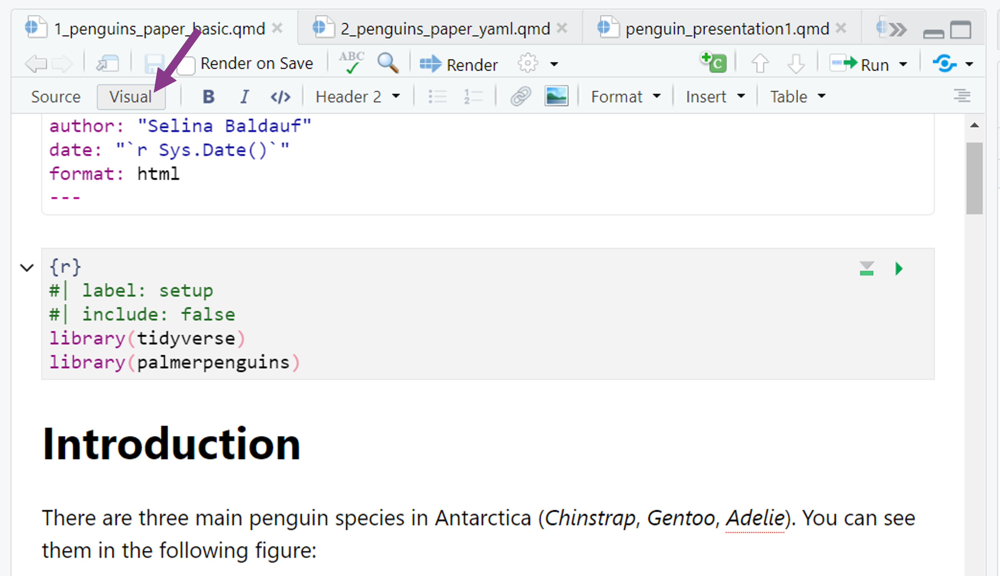
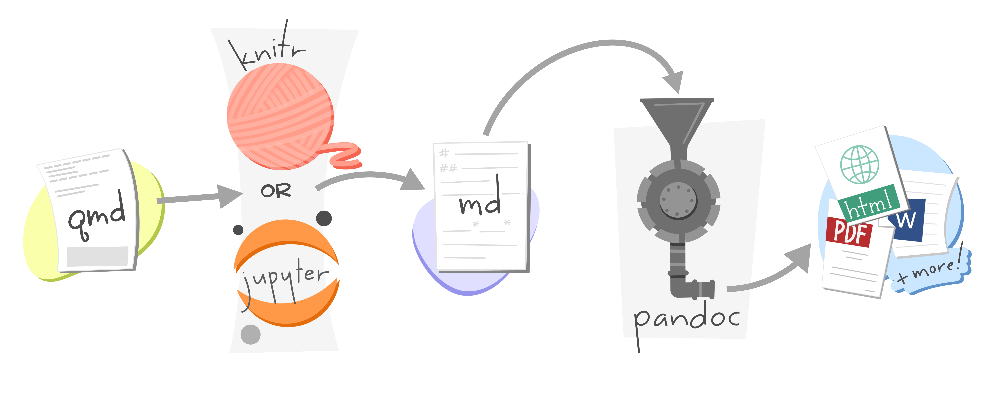

## What is this lecture series?

### Scientific workflows: Tools and Tips :hammer_and_wrench:

::: nonincremental

:date: Every 3rd Thursday :clock4: 4-5 p.m. :round_pushpin: Webex

- One topic from the world of scientific workflows
- Material provided [online](https://selinazitrone.github.io/tools_and_tips/)
- If you don't want to miss a lecture
  - [Subscribe to the mailing list](https://lists.fu-berlin.de/listinfo/toolsAndTips)
- For credit points: Send me a short message (Email or Webex)

:::

## What is Quarto?

. . .

> Quarto is an open-source scientific and technical publishing system

. . .

Basic idea: Create documents with dynamic content and text

```{r}
#| echo: false
#| fig-cap: <small>Artwork from "Hello, Quarto" keynote by Julia Lowndes and Mine Çetinkaya-Rundel, presented at RStudio Conference 2022. Illustrated by [Allison Horst](https://allisonhorst.com)</small>
#| fig-align: center
#| fig-alt: A schematic representing the multi-language input (e.g. Python, R, Observable, Julia) and multi-format output (e.g. PDF, html, Word documents, and more) versatility of Quarto.

```

## Document types with Quarto

Examples of document types that can be created with Quarto:

::: {.nonincremental}

-   **Documents**: HTML, PDF, Word
-   **Presentations**: HTML, Powerpoint
-   **Books**: HTML, ePub, PDF
-   **Websites**
- ...

:::

## Today

Quarto is a huge topic and there are so many possibilities!

. . .

<br>

- Practical **introduction** and **overview**
- Main focus R and Positron/RStudio, but same workflow with other languages and other IDEs
- Download a quarto demo project from [Github](https://github.com/selinaZitrone/quarto_demo)

## How to get Quarto

Different options, depending on your workflow:

- **Integrated** in some IDEs (e.g. R Studio, Positron)
- Download the **CLI** for use with other IDEs and workflows
- There is also an **R package** to call quarto from (`install.packages("quarto")`)

. . .

<br>

Check out the [Quarto website](https://quarto.org/docs/get-started/) for download and tutorials for all options.

# Let's get started! {#section-slide background-image="images/2025_10_16_quarto-2/penguins_jumping.png" background-size="cover"}

```{css, echo=FALSE}
#section-slide h1 {
 color: #fee4ff;
 margin-top: -27%;
}

#section-slide .aside-custom {
  position: fixed;
  color: #fee4ff;
  font-size: 0.5em;
  bottom: -20px;
  left: -130px;
  max-width: 60%
  /* other properties */
}

```

:::{.aside-custom}
“Artwork from”Hello, Quarto” keynote by Julia Lowndes and Mine Çetinkaya-Rundel, presented at RStudio Conference 2022. Illustrated by Allison Horst.”
:::

## Reproducible documents step by step

```{r}
#| fig-align: center
#| out-width: "80%"

```

An [HTML example](../sessions/additional_material/02_quarto/penguins_paper.html)

## Reproducible documents step by step

1.  *Create* a `.qmd` document
2.  *Write* the document including:
-   **text** e.g. introduction, methods, or discussion
-   **code** (R, Python, Julia) that produces numbers, figures, tables, ...
-   **metadata** that defines how the document should look like (e.g. which output format)
3.  *Render* the document to a defined output format (e.g. PDF) using `Quarto`


## References for all the elements

:::{.nonincremental}

-   [Mardown syntax reference](https://quarto.org/docs/authoring/markdown-basics.html)
-   Code chunks:
    -   [R code](https://quarto.org/docs/computations/r.html)
    -   [Python code](https://quarto.org/docs/computations/python.html)
-   YAML header options:
    -   [HTML](https://quarto.org/docs/reference/formats/html.html)
    -   [PDF](https://quarto.org/docs/reference/formats/pdf.html)
    -   [DOCX](https://quarto.org/docs/reference/formats/docx.html)

:::

## The text body - Markdown

Markdown is a simple markup language to create formatted text, you can e.g.

. . .

- Make italic *text* with \*text\* or bold **text** with \*\*text\*\*

- Generate headers of different levels

. . .

```md
# Header level 1
## Header level 2
### Header level 3
```

- Create bullet lists

. . .

```md
A bullet point list

- item 1
- item 2
- item 3
```

## The text body - Markdown

You can also do more complex things like:

- Including images, links or footnotes
- Adding citations
- Latex style mathematical formulas

## The text body - Markdown

- RStudio and Positron also have **visual editors** 
- Convenient, word-like interface for formatting text and adding features.
  - E.g. Insert citations from Zotero library, DOI search, PubMed, ...

```{r}
#|label: fig-visual-editor

```

## The Code

**Inline code** starts and ends with 1 backtick

```{r, echo=FALSE}
code <- "`{r} `"
cat(code)
```

. . .

**Example**

``` md
The mean of the values 1, 2 and 3 is `{{r}} mean(1:3)`
```

**Rendered output**<br>

The mean of the values 1, 2 and 3 is `{r} mean(1:3)`.

. . .

<br>

Same for Python:

``` md
The mean of the values 1, 2 and 3 is `{{python}} np.mean([1,2,3])`
```

## The Code

**Code chunks** starts and ends with 3 backticks

```` md
```{{r}}
library(ggplot2)

ggplot(penguins, aes(flipper_len, body_mass)) + 
  geom_point() + 
  geom_smooth(method = "lm")
```
````

<br>

. . .

````         
```{{python}}
import numpy as np
import matplotlib.pyplot as plt

r = np.arange(0, 2, 0.01)
theta = 2 * np.pi * r
fig, ax = plt.subplots(subplot_kw = {'projection': 'polar'})
ax.plot(theta, r)
ax.set_rticks([0.5, 1, 1.5, 2])
ax.grid(True)
plt.show()
```
````

## The Code

**Run code chunk**

-   Code chunks can be run inside the document
-   Code chunks are run when document is rendered

## The code

Code chunk have special comments that start with `#|` and that control the behaviour
of the chunk.

```` md
```{{r}}
#| label: fig-penguins
#| fig-cap: Temperature and ozone level.
#| echo: false

library(ggplot2)

ggplot(penguins, aes(flipper_len, body_mass)) + 
  geom_point() + 
  geom_smooth(method = "lm")
```
````

- `label`: Figure and chunk label that can be referred to in text
- `fig-cap`: Figure caption
- `echo`: Include the output (i.e. the plot) in the document but don't show the code

## YAML header

. . .

**For Metadata**

``` yaml
---
title: "My first document"
subtitle: "Whatever subtitle makes sense"
author: "Selina Baldauf"
date: today
---
```

## YAML header

**For document output formats**

``` yaml
---
format: html
---
```

or other formats like `pdf`, `docx`, `revealjs`, `powerpoint`, ...

. . .

You can also specify multiple output formats

``` yaml
---
title: "My first document"
author: "Selina Baldauf"
date: today
format: 
  html: default
  pdf: default
  docx: default
---
```

## YAML header

**For document options**

``` yaml
---
title: "My first document"
author: "Selina Baldauf"
date: today
format: 
  html: 
    number-sections: true
    toc: true
    toc-location: left
---
```

-   Some options are shared, some are specific to one format
-   Be careful to get the indentation right!


## YAML header

**Execute options**

``` yaml
---
title: "My first document"
author: "Selina Baldauf"
date: today
format: html
execute: 
  message: false
  warning: false
---
```

-   Default options for code chunks
-   Can be overwritten by local comments in code chunks

## Render the document

Many different options:

:::{.nonincremental}

- In RStudio/Positron/VS Code: Render button or keyboard shortcut (usually `Ctrl/Cmd + Shift + K`)
- In the terminal/console: `quarto render my_document.qmd`
- From R, using the [`quarto` package](https://quarto.org/docs/blog/posts/2025-07-28-r-package-release-1.5/): `quarto::quarto_render("my_document.qmd")`

:::

. . .

These commands can be customized with additional options, e.g.

```cmd
quarto render my_document.qmd --to html
quarto render my_document.qmd --to docx
```

## Render the document

What happens during rendering?

```{r}
#| fig-alt: A schematic representing rendering of Quarto documents from .qmd, to knitr or jupyter, to plain text markdown, then converted by pandoc into any number of output types including html, PDF, or Word document.
#| fig-cap: Artwork from "Hello, Quarto" keynote by Julia Lowndes and Mine Çetinkaya-Rundel,presented at RStudio Conference 2022. Illustrated by Allison Horst.

```

## Parameterized reports

You can also define parameters to be used in your document

:::{.fragment}

**R** (knitr engine): Add parameters to the YAML header

``` yaml
---
title: "My first document"
format: html
params:
  species: "Adelie"
---
```

Use `params$species` to access.

:::

:::{.fragment}

**Python** (Jupyter engine): Add a special code chunk at beginning

```` md
```{{python}}
#| tags: [parameters]

species = 'Adelie'
```
````

Access via the parameter name `species`.

:::

## Parameterized reports

Render your document with different parameter inputs:

In R:

```{r}
#| eval: false
#| echo: true
quarto::quarto_render(
  input = "my_report.qmd",
  output_format = "pdf",
  output_file = "report_chinstrap.pdf",
  params = list(species = "Chinstrap")
)
```

In the console:

```cmd
quarto render my_report.qmd --to pdf --output "report_chinstrap.pdf" -P species:Chinstrap
```

## Summary

- Quarto combines formatted text and code in one document

. . .

**Benefits**

- **Reproducibility**: Code and text in one document
- **Flexibility**: Different output formats and programming languages
- **Version control friendly**: Text based
- **Parameterized reports**: Generate multiple reports from the same template
- ...


## {#outlook-slide background-image="images/2023_05_11_quarto/quarto_outlook.png" background-size="cover"}

```{css, echo=FALSE}
#outlook-slide h1 {
 margin-top: -30%;
}

.reveal .slide .aside-custom-right {
  position: fixed;
  color: #fef0ff;
  font-size: 0.5em;
  bottom: -20px;
  right: -100px;
  max-width: 60%
  /* other properties */
}

/* Add this to style the bullet points and text */
#outlook-slide ul {
  color: #fef0ff;
  width: 85%;
}
```

- Other **options and formats**: Presentations, Books, Websites
- Easily **publish** documents or websites
- Check out the **demo project** and the **resources** on the lecture website


:::{.aside-custom-right}
"Artwork from "Hello, Quarto" keynote by Julia Lowndes and Mine Çetinkaya-Rundel, presented at RStudio Conference 2022. Illustrated by Allison Horst."
:::

## Next lecture

#### Topic tba

<br>

:date: 20th November :clock4: 4-5 p.m. :round_pushpin: Webex

:bell: [Subscribe to the mailing list](https://lists.fu-berlin.de/listinfo/toolsAndTips)

:e-mail: For topic suggestions and/or feedback [send me an email](mailto:selina.baldauf@fu-berlin.de)

# The end :) {#end-slide background-image="images/2023_05_11_quarto/quarto_thankyou.png" background-size="cover"}

Questions?

```{css, echo=FALSE}
#end-slide h1 {
 margin-top: -27%;
}

.aside-custom-left {
  position: absolute !important;
  left: 0 !important;
  bottom: 0 !important;
  color: #fef0ff;
  font-size: 0.5em;
  max-width: 60%;
}

```

::: {.aside-custom-left}
“Artwork from”Hello, Quarto” keynote by Julia Lowndes and Mine Çetinkaya-Rundel, presented at RStudio Conference 2022. Illustrated by Allison Horst.”
:::


# References

:::{.nonincremental}
- [Quarto website](https://quarto.org/) offers everything you need to get started
  - [Download Quarto and starting guide](https://quarto.org/docs/get-started/) for different IDEs
  - [Guides for different output formats](https://quarto.org/docs/guide/)
  - [Gallery with Examples](https://quarto.org/docs/gallery/)
- [Quarto introduction workshop](https://www.youtube.com/watch?v=yvi5uXQMvu4) on Youtube
- [A curated collection of resources](https://github.com/mcanouil/awesome-quarto#featured-new-releases)

:::