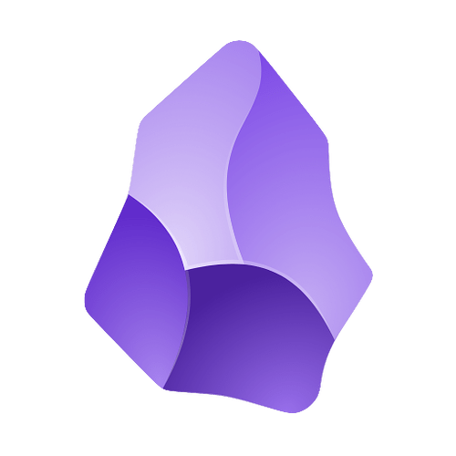

## What is this lecture series?

### Scientific workflows: Tools and Tips :hammer_and_wrench:

::: nonincremental

:date: Every 3rd Thursday :clock4: 4-5 p.m. :round_pushpin: Webex

- One topic from the world of scientific workflows
- Material provided [online](https://selinazitrone.github.io/tools_and_tips/)
- If you don't want to miss a lecture
  - [Subscribe to the mailing list](https://lists.fu-berlin.de/listinfo/toolsAndTips)
- For credit points: Send me a short message (Email or Webex)

:::

## Note taking is essential for scientists

:::{.nonincremental}

- Todo lists
- Project notes
- Meeting notes
- Resource notes (papers, videos, blogposts, ...)
- Brainstorming paper ideas (mindmaps etc.)
- Knowledge notes
- ...

:::

## Good and useful notes are

- 🔎 *searchable* -> digital
- 📆 *sustainable* -> no proprietary file formats
- 🔗 *connected* -> linked notes
- 😃 *easy and fun* -> keep motivated to actually take notes

## Today

:::{.nonincremental}
- Basic overview of Obsidian
- Implement some basic workflows
:::

. . .

Find additional material on the [lecture website](https://selinazitrone.github.io/tools_and_tips/14_obsidian-2.html):

:::{.nonincremental}

- demo notebook
- Youtube tutorial
- other resources

:::

## Obsidian

:::{.columns}

:::{.column width="50%"}

Obsidian is

- free for personal use
- available for all platforms
- markdown-based
- simple at its core
- highly scalable and customizable

:::

:::{.column width="50%"}

:::

:::

# Let's get started {.inverse}

{style="float:right;padding: 0 0 0 10px;" fig-alt="Obsidian Logo" width="300"}

## Summary

Obsidian makes your notes

- 🔎 *searchable*
- 📆 *sustainable* 
- 🔗 *connected*
- 😃 *easy and fun*

## Summary

Benefits

- 🗂️**Stay organized**

::: {.fragment}

:::{.nonincremental}

- 🧠 **Second Brain**
 	- Store knowledge
 	- Get stuff out of your first brain

:::

:::

- 💾 **Find information again**, also in 20 years

## Get started with note taking & Obsidian

- Perfect is the enemy of good: Just start taking notes
- Start simple and then improve your workflow with time
- Keep only what is useful

. . .

Check out the resources linked on the [lecture website](https://selinazitrone.github.io/tools_and_tips/14_obsidian-2.html):

:::{.nonincremental}

- demo notebook
- Youtube tutorial
- other resources

:::

## Next lecture

#### Topic tba

 

:date: 18th December :clock4: 4-5 p.m. :round_pushpin: Webex

:bell: [Subscribe to the mailing list](https://lists.fu-berlin.de/listinfo/toolsAndTips)

:e-mail: For topic suggestions and/or feedback [send me an email](mailto:selina.baldauf@fu-berlin.de)

# Thank you for your attention {.inverse}

:::{.columns}

:::{.column width="50%"}

Questions?

:::

:::{.column width="50%"}

{style="float:right;padding: 0 0 0 10px;" fig-alt="Obsidian Logo" width="300"}

:::

:::