## What is this lecture series?

### Scientific workflows: Tools and Tips :hammer_and_wrench:

::: nonincremental

:date: Every 3rd Thursday :clock4: 4-5 p.m. :round_pushpin: Webex

- One topic from the world of scientific workflows
- Material provided [online](https://selinazitrone.github.io/tools_and_tips/)
- If you don't want to miss a lecture [subscribe to the mailing list](https://lists.fu-berlin.de/listinfo/toolsAndTips)
- For credit points: Send me a short message (Email or Webex)

:::

## Motivation

- Speed up repetitive tasks
- Learn new methods and languages
- Support debugging, documenting, refactoring, ...

## AI tools for programming

:::{.nonincremental}
- Browser-based chat bots (ChatGPT, etc.)
- Web-tools for data analysis (Data analyst GPT, JuliusAI, ...)
- **IDE-integrated AI tools** (GitHub Copilot, Codium AI, ...)
:::

. . .

Integrated tools

- know your project structure
- see your code and console output
- respond in context while coding

## Today

**GitHub Copilot** inside the **IDE Positron**

- How to use it
- Limitations and responsible use

# Let's get started {.inverse}

> GitHub Copilot in Positron

## GitHub Copilot

:::{.columns}

:::{.column width="50%"}

- **Integrated** and **context-aware**
- **Standard** tool for different environments
- **Free** for academics with an educational account 
  - See [lecture website](https://selinazitrone.github.io/tools_and_tips/sessions/additional_material/07_ai_tools/get_copilot_step_by_step.html) for guide on how to get it

:::

:::{.column width="50%"}

{width="60%" fig-align="center"}

:::
:::

## Positron

:::{.columns}
:::{.column width="50%"}

- General-purpose data science IDE
- Built by the same team behind RStudio
- Based on VS Code
- Complete GitHub Copilot integration

:::
:::{.column width="50%"}

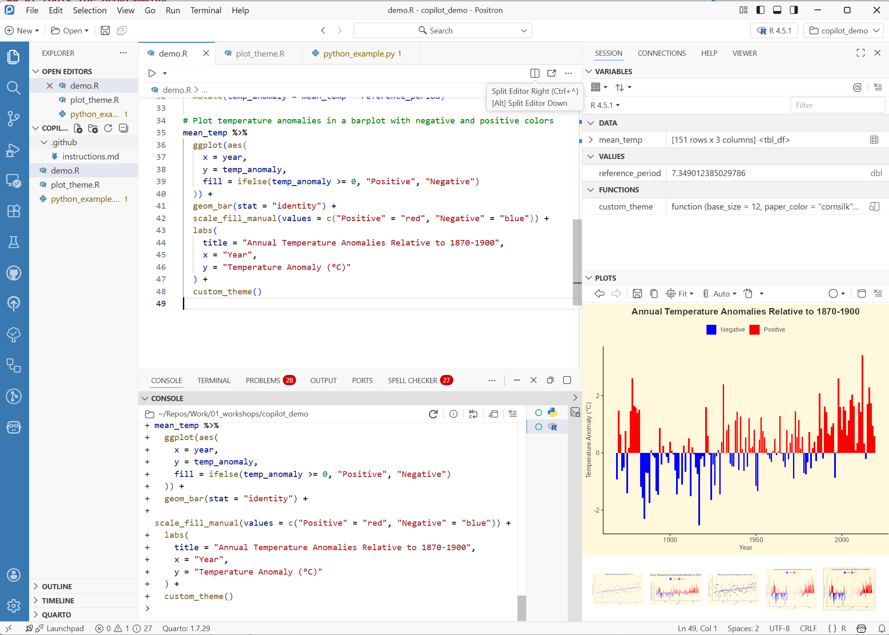

:::
:::

## Code auto-complete

. . .

:::{.columns}

:::{.column width="50%"}

Copilot predicts what you want to write based on

:::{.nonincremental}
-  Current code
-  Open files
-  Comments
:::

:::

:::{.column width="50%"}

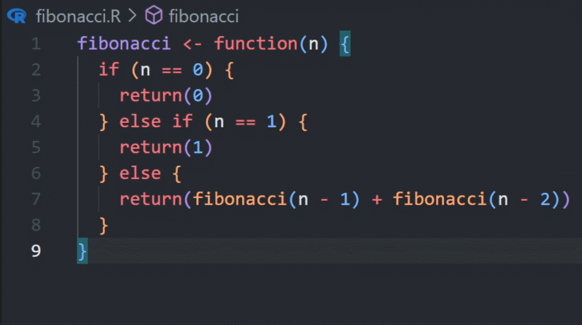

:::

:::
  
## Get better suggestions

. . .

:::{.nonincremental}
- **Provide context**
  - Good comments and names for functions and variables
  - Open other relevant files
:::

. . .

:::{.nonincremental}

- **Adopt a good coding style**
  - GitHub Copilot will imitate your style

:::

. . .

:::{.nonincremental}

- **Acceptance discipline**
  - Don't auto-accept everything
  - Modify suggestions if needed

:::

## Sidebar Chat

:::{.columns}

:::{.column width="50%"}

- Tell GitHub Copilot what to do with your code
- Larger contexts and longer conversations
- Can see: files, console output, project workspace

:::
:::{.column width="50%"}
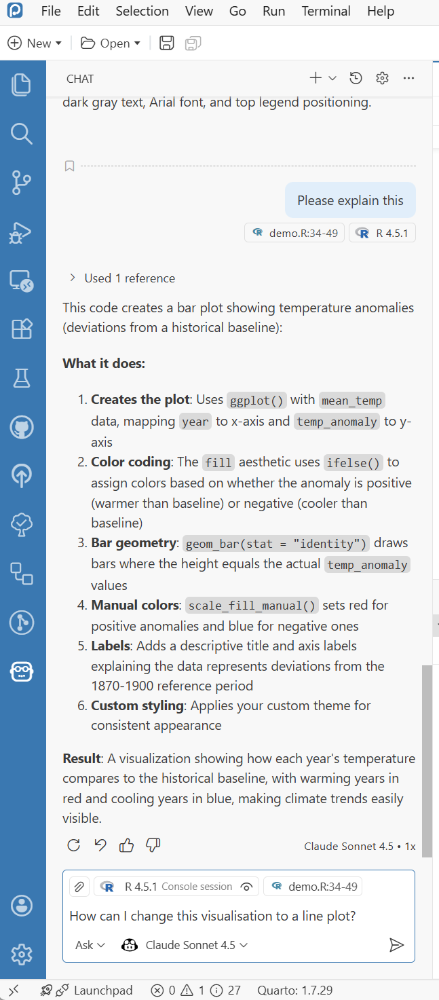{width="60%" fig-align="center"}
:::
:::

## The default context

:::{.nonincremental}
- Context is indicated at the top of the chat
- Default context: current file + console output
- If you highlight code, the highlighted code is added as context
:::

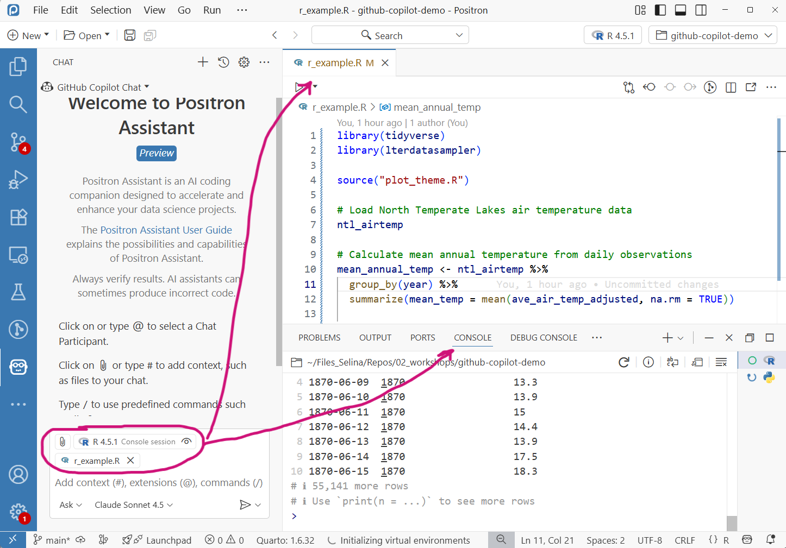{width="55%" fig-align="center"}

## The "Add context" button

:::{.nonincremental}
- Add other files and folders as context with the "Add context" button
:::

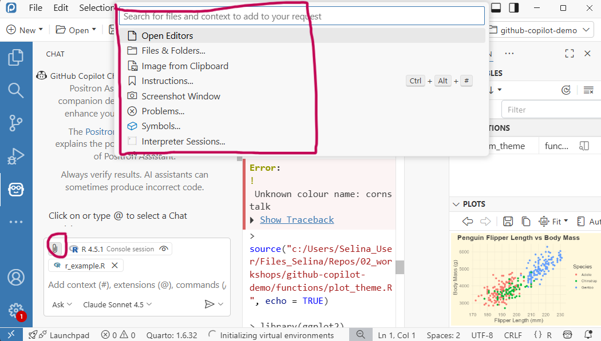{width="55%" fig-align="center"}

## Use @, # or copy-paste

:::{.columns}

:::{.column width="50%"}

`@workspace` adds all files in the project

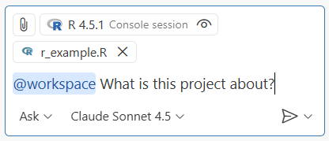
:::
:::{.column width="50%"}
`#file` adds specific files to the context

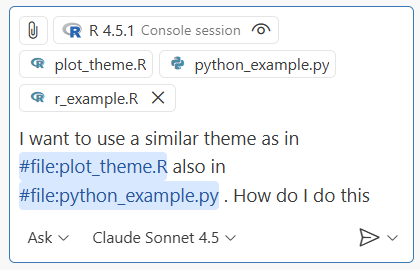

:::
:::

You can also copy paste images (e.g. screenshots) as context in the chatbox

## Sidebar chat: prompt ideas

:::{.columns}
:::{.column width="50%"}

Overview of unfamiliar scripts

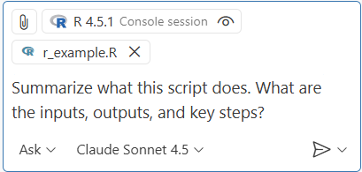

:::

:::{.column width="50%"}

:::{.fragment}

Review your own code

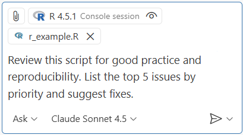

:::

:::
:::

## Sidebar chat: prompt ideas

:::{.columns}
:::{.column width="50%"}

Understand output (errors, warnings, surprising results)

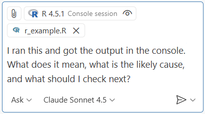

:::

:::{.column width="50%"}

:::{.fragment}

Write project-level documentation draft

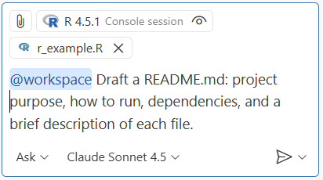

:::

:::
:::

## Advanced features

- **Project-level instruction files**
  - Give instructions that apply to the whole project
  - Special file in `/.github/instructions.md`
- **Agents**: Automate multi-step workflows (use with care)

## Limitations and risks

- Can suggest
  - Outdated functions and code
  - Patterns that are common but not best practice
- GitHub Copilot has no understanding
- Predicts plausible code not necessarily correct code
  - Code can be subtly wrong or inappropriate
- Risk of over-reliance

## Responsible use

- Don't treat AI as an authority: review and double-check
- Use version control as a safety net: review and trace changes
- Privacy: Code, comments and console output may be shared with model providers
  - Beware if you have sensitive data
- Check institutional and journal guidelines
- Transparency: Disclose your use of AI tools
- You are responsible for your scientific output

## Conclusion

- GitHub Copilot can be a great **assistant**
- Support but not replace

## Getting started

:::{.nonincremental}
1. Get GitHub Copilot for free with your educational GitHub account
2. Install Positron
3. Setup GitHub Copilot in Positron
:::

Check out the [lecture website](https://selinazitrone.github.io/tools_and_tips/sessions/15_github-copilot.html) for all relevant information

## Next lecture

#### Topic t.b.a.

 

:date: 15th January :clock4: 4-5 p.m. :round_pushpin: Webex

:bell: [Subscribe to the mailing list](https://lists.fu-berlin.de/listinfo/toolsAndTips)

:e-mail: For topic suggestions and/or feedback [send me an email](mailto:selina.baldauf@fu-berlin.de)

# Thanks for your attention :) {.inverse}
Questions?    
