## Scientific workflows: Tools and Tips :hammer_and_wrench:

:::{.nonincremental}

:date: Every 3rd Thursday :clock4: 4-5 p.m. :round_pushpin: Webex

-   Slides and material provided [online](https://selinazitrone.github.io/tools_and_tips/)
    -   [Subscribe to the mailing list](https://lists.fu-berlin.de/listinfo/toolsAndTips)
-   **Credit points**: send me a private message/email with your name and email

:::

## It's never final


](images/2026_01_15_git-3/never_final.png){fig-align="center" width=38%}

## Why version control?

Git is like a Lab Notebook for your scripts

- **Tracks** every change in your scripts
- Helps you **recover** older versions
- Enables safe and easy **collaboration**
- Makes it easy to **share** your work with others

## Today

- Introduction to **Git**
- Simple Git workflow in **theory and practice**
- Publish your work on **GitHub**
- Find detailed how-to guides on the website

## What is Git?

- **Open source and free** to use version control software

- Quasi **standard** for software development

- **Complete** and **long-term** history of every file in your project

- A whole universe of **other software and services** around it

## What is Git?

- For projects with **mainly text files** (e.g. code, markdown files, ...)

- Basic idea: Take snapshots (**commits**) of your project over time

. . .

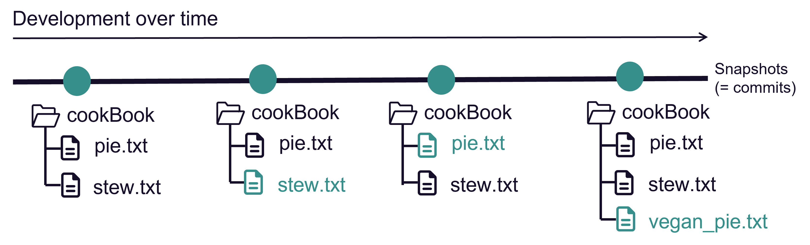

- A project version controlled with Git is a Git **repository** (**repo**)

## Version control with Git

Git is a **distributed version control system**


:::{.fragment}

Idea: many *local* repositories synced via one *remote* repo

<br> 

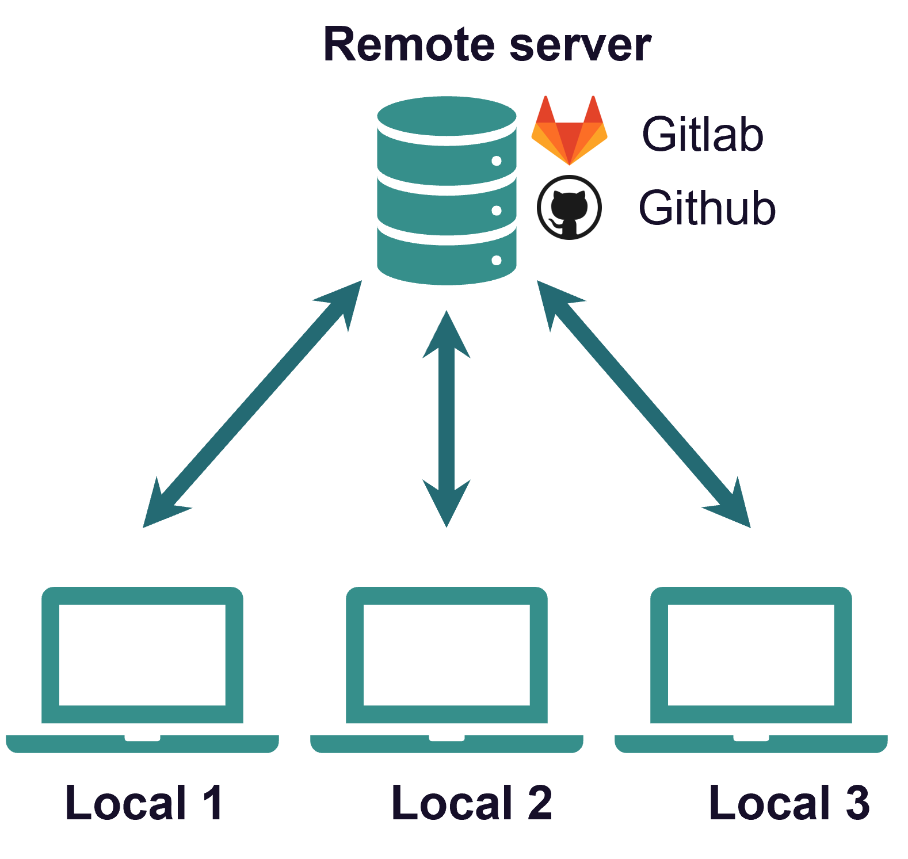{width=40% fig-align="center"}


:::


## How to use Git

After you [installed it](https://www.atlassian.com/de/git/tutorials/install-git) there are different ways to interact with the software.

## How to use Git - Terminal

Using Git from the terminal

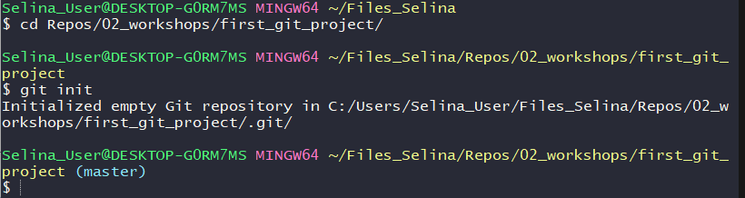

. . . 

:::{.columns}

:::{.column width="50%"}

:heavy_plus_sign: Most control<br>

:heavy_plus_sign: A lot of help/answers online<br>

:::

:::{.column width="50%"}

:::{.fragment}

:heavy_minus_sign: You need to use terminal :scream:<br>

:::

:::

:::

## How to use Git - Integrated GUIs

A Git GUI is integrated in most (all?) IDEs, e.g. R Studio, VS Code

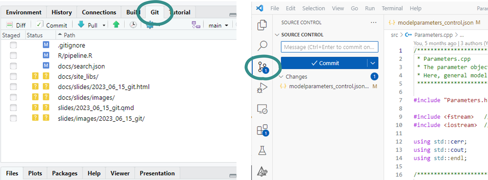{fig-align="center" width=80%}

. . .

:::{.columns}

:::{.column width="50%"}

:heavy_plus_sign: Easy and intuitive <br>

:heavy_plus_sign: Stay inside IDE<br>

:::

:::{.column width="50%"}

:::{.fragment}

:heavy_minus_sign: Different for every program <br>

:::

:::

:::

## How to use Git - Standalone GUIs
  
Standalone Git GUI software, e.g. GitHub Desktop, Source Tree, ...

{width=50% fig-align="center"}

. . .

:::{.columns}

:::{.column width="50%"}

:heavy_plus_sign: Easy and intuitive <br>

:heavy_plus_sign: Use for all projects <br>

:::

:::{.column width="50%"}

:::{.fragment}

:heavy_minus_sign: Switch programs to use Git <br>

:::

:::

:::

## How to use Git

#### Which one to choose?

- Depends on experience and taste
- You can mix methods because they are all interfaces to the same Git

:::{.fragment}

:::{.nonincremental}

- We will use GitHub Desktop
  - Beginner-friendly, intuitive and convenient
  - Nice integration with GitHub

:::

:::

:::{.fragment}

:::{.callout-tip}

Have a look [here](https://selinazitrone.GitHub.io/get-started-with-git/) to find **How-To guides for the other methods** as well.

:::

:::

# The basic Git workflow {.inverse}

> `git init`, `git add`, `git commit`, `git push`

## Example

A cook book project to collect all my favorite recipes.


. . .

In real life this would be e.g. a data analysis project, your thesis in LaTex, 
a software project, ...

## Step 1: Initialize a Git repository

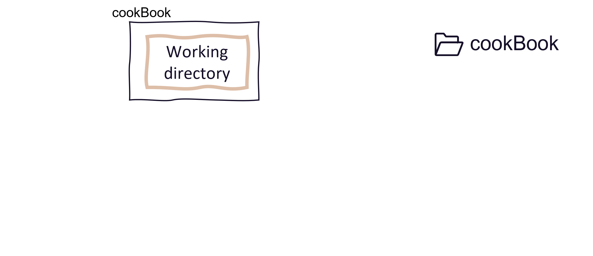

## Step 1: Initialize a Git repository

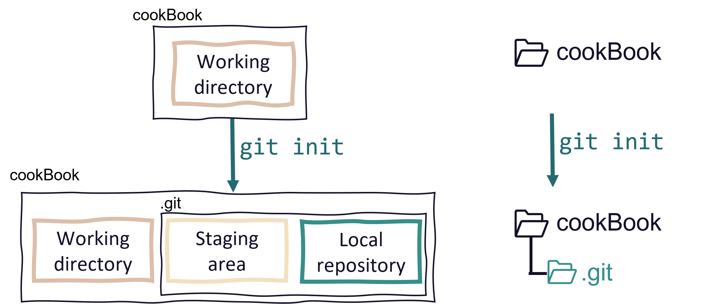

## Step 1: Initialize a Git repository

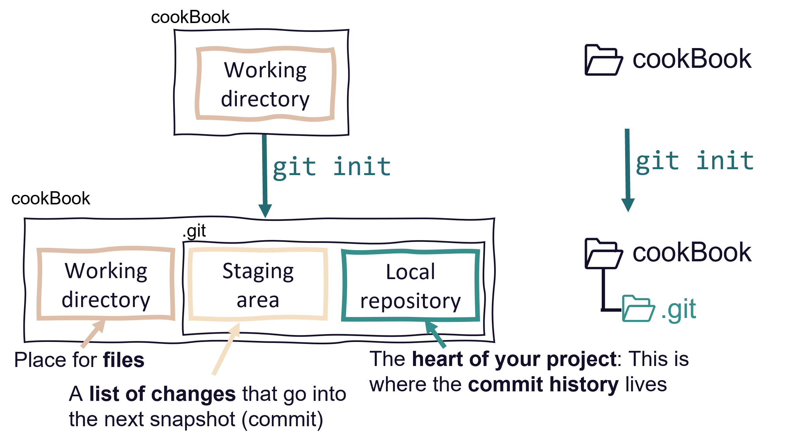


## Step 2: Add and modify files

Git detects any changes in the working directory

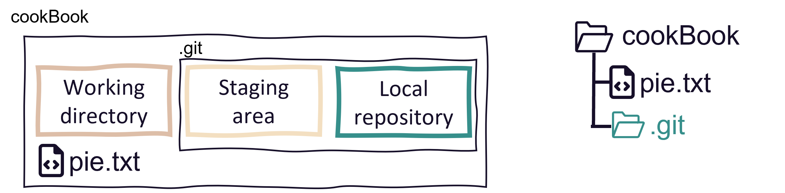

## Step 2: Stage changes

Staging a file means to **list it for the next commit**.


## Step 2: Stage changes

Staging a file means to **list it for the next commit**.

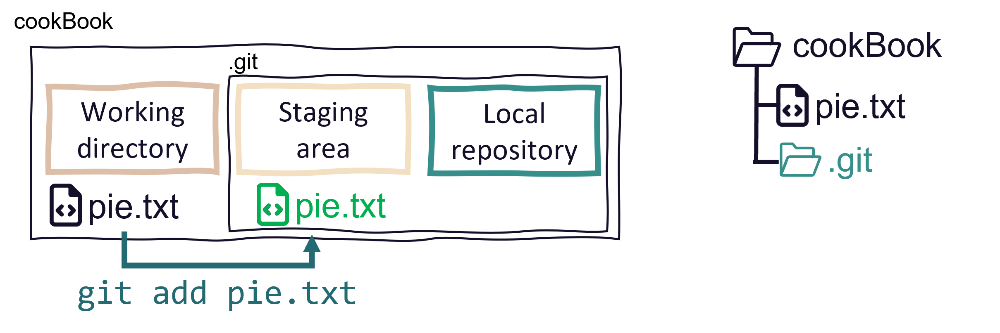

## Step 3: Commit changes

Commits are the snapshots of your project state

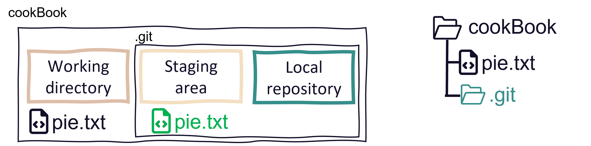

## Step 3: Commit changes

Commits are the snapshots of your project state

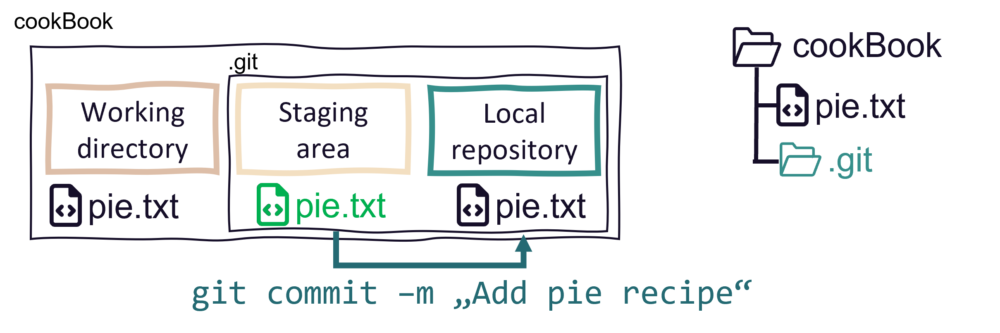

## Step 3: Commit changes

Changes are part of Git history and staging area is clear again 

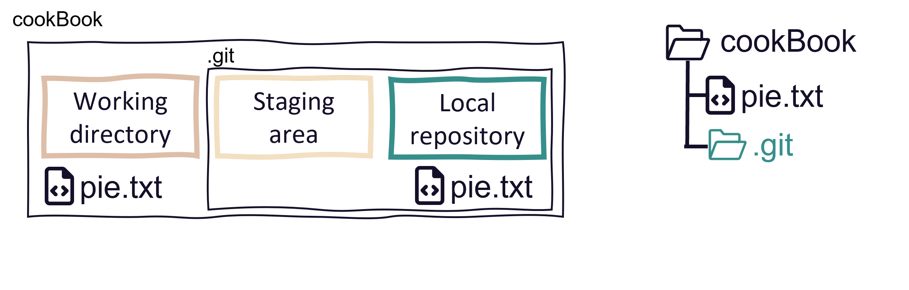

## The commit history

::: {layout="[[-1], [1], [-1]]" layout-valign="bottom"}

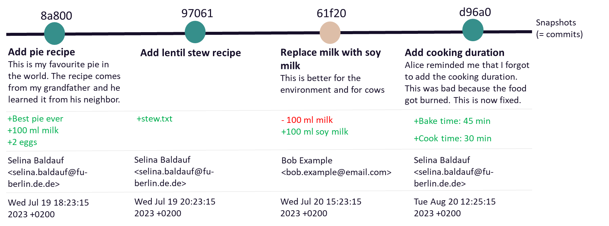

:::

## Good commit messages

 on commit messages](https://imgs.xkcd.com/comics/git_commit.png){fig-align="center" width=70%}

## Good commit messages

Good commit messages are descriptive and helpful.

:::{.columns}

:::{.column width="47%"}

:heavy_check_mark:

```md
Add pie recipe

This is my favorite pie in the world. 
The recipe comes from my grandfather and 
he learned it from his neighbor.
```

:::

:::{.column width="47%"}

:x:

```md
added a file.

This is really good.
```

:::

:::


See [here](https://cbea.ms/git-commit/) for more details on good commit messages.

## Step 4: Share changes with the remote repo

Use remote repos (on a server) to **backup**, **synchronize**, **share** and **collaborate**

::: {.nonincremental}

- can be **private** (you + collaborators) or
**public** (visible to anyone)

:::

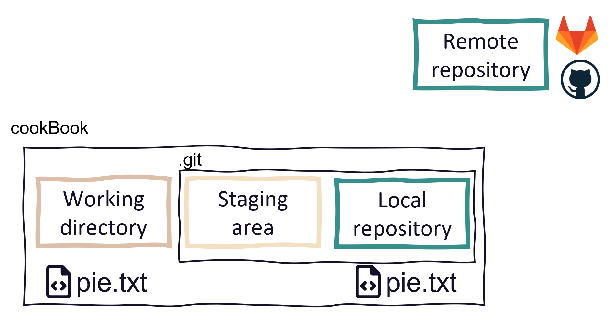{width=60% style="position: relative; bottom: -20px; left: 50%; transform: translateX(-50%);"}

## Step 4: Share changes with the remote repo

Use remote repos (on a server) to **backup**, **synchronize**, **share** and **collaborate**

::: {.nonincremental}

- can be **private** (you + collaborators) or
**public** (visible to anyone)

:::

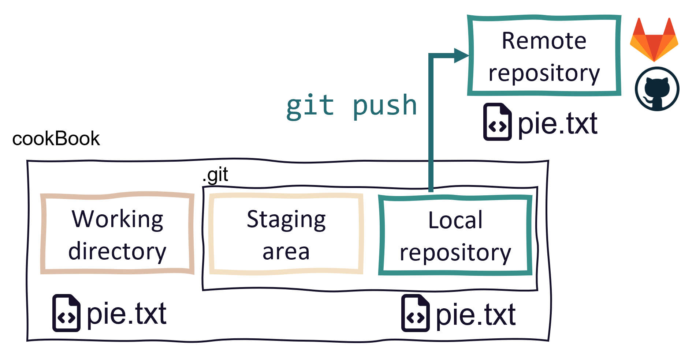{width=60% style="position: relative; bottom: -20px; left: 50%; transform: translateX(-50%);"}

## Recap

:::{.columns}

:::{.column width="70%"}

Basic Git workflow:

:::{.nonincremental}

1. **Initialize** a Git repository
2. **Work** on the project
3. **Stage** and **commit** changes to the local repository
4. **Push** to the remote repository

:::

:::

:::{.column width="30%"}

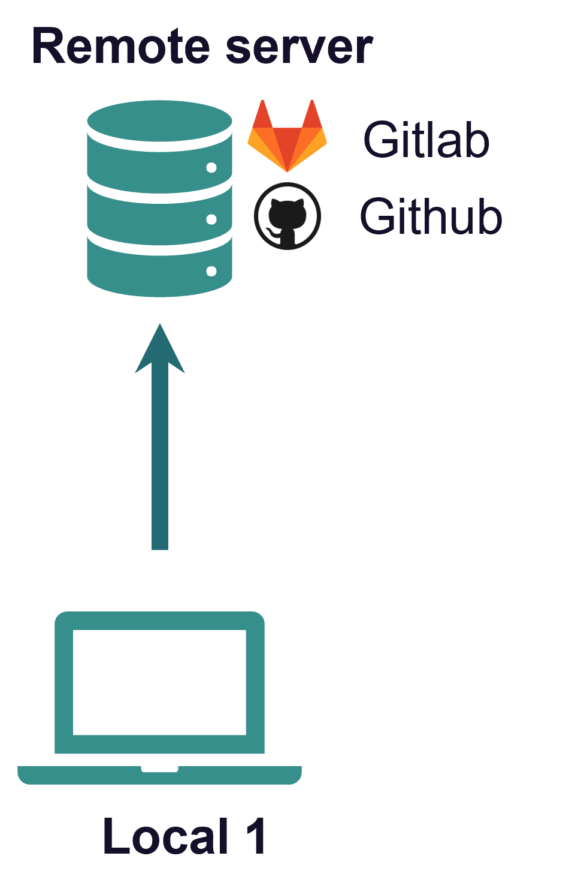{fig-align="center"}

:::

:::


## Recap

:::{.columns}

:::{.column width="70%"}

Basic Git workflow:

:::{.nonincremental}

1. **Initialize** a Git repository
2. **Work** on the project
3. **Stage** and **commit** changes to the local repository
4. **Push** to the remote repository

:::

:::

:::{.column width="30%"}

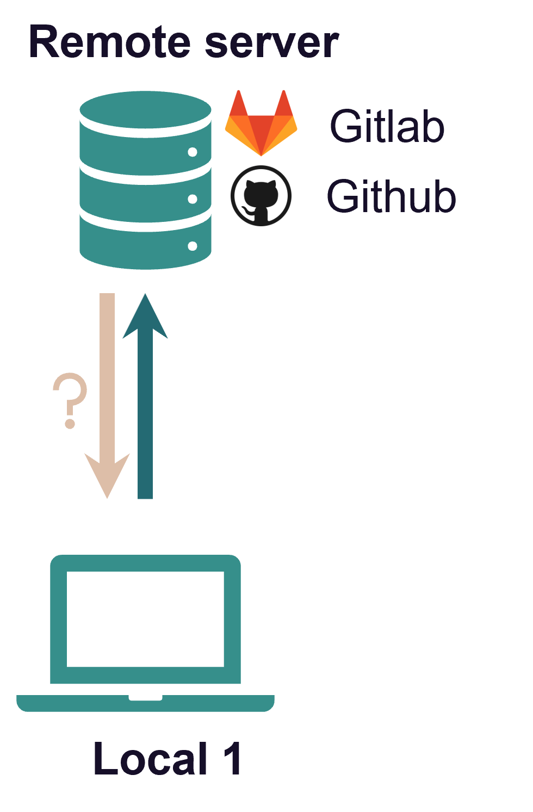{fig-align="center"}

:::

:::

## Recap

Git is a **distributed version control system**

:::{.columns}

:::{.column width="50%"}


:::

:::{.column width="50%"}

::: {.nonincremental}

- Idea: many *local* repositories synced via one *remote* repo

:::

::: {.nonincremental}
- Collaborate with
  - **yourself** on different machines
  - your **colleagues** and friends
  - **strangers** on open source projects

:::

:::

:::

## Get a repo from a remote

In Git language, this is called **cloning**

<br>
You can clone all public repositories and private repositories if you are a owner/collaborator
<br>


## Get a repo from a remote

In Git language, this is called **cloning**

<br>
You can clone all public repositories and private repositories if you are a owner/collaborator
<br>

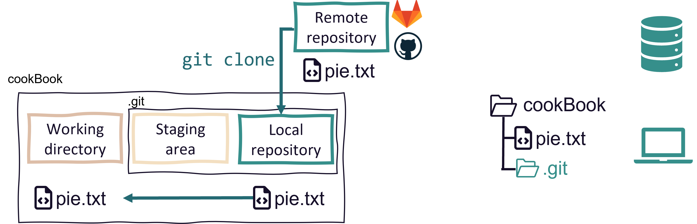

## Get changes from the remote

::: {.nonincremental}

- Local changes, publish to remote: `git push`
- Remote changes, pull to local: `git pull`

:::

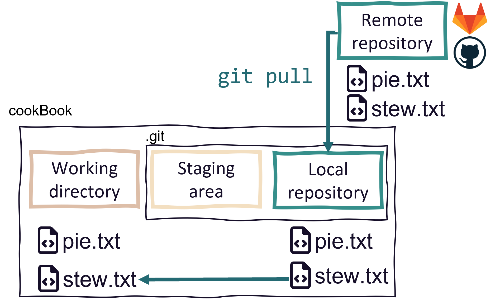{width=63% fig-align="center"}

## A simple collaboration workflow

<br>


::: {.nonincremental}

- One remote repo on GitHub, multiple local repos

:::

- Idea: Everyone works on the same branch
  - **Pull before** you start **working**
  - **Push after** you finished **working**
  
## A simple collaboration workflow {visibility="hidden"}

<br>


This works well if

- Repo is not updated often
- You don't work on the same files simultaneously
- No need to discuss changes before they are integrated
- You collaborate with yourself

## A simple collaboration workflow {visibility="hidden"}

<br>


This workflow starts to be problematic when

- People push often/forget to pull regularly
  - Potential conflicts on main
- You just want to experiment
  - Everything goes directly to main
  
## A branching-merging workflow

<br>

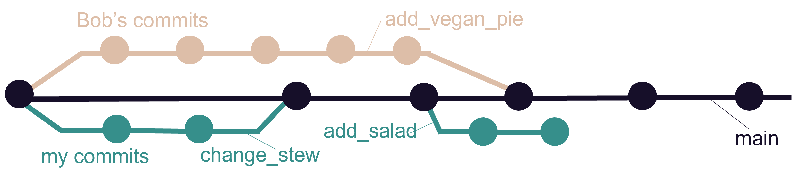

- One remote repo on GitHub, multiple local repos
- Idea: Everyone works on the their **separate branch**
  - **Merge** branch with the main when work is done
- Check out the How-To guide for details

## A branching-merging workflow {visibility="hidden"}

<br>


#### Advantages of this approach {visibility="hidden"}

- Guarantee that main always works
- Potential conflicts don't have to be solved on main
- You can experiment without messing up the main

## Working on a separate branch {visibility="hidden"}

The steps to create and work on a separate branch are easy:


- Create a local branch and switch to it
- Work on the branch like you are used to
  - Make changes, **stage** and **commit**

# Publishing your work {.inverse}

## Remote repositories

- There are **commercial** and **self-hosted** options for your remote repositories
  - Commercial: GitHub, Gitlab, Bitbucket, ...
  - Self-hosted: Gitlab (maybe at your institution?)

- Please be aware of your institutional guidelines
  - Servers outside EU
  - Privacy rules might apply depending on type of data

## Public repositories

- Making a repository public is a good way to publish and share your work
- Always add a README.md file
- Always add a LICENSE file
  - This is important to clarify how others can use your work
- [Connect your repo with Zenodo to get a DOI](https://emilio-berti.GitHub.io/idiv-git-introduction/21-GitHub_zenodo/index.html)

. . . 

If you are interested, browse some nice GitHub repositories for inspiration (e.g.
[Git training repository](https://github.com/UnseenWizzard/git_training), [Computational notebooks](https://github.com/FellowsFreiesWissen/computational_notebooks), [Repo to publish code from a manuscript](https://github.com/oksanabuzh/Buzhdygan_et_al_sCale_Div_Driver))

## Outlook

- Git can do much more than we covered today
  - Complex collaboration workflows with code review steps
  - Rolling back to previous versions
  - Ignoring files from the repository
  - ...
- GitHub et al. offer many more features
  - Issues, pull requests, code review, project management, ...
  - Host websites, wikis, ...
- Start with the basic workflow and build on that

## Next lecture

Semester break in February/March!

### Topic of next lecture t.b.a.

:date: 16th April :clock4: 4-5 p.m. :round_pushpin: Webex

:bell: [Subscribe to the mailing list](https://lists.fu-berlin.de/listinfo/toolsAndTips)

:e-mail: For topic suggestions and/or feedback [send me an email](mailto:selina.baldauf@fu-berlin.de)


# Thanks for your attention {.inverse}

> Questions?

## Summary of the basic steps

:::{.nonincremental}

- `git init`: Initialize a git repository
  - Adds a `.git` folder to your working directory
- `git add`: Add files to the staging area
  - This marks the files as being part of the next commit
- `git commit`: Take a snapshot of your current project version
  - Includes time stamp, commit message and information on the person who did the commit
- `git push`: Push new commits to the remote repository
  - Sync your local project version with the remote e.g. on GitHub

:::

# Undo things {.inverse}

> `git revert`

## Revert changes

- Use `git revert` to revert specific commits
- This does not delete the commit, it creates a **new commit that undoes a previous commit**
  - It's a safe way to undo commited changes

. . .

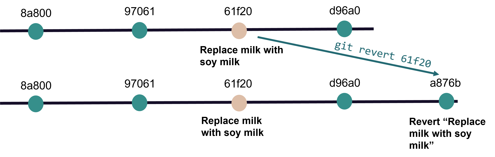{width=90%}


# Go back in time {.inverse}

> `git checkout`

## Checkout a previous commit

Take your work space back in time temporarily with `git checkout`

. . .

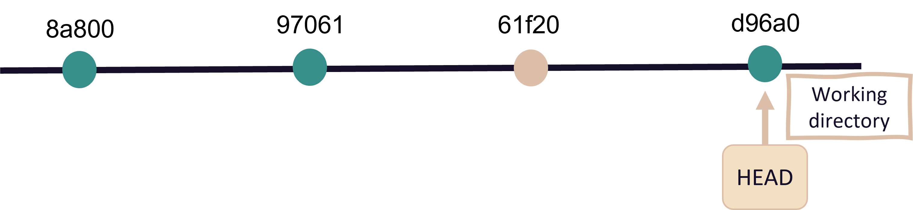{width=85%}

. . .

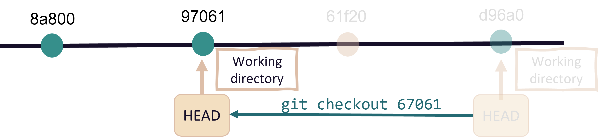{width=85%}


# Ignoring files with `.gitignore` {.inverse}

## Ignore files with `.gitignore`

::: {.nonincremental}

- Useful to ignore e.g.
  - Compiled code and build directories
  - Log files 
  - Hidden system files
  - Personal IDE config files
  - ...
  
:::

## Ignore files with `.gitignore`


- Create a file with the name `.gitignore` in working directory

- Add all files and directories you want to ignore to the `.gitignore` file


#### Example

```md
*.html    # ignore all .html files
*.pdf     # ignore all .pdf files

debug.log # ignore the file debug.log

build/    # ignore all files in subdirectory build
```

See [here](https://www.atlassian.com/git/tutorials/saving-changes/gitignore) for more ignore patterns that you can use.