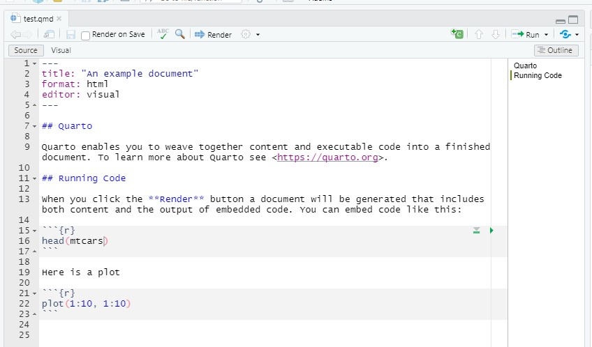
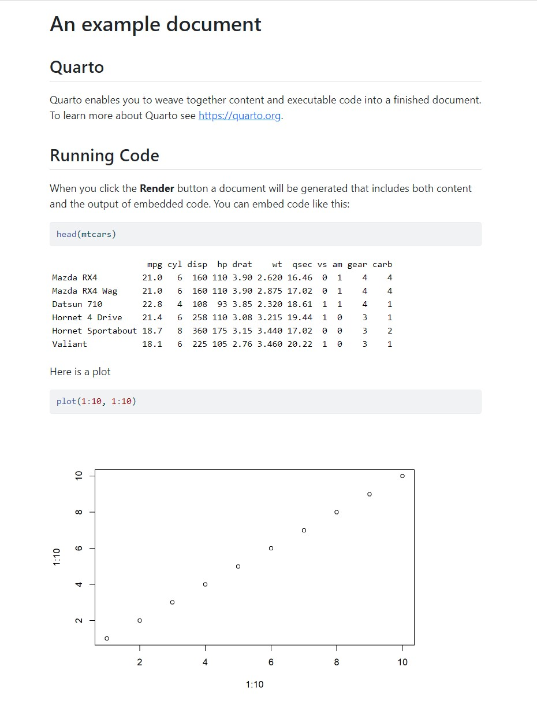
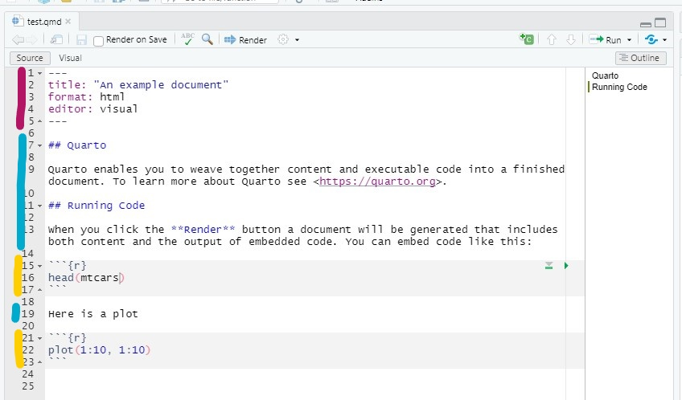

## What is this lecture series?

### Scientific workflows: Tools and Tips :hammer_and_wrench:

::: nonincremental

:date: Every 3rd Thursday :clock4: 4-5 p.m. :round_pushpin: Webex

- One topic from the world of scientific workflows
- Material provided [online](https://selinazitrone.github.io/tools_and_tips/)
- If you don't want to miss a lecture
  - [Subscribe to the mailing list](https://lists.fu-berlin.de/listinfo/toolsAndTips)
- For credit points: Send me a short message (Email or Webex)

:::

## Why an academic website?

- Showcase your work, publications, projects, ...
- It's *yours*, you can take it with you (unlike institutional pages)
- A central place where people can find you and your research

## Tools

There are many tools for static websites, today we use **Quarto**

- Simple, works in RStudio / Positron / VS Code
- Easy to publish for free
- Excellent [documentation](https://quarto.org/docs/websites/)

## What a finished site can look like

Some examples of nice academic Quarto websites:

::: nonincremental

- [Silvia Canelón](https://silviacanelon.com/)
- [Andrew Heiss](https://www.andrewheiss.com/)
- [Sam Csik](https://samanthacsik.github.io/)
- [John Helveston](https://www.jhelvy.com/)

:::

. . .

Goal for today: Build (and publish) a simple personal website with Quarto to perfect later!

## Plan for today

::: nonincremental

1. Quick **Quarto intro/refresher**
2. Basic **website** from scratch
3. Understand and customize an **academic website template**
4. **Publish** your website via GitHub Pages

:::

. . .

To **follow along** you only need:

- Recent version of RStudio (or Positron, VS Code)
- GitHub account (for publishing, optional)

## What is Quarto?

. . .

> Quarto is an open-source scientific and technical publishing system

. . .

Quarto can create many types of output:

::: {.nonincremental}

-   **Documents**: HTML, PDF, Word
-   **Presentations**: HTML, Powerpoint
-   **Books**: HTML, ePub, PDF
-   **Websites**: HTML
- ...

:::

## What is Quarto?


::: {.columns}

::: {.column}

A Quarto document (`.qmd`) is basically a text file



:::

::: {.column}

:::{.fragment}

When you **render** it, Quarto turns it into a nice HTML/PDf/etc. 



:::

:::

:::

## Basic components of a Quarto document

```{=html}
<style>
.highlight-pink { background-color: #e83e8c; color: #100F0F; padding: 0.1em 0.2em; font-weight: bold; }
.highlight-blue { background-color: #4a9ed9; color: #100F0F; padding: 0.1em 0.2em; font-weight: bold; }
</style>
```

::: {.columns}

::: {.column}

A Quarto document (`.qmd`) is basically a text file



:::

::: {.column}

A Quarto document (`.qmd`) has three components:

  - [**YAML** header]{.highlight-pink} for metadata and configuration
  - [**Markdown** text]{.highlight-blue}
  - (Optional) [**code** chunks]{.highlight-ylw} (R, Python, Julia, ...)

:::

:::

## The YAML header

::: {.columns}

::: {.column}

```yaml
---
title: "An example document"
author: "Selina Baldauf"
date: "2023-05-11"
format:
  html:
    theme: cosmo
    toc: true
```

:::

::: {.column}


- Between --- at the top of the file
- Metadata + settings in key: value form
  - Careful with indentation and alignment

:::

:::

## The Markdown text

::: {.columns}

::: {.column}

You write content like this:

````markdown
# A section header

## A subsection header

Some **bold** and *italic* text and a
[link to Quarto](https://quarto.org).

- First bullet
- Second bullet
- Third bullet
````

:::

::: {.column}

And it will render like this:

### A section header

#### A subsection header

Some **bold** and *italic* text and a
[link to Quarto](https://quarto.org).

:::{.nonincremental}
- First bullet
- Second bullet
- Third bullet
:::

:::

:::

. . .

:::{.callout-note}

Checkout other [Quarto Markdown Basics](https://quarto.org/docs/authoring/markdown-basics.html)

:::

# A Quarto website from scratch {.inverse}

> A Quarto *website* is just: **several `.qmd` files + one `_quarto.yml` config file**

## Quarto website summary

- Quarto website = a folder of `.qmd` files for **content** + `_quarto.yml` for **configuration**
- To add a page: create a `.qmd` and add it to the navbar in `_quarto.yml`
- See your changes: Render the project

# Building an academic website {.inverse}

> Create a personal website from a template

## The template

## Get the template

:::{.nonincremental}

1. Download the template from the link in chat
2. Unzip and open the `.Rproj` file in RStudio
3. Click **Render** to see the template site

:::

## Project structure

::: nonincremental

| File / Folder | Purpose |
|---|---|
| `_quarto.yml` | Site-wide config (navbar, theme, footer) |
| `index.qmd` | Home page |
| `about.qmd` | About page with your profile/CV |
| `publications.qmd` | Publications page |
| `blog.qmd` + `posts/` | Blog listing + individual posts |
| `styles.css` | Small custom style tweaks |

:::

## Customize the `_quarto.yml` {.inverse}

::: nonincremental

> :pencil2: **Exercise (5 min):**
>
> 1. Change the site `title` and footer `text`
> 2. Browse the themes from the [theme list](https://quarto.org/docs/output-formats/html-themes.html) and swap the `theme` value
> 3. Render and see what changed

:::

:::{.callout-note}

## If you finish early

Find out which other elements you could customize in the `_quarto.yml` on the Quarto website:

:::{.nonincremental}

- [Website Navigation](https://quarto.org/docs/websites/website-navigation.html): Navbar, footer options, etc.
- [Theming options](https://quarto.org/docs/output-formats/html-themes.html): Change some colors, font sizes, etc.

:::

:::

## Customize the landing page `index.qmd` {.inverse}

::: nonincremental

> :pencil2: **Exercise (5 min):**
>
> 1. Replace the placeholder text with a short bio
> 2. YAML: Update the `links:`, delete what doesn't apply, add your own
> 3. YAML: Try a different `template:` and re-render
> 4. (Optional) Add a photo to the project folder and update the image path

:::

:::{.callout-note}

Get an overview of the available [About page templates](https://quarto.org/docs/websites/website-about.html#templates)

:::

## Customize `about.qmd` and `publications.qmd` {.inverse}

::: nonincremental

> :pencil2: **Exercise (5 min):**
>
> Replace the placeholder content with your own content. 
> You can also just add some lines and experiment with Markdown formatting. You can do the full content later.

:::

:::{.callout-note}

Find a markdown reference on the Quarto website: [Markdown Basics](https://quarto.org/docs/authoring/markdown-basics.html)

:::

## Add a blog post {.inverse}

::: nonincremental

> :pencil2: **Exercise (5 min):**
>
> 1. Create a new folder in `posts/`, add an `index.qmd` with a title, date, and a few lines of text
> 2. Render and check that it appears in the blog listing
> 3. (Optional) Try changing listing type `type: default` to `type: grid` in `blog.qmd`

:::

::: {.callout-note}

Find out about [listing page types](https://quarto.org/docs/websites/website-listings.html)

:::

## Custom styling with SCSS

Themes are a starting point. If you want to tweak colors, fonts, or spacing, you can use SCSS.

Wire it into `_quarto.yml`:

```yaml
format:
  html:
    theme: [cosmo, custom.scss]
```

. . .

::: nonincremental

- **Want to go further?**
  - [Quarto theming docs](https://quarto.org/docs/output-formats/html-themes.html#theme-options)
  - Pick colors with [coolors.co](https://coolors.co) or [Adobe Color](https://color.adobe.com)

:::

# Publishing a website {.inverse}

## How publishing works

::: nonincremental

1. When you **render**, Quarto produces a folder of HTML, CSS, and image files
2. A **hosting service** stores those files and serves them at a public URL
3. That's the entire concept: **render → upload → live**

:::

. . .

**Options:** GitHub Pages, Netlify, Posit Connect Cloud, university web server, ...

Today we use **GitHub Pages**: free, reliable, and standard in academia.

## Publishing to GitHub Pages

::: nonincremental

Three steps:

1. Tell Quarto to **render to `docs/`** by adding `output-dir: docs` in `_quarto.yml`
2. **Push to GitHub**: create a repo and push your project
3. **Turn on Pages** in the repo settings

:::

. . .

Your site will be live at `https://<username>.github.io/<reponame>/`

## Step 1: Render to `docs/`

Add this to `_quarto.yml`:

```yaml
project:
  type: website
  output-dir: docs
```

Then render again.

## Step 2: Push to GitHub

- I'll demo this with **GitHub Desktop** (easiest for beginners)
- If you use Git from the terminal or RStudio, that works too

. . .

::: nonincremental

1. Open GitHub Desktop → **Add Existing Repository** (or create new)
2. Commit all files
3. **Publish repository** to GitHub

:::

## Step 3: Turn on GitHub Pages

::: nonincremental

On your GitHub repo page:

1. **Settings** → **Pages** (left sidebar)
2. Source: **Deploy from a branch**
3. Branch: **main**, folder: **/docs**
4. Click **Save**
5. Wait ~1-2 min → your site is live :tada:

:::

## Exercise: Publish your website {.inverse}

::: nonincremental

> :pencil2: **Now you: publish your website!**
>
> Follow the three steps. If your site is live, **drop the URL in the chat**!
>
> If you don't have Git set up, follow along conceptually. I'll share a written guide with screenshots so you can finish at your own pace.

:::

## Updating your site later

The workflow from now on:

::: nonincremental

1. **Edit** your `.qmd` files
2. **Render**
3. **Commit and push** (Git pane or GitHub Desktop)
4. GitHub rebuilds automatically, changes are live in ~1 min

:::

. . .

That's it. Welcome to having a website. :tada:

# Wrap up {.inverse}

> Where to go from here

## What you built today

::: nonincremental

- Built a Quarto website from scratch
- Customized the main page types: **About pages**, **plain pages**, **listing pages**
- Configured the site through `_quarto.yml` (themes, navbar, footer)
- Published to GitHub Pages

:::

. . .

That's the whole core skill set. Everything else is variations and extras.

## Inspiration: academic Quarto sites

| Site | Highlights |
|---|---|
| [Silvia Canelón](https://silviacanelon.com/) | Beautiful design, custom styling |
| [Andrew Heiss](https://www.andrewheiss.com/) | Rich academic content, blog, teaching |
| [Sam Csik](https://samanthacsik.github.io/) | Clean structure, well-organized |
| [John Helveston](https://www.jhelvy.com/) | Great publications page |

. . .

:bulb: **Tip**: Find their GitHub repos and look at the source code!

More examples: [Gang He's curated list](https://drganghe.github.io/quarto-academic-site-examples.html)

## Where to go next

::: nonincremental

- Point your own **custom domain** (`yourname.com`) at your GitHub Pages site
- Switch to a **`.bib` file** for automatic publication formatting ([docs](https://quarto.org/docs/authoring/citations.html))
- Go deeper into **SCSS** for custom styling
- Add **Google Analytics** or **Plausible** to see who visits ([docs](https://quarto.org/docs/websites/website-tools.html#google-analytics))
- Write your **first real blog post**: research note, conference takeaways, tutorial

:::

## Next lecture

#### Topic tba

<br>

:date: tba :clock4: 4-5 p.m. :round_pushpin: Webex

:bell: [Subscribe to the mailing list](https://lists.fu-berlin.de/listinfo/toolsAndTips)

:e-mail: For topic suggestions and/or feedback [send me an email](mailto:selina.baldauf@fu-berlin.de)

# The end :) {background-color="#2c2c2c"}

Questions?

## References

::: nonincremental

- [Quarto website documentation](https://quarto.org/docs/websites/)
- [Get started with Quarto](https://quarto.org/docs/get-started/)
- [HTML themes overview](https://quarto.org/docs/output-formats/html-themes.html)
- [About page templates](https://quarto.org/docs/websites/website-about.html)
- [Listing pages (blogs, publications, ...)](https://quarto.org/docs/websites/website-listings.html)
- [Publishing options](https://quarto.org/docs/publishing/)
- [Adding a blog to a Quarto website](https://samanthacsik.github.io/posts/2022-10-24-quarto-blogs/) (Sam Csik)
- [Academic site examples](https://drganghe.github.io/quarto-academic-site-examples.html) (Gang He)

:::
