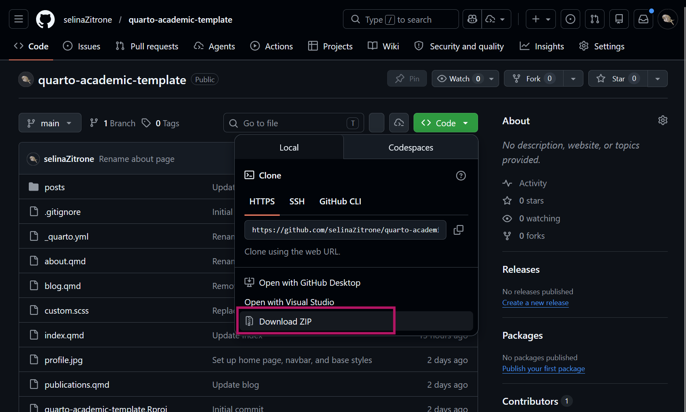

## What is this lecture series?

### Scientific workflows: Tools and Tips :hammer_and_wrench:

::: nonincremental

:date: Every 3rd Thursday :clock4: 4-5 p.m. :round_pushpin: Webex

- One topic from the world of scientific workflows
- Material provided [online](https://selinazitrone.github.io/tools_and_tips/)
- If you don't want to miss a lecture
  - [Subscribe to the mailing list](https://lists.fu-berlin.de/listinfo/toolsAndTips)
- For credit points: Send me a short message (Email or Webex)

:::

## Why an academic website?

- Showcase your work, publications, projects, ...
- It's *yours*, you can take it with you (unlike institutional pages)
- A central place where people can find you and your research

## Tools

There are many tools for static websites, today we use **Quarto**

- Simple, works in RStudio / Positron / VS Code
- Easy to publish for free
- Excellent [documentation](https://quarto.org/docs/websites/)

## What a finished site can look like

Some examples of nice academic Quarto websites:

::: nonincremental

- [Silvia Canelón](https://silviacanelon.com/)
- [Andrew Heiss](https://www.andrewheiss.com/)
- [Sam Csik](https://samanthacsik.github.io/)
- [John Helveston](https://www.jhelvy.com/)

:::

. . .

Goal for today: Build (and publish) a simple personal website with Quarto to perfect later!

## Plan for today

::: nonincremental

1. Quick **Quarto intro/refresher**
2. Basic **website** from scratch
3. Understand and customize an **academic website template**
4. **Publish** your website via GitHub Pages

:::

. . .

To **follow along** you only need:

- Recent version of RStudio (or Positron, VS Code)
- GitHub account (for publishing, optional)

## What is Quarto?

. . .

> Quarto is an open-source scientific and technical publishing system

. . .

Quarto can create many types of output:

::: {.nonincremental}

-   **Documents**: HTML, PDF, Word
-   **Presentations**: HTML, Powerpoint
-   **Books**: HTML, ePub, PDF
-   **Websites**: HTML
- ...

:::

## What is Quarto?


::: {.columns}

::: {.column}

A Quarto document (`.qmd`) is basically a text file


:::

::: {.column}

:::{.fragment}

When you **render** it, Quarto turns it into a nice HTML/PDf/etc. 


:::

:::

:::

## Basic components of a Quarto document

```{=html}
<style>
.highlight-pink { background-color: #e83e8c; color: #100F0F; padding: 0.1em 0.2em; font-weight: bold; }
.highlight-blue { background-color: #4a9ed9; color: #100F0F; padding: 0.1em 0.2em; font-weight: bold; }
</style>
```

::: {.columns}

::: {.column}

A Quarto document (`.qmd`) is basically a text file


:::

::: {.column}

A Quarto document (`.qmd`) has three components:

  - [**YAML** header]{.highlight-pink} for metadata and configuration
  - [**Markdown** text]{.highlight-blue}
  - (Optional) [**code** chunks]{.highlight-ylw} (R, Python, Julia, ...)

:::

:::

## The YAML header

::: {.columns}

::: {.column}

```yaml
---
title: "An example document"
author: "Selina Baldauf"
date: "2023-05-11"
format:
  html:
    theme: cosmo
    toc: true
---
```

:::

::: {.column}


- Between `---` at the top of the file
- Metadata + config in "key: value" form
- Careful with indentation and alignment of nested elements

:::

:::

## The Markdown text

::: {.columns}

::: {.column}

You write content like this:

````markdown
# A section header

## A subsection header

Some **bold** and *italic* text and a
[link to Quarto](https://quarto.org).

- First bullet
- Second bullet
````

:::

::: {.column}

And it will render like this:

### A section header

#### A subsection header

Some **bold** and *italic* text and a
[link to Quarto](https://quarto.org).

:::{.nonincremental}
- First bullet
- Second bullet
:::

:::

:::

. . .

:::{.callout-note}

## Other Quarto Markdown Basics

Checkout the [Quarto docs](
https://quarto.org/docs/authoring/markdown-basics.html)

:::

# A Quarto website from scratch {.inverse}

> Quarto website = a folder of `.qmd` files for **content** + `_quarto.yml` for **configuration**

## Project structure

Create a Website project in R Studio: <br>
File > New Project > New Directory > Quarto Website

| File | Purpose |
|---|---|
| `_quarto.yml` | Site-wide config (navbar, theme, etc.) |
| `index.qmd` | Home page |
| `about.qmd` | About page |
| `styles.css` | Small custom style tweaks |
| `project-name.Rproj` | The R project file to open the project |

## Quarto website summary

- Quarto website = a folder of `.qmd` files for **content** + `_quarto.yml` for **configuration**
- To add a page: create a `.qmd` and add it to the navbar in `_quarto.yml`
- See your changes: Render the project

# Building an academic website {.inverse}

> Create a personal website from a template

## Get the template

:::{.nonincremental}

1. Download the template from [here](https://github.com/selinaZitrone/quarto-academic-template)
2. Unzip and open the `.Rproj` file in RStudio
3. Click **Render** to see the template site

:::

{width="70%"}

## Project structure

::: nonincremental

| File / Folder | Purpose |
|---|---|
| `_quarto.yml` | Site-wide config (navbar, theme, footer) |
| `index.qmd` | Home page |
| `about.qmd` | About page with your profile/CV |
| `publications.qmd` | Publications page |
| `blog.qmd` + `posts/` | Blog listing + individual posts |
| `styles.css` | Small custom style tweaks |

:::

## Customize the `_quarto.yml` {.inverse}

::: nonincremental

> :pencil2: **Exercise (5 min):**
>
> 1. Change the site `title` and `footer` text
> 2. Browse the themes from the [theme list](https://quarto.org/docs/output-formats/html-themes.html) and swap the `theme` value for what you like most
> 3. Render and see what changed

:::

:::{.callout-note}

## Learn more about `_quarto.yml` configuration

:::{.nonincremental}

- [Website Navigation](https://quarto.org/docs/websites/website-navigation.html): Navbar, footer options, etc.
- [Theming options](https://quarto.org/docs/output-formats/html-themes.html): Change some colors, font sizes, etc.

:::

:::

## Customize the landing page `index.qmd` {.inverse}

::: nonincremental

> :pencil2: **Exercise (10 min):**
>
> 1. Replace the placeholder text with a short bio
> 2. YAML: Update the `links`, delete what doesn't apply, add what's missing
> 3. YAML: Try a different `template` and re-render
> 4. (Optional) Add a photo to the project folder and update the image path

:::

:::{.callout-note}

## Learn more about "About page templates"

Check out the [Quarto docs](https://quarto.org/docs/websites/website-about.html#templates)

:::

## Customize `about.qmd` and `publications.qmd` {.inverse}

::: nonincremental

> :pencil2: **Exercise (5 min):**
>
> Replace the placeholder content with your own content. 
> You can also just add some lines and experiment with Markdown formatting. You can do the full content later.

:::

:::{.callout-note}

## Learn more about Markdown

Checkout the [Markdown Basics](https://quarto.org/docs/authoring/markdown-basics.html) on the Quarto website

:::

## Add a blog post {.inverse}

::: nonincremental

> :pencil2: **Exercise (10 min):**
>
> 1. Create a new folder in `posts/`, add an `index.qmd` with a title, date, and a few lines of text
> 2. Render and check that it appears in the blog listing
> 3. (Optional) Try changing listing `type` from `default` to `grid` or `table` in `blog.qmd` and render to see the difference

:::

::: {.callout-note}

## Learn more about listing page types

Check out the [Quarto docs](https://quarto.org/docs/websites/website-listings.html)

:::

## Custom styling with SCSS

Themes are a starting point. If you want to tweak colors, fonts, or spacing, you can use SCSS.

Wire it into `_quarto.yml`:

```yaml
format:
  html:
    theme: [cosmo, custom.scss]
```

:::{.callout-note}

## Learn more about theming and custom styling

:::{.nonincremental}

- [Quarto theming docs](https://quarto.org/docs/output-formats/html-themes.html#theme-options)
- [Different variables](https://quarto.org/docs/output-formats/html-themes.html#sass-variables) you can set in custom SCSS

:::

:::

# Publishing a website {.inverse}

## How publishing works

::: nonincremental

1. When you **render**, Quarto produces a folder of HTML, CSS, and image files (default: `_site/`)
2. Upload these files to a **hosting service** that stores the files and serves them at a public URL

:::

. . .

**Hosting options:** GitHub Pages, Netlify, Posit Connect Cloud, university web server, ...

## Publish your website {.inverse}

::: nonincremental

> :pencil2: **Exercise (10 min):**
>
> Follow the step-by-step guide. If your site is live, **drop the URL in the chat**!
>

:::

## Updating your site later

::: nonincremental

1. **Edit** your `.qmd` files
2. **Render**
3. **Commit and push** (Git pane or GitHub Desktop)
4. GitHub rebuilds automatically, changes are live in ~1 min

:::

# Wrap up {.inverse}

> Where to go from here

## Today

::: nonincremental

- Built a Quarto website from scratch
- Customized the main page types: **About pages**, **plain pages**, **listing pages**
- Configured the site through `_quarto.yml` (themes, navbar, footer)
- Published to GitHub Pages

:::

## Inspiration: academic Quarto sites

People are nice and provide source code for their websites. If you see elements that you like, you can check out how they did it and adapt it for your own site.

| Site | Source code |
|---|---|
| [Silvia Canelón](https://silviacanelon.com/) | [https://github.com/spcanelon/silvia](https://github.com/spcanelon/silvia) |
| [Andrew Heiss](https://www.andrewheiss.com/) | [https://github.com/andrewheiss/ath-quarto](https://github.com/andrewheiss/ath-quarto) |
| [Sam Csik](https://samanthacsik.github.io/) | [https://github.com/samanthacsik/samanthacsik.github.io](https://github.com/samanthacsik/samanthacsik.github.io) |
| [John Helveston](https://www.jhelvy.com/) | [https://github.com/jhelvy/jhelvy_quarto](https://github.com/jhelvy/jhelvy_quarto) |

More examples from [Gang He's curated list](https://drganghe.github.io/quarto-academic-site-examples.html)

## Next steps


- Customize your website
  - Add relevant content and pages
  - Customize the look with **SCSS** for custom styling
- Use your **custom domain** (`yourname.com`) for your GitHub Pages site
- Get an overview of other Quarto website features on the [Quarto docs](https://quarto.org/docs/websites/).

## Next lecture/workshop

#### Topic tba

<br>

:date: 21.05.2026 :clock4: 4-5/6 p.m. :round_pushpin: Webex

:bell: [Subscribe to the mailing list](https://lists.fu-berlin.de/listinfo/toolsAndTips)

:e-mail: For topic suggestions and/or feedback [send me an email](mailto:selina.baldauf@fu-berlin.de)

# The end :) {background-color="#2c2c2c"}

Questions?
