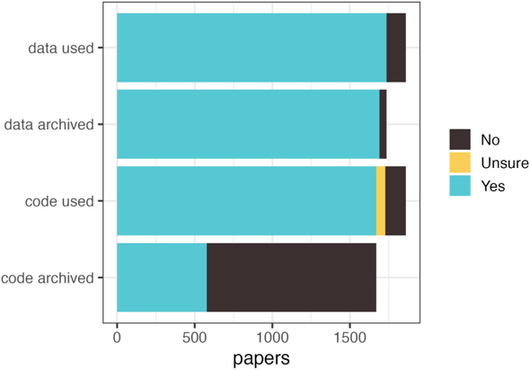

<!--
DRAFT STATUS: Sections 0-5 drafted.
Next rounds: last look (6), AI help + portable prompt (7), checklist & take-aways (8).
Red thread: the phd_analysis repo improves every section, SLIDES ONLY
(no live cleaning). New lines in each after-tree are marked "<- new".

IMAGES NEEDED so far (slides/images/2026_07_16_code-sharing/):
- cooper-2026-figure.png : figure from Cooper et al. 2026 (BES journals,
  data 2017-2024). TODO Selina: export from the paper, confirm the exact
  citation, the headline stat, and the figure licence (BES journals are
  usually CC-BY, confirm).
Full asset list: see "Slide visuals & assets" in the plan.
-->

## What is this lecture series?

### Scientific workflows: Tools and Tips :hammer_and_wrench:

::: nonincremental

:date: Every 3rd Thursday :clock4: 4-5 p.m. :round_pushpin: Webex

-   One topic from the world of scientific workflows
-   Material provided [online](https://selinazitrone.github.io/tools_and_tips/)
-   If you don't want to miss a lecture
    -   [Subscribe to the mailing list](https://lists.fu-berlin.de/listinfo/toolsAndTips)

:::

## Sharing code is still the exception

::: {.columns}

::: {.column width="55%"}

{fig-alt="Bar chart of 1861 papers in British Ecological Society journals: nearly all papers that used data archived it, but only about a third of papers that used code archived the code."}

:::

::: {.column width="45%"}

::: {.fragment}

1861 papers, 7 journals, 2017-2024:

-   Data is archived almost every time
-   Code is archived by **only 35%** of the papers that used it

:::

:::

:::

::: aside
[Cooper et al. (2026)](https://doi.org/10.1111/2041-210X.70338), *Methods in Ecology and Evolution*
:::

. . .

And where code *was* archived, the problem was rarely the download.

It was that nobody outside the original group could **understand** it: about a third had no README.

. . .

Today: how to end up on the good side of this plot, with reasonable effort.

## Meet our example project

Your paper is accepted: *"Temperature and antibiotic resistance in soil bacteria"*.

This is the folder behind it, grown organically over three years:

::: {.fragment}

```
phd_analysis/
├── analysis.R
├── analysis_final.R
├── analysis_final_v2_REALLY.R
├── data_new.xlsx
├── data_new_fixed2.xlsx
├── plots_old/
├── final_figures_USE_THESE/
├── old_stuff/
└── test.R
```

:::

. . .

It works. On your laptop. If you remember which script to run.

## The day you have to share it

::: nonincremental

-   The journal asks for a **code availability statement**
-   A **collaborator** wants to build on your analysis
-   A **new PhD student** takes over the project
-   **Future you** comes back after two years

:::

. . .

<br>

The folder will not clean itself up. And maybe the code does not even run anymore.

. . .

**Today we take this repository from messy to publishable**, step by step. You watch it improve section by section; at the end you get the same steps as a checklist.

## Why share your code properly?

. . .

:arrows_counterclockwise: **Reproducibility** Others can redo your analysis and trust the results
<br><br>

. . .

:gear: **Reuse** Others (and you) can build on it instead of starting over
<br><br>

. . .

:mag: **Visibility** Credit, collaboration opportunities, citable output
<br><br>

. . .

:crystal_ball: **Continuity** Future you can pick the project up again after two years

## Today: the minimum publishable repository

. . .

Shareable ≠ perfect. We focus on the **minimum requirements**, in five steps:

::: {.nonincremental}

1.  **Structure & orientation** · Can someone understand it?
2.  **Running it** · Can someone rerun it?
3.  **Data** · Can someone understand the data situation?
4.  **Licence & citation** · Can someone legally reuse and cite it?
5.  **Archive & publish** · Can someone find the exact version you used?

:::

. . .

Each section adds items to a **checklist** that you take home at the end.

At the end: **AI tools** that run this checklist for you.

## What this lecture is (and is not)

::: nonincremental

-   About **data-analysis projects**, not research software
-   **Language-agnostic**: everything applies to R, Python, or anything else (with one-line R/Python pointers)
-   About the **project around the code** (structure, data, licence, archive), not code polish

:::

. . .

<br>

And one reassurance up front:

**"I can't share my data" ≠ "I can't share."** Sensitive or restricted data is normal in your fields; there is an accepted way to publish anyway (section 3).

# 1. Structure & orientation {background-color="#2c3e50"}

### Can someone understand what this is?

## The first thing a stranger sees

::: {.columns}

::: {.column width="48%"}

Our repository today:

```
phd_analysis/
├── analysis.R
├── analysis_final.R
├── analysis_final_v2_REALLY.R
├── data_new.xlsx
├── data_new_fixed2.xlsx
├── plots_old/
├── final_figures_USE_THESE/
├── old_stuff/
└── test.R
```

:::

::: {.column width="52%"}

::: {.fragment}

Questions a reviewer cannot answer:

::: {.nonincremental}

-   What is this project about?
-   Which file is the real analysis?
-   Which data is the real data?
-   Where do the figures come from?
-   What can I delete?

:::

:::

:::

:::

. . .

Nothing here is *wrong*. It is just **unreadable from the outside**.

## Fix 1: a conventional structure

Separate **data**, **code**, and **output**. Nothing else is mandatory.

::: {.columns}

::: {.column width="50%"}

#### Before

```
phd_analysis/
├── analysis.R
├── analysis_final.R
├── analysis_final_v2_REALLY.R
├── data_new.xlsx
├── data_new_fixed2.xlsx
├── plots_old/
├── final_figures_USE_THESE/
├── old_stuff/
└── test.R
```

:::

::: {.column width="50%"}

::: {.fragment}

#### After

```
temperature-resistance/
├── README.md
├── data/
│   └── raw/
├── R/
│   ├── 01_clean-data.R
│   ├── 02_fit-models.R
│   └── 03_make-figures.R
└── output/
    ├── figures/
    └── tables/
```

:::

:::

:::

::: {.fragment}

Delete the dead ends. If you cannot bear to, that is what version control is for.

:::

## Fix 2: file names that explain themselves

::: {.columns}

::: {.column width="50%"}

#### Bad

::: {.nonincremental}

-   `analysis_final_v2_REALLY.R`
-   `test.R`
-   `data_new_fixed2.xlsx`

:::

:::

::: {.column width="50%"}

::: {.fragment}

#### Good

::: {.nonincremental}

-   `02_fit-models.R`
-   `01_clean-data.R`
-   `2024-03-11_growth-assay.csv`

:::

:::

:::

:::

. . .

::: {.nonincremental}

-   No spaces, no special characters
-   Say what the file **does** or **contains**
-   Numbers first, so the default sorting is the reading order

:::

. . .

::: aside
More on naming: [Jenny Bryan's talk](https://speakerdeck.com/jennybc/how-to-name-files) and the [*Write R code that lasts*](https://selinazitrone.github.io/tools_and_tips/) session
:::

## Fix 3: the README is the front door

::: {.callout-tip}
## Remember the number

**A third** of the archived papers had **no README at all**. This one file is the highest-value thing you will do today.

:::

. . .

A stranger should be able to read it in two minutes and know:

::: {.nonincremental}

-   **What** this project is, and which **paper** it belongs to
-   **How to run it**: what to run first, in which order (section 2)
-   **Where the data is**, and what you may do with it (section 3)
-   **How to cite** it, and under which **licence** (section 4)
-   **Who to ask** when it breaks

:::

. . .

The README is the container. Every section today adds a line to it.

## A README skeleton you can copy

```markdown
# Temperature and antibiotic resistance in soil bacteria

Code and data for: Baldauf et al. (2026), *Journal*, doi:10.xxxx/xxxxx

## What is in here
- `R/`        analysis scripts, run in numerical order
- `data/raw/` the raw growth-assay measurements (read-only)
- `output/`   figures and tables produced by the scripts

## How to run
1. Install dependencies: `renv::restore()`
2. Run `R/00_main.R`, which runs everything in order.
Figure 2 of the paper is produced by `R/03_make-figures.R`.

## Data
See `data/README.md` for the codebook.

## Citation and licence
Cite via `CITATION.cff`. Code: MIT. Data: CC-BY-4.0.

## Contact
selina.baldauf@fu-berlin.de
```

. . .

Which script makes **Figure 2**? Answer that one question and you are ahead of most papers.

## What a good README looks like in the wild

::: {.callout-note}
## IMAGE PLACEHOLDER: `readme-good-example.png`

Screenshot of a **real, published** research repository's README as rendered on GitHub, with 3-4 annotations (arrows/boxes) pointing to: (1) the one-line purpose + paper link, (2) the "how to run" section, (3) the data availability note, (4) the citation/licence block.

Candidate sources for a real example: the [CODECHECK register](https://codecheck.org.uk/register), the [ReproHack Hub](https://www.reprohack.org/), or a compendium from your own field.

:::

## Your checklist so far

::: {.callout-tip}
## 1. Structure & orientation

::: {.nonincremental}

-   [ ] Data, code and output live in separate folders
-   [ ] File names say what the file does or contains
-   [ ] A `README` at the top level says what this is, how to run it, and who to ask

:::

:::

. . .

Three items. Your repository is already more usable than a third of published ones.

# 2. Running it {background-color="#2c3e50"}

### Can someone rerun it?

## The stranger can now read it. Can they run it?

Our reviewer opens `01_clean-data.R` and finds:

```{r}
#| echo: true
#| eval: false
setwd("C:/Users/selina/PhD/final_analysis/")
data <- read.csv("C:/Users/selina/PhD/data_new_fixed2.csv")
```

. . .

Three ways this fails on any other machine:

::: {.nonincremental}

-   The paths exist only on your laptop
-   Nothing says which script to run first
-   Nothing says which packages (and versions) are needed

:::

## Fix 1: make the run order obvious

Pick the level that fits your project. Every level counts.

| | Solution |
|---|---------------------------------------------|
| Minimum | Numbered scripts: `01_`, `02_`, `03_` (done in section 1) |
| Minimum | A "How to run" section in the README |
| Better | One main script that runs everything |
| If you outgrow this | Workflow tools: `targets` (R), `snakemake` (Python) |

. . .

The main script is four lines:

```{r}
#| echo: true
#| eval: false
# 00_main.R: reproduces all results and figures
source("R/01_clean-data.R")
source("R/02_fit-models.R")
source("R/03_make-figures.R")
```

Same idea in Python: a `main.py` (or a `run.sh`) that calls your scripts in order.

## Fix 2: paths that work on other machines

::: {.columns}

::: {.column width="50%"}

#### Bad

```{r}
#| echo: true
#| eval: false
setwd("C:/Users/selina/PhD/...")
data <- read.csv(
  "C:/Users/selina/PhD/data.csv"
)
```

Works exactly once, on exactly one computer.

:::

::: {.column width="50%"}

::: {.fragment}

#### Good

```{r}
#| echo: true
#| eval: false
data <- read.csv(
  "data/raw/growth-assay.csv"
)
```

Relative to the project root: works everywhere.

:::

:::

:::

. . .

One-liners: in R, use RStudio Projects or the `here` package; in Python, run from the project root and build paths with `pathlib`.

## Fix 3: record what your code needs

The dependency ladder, again pick your level:

| | Solution |
|---|---------------------------------------------|
| Minimum | Paste your versions into the README: `sessionInfo()` (R) or `pip freeze` (Python) |
| Better | A lockfile: `renv.lock` (R) or `requirements.txt` / `environment.yml` (Python) |
| If you outgrow this | Containers (Docker), not today's topic |

. . .

The lockfile in R is two commands:

```{r}
#| echo: true
#| eval: false
renv::init()      # once, at the start of the project
renv::snapshot()  # whenever your packages change
```

. . .

Whichever level: include the **language version** (R 4.4.1, Python 3.12).

## Two one-liners before we move on

::: {.nonincremental}

-   **Seeds:** anything random (bootstrapping, permutations, simulations) gets `set.seed(42)` at the top; `random.seed` / `np.random.seed` in Python
-   **Code quality is not a sharing gate:** you do not need to refactor before you publish. If you want cleaner code anyway: [*Write R code that lasts*](https://selinazitrone.github.io/tools_and_tips/)

:::

## Where our repository stands

```
temperature-resistance/
├── README.md            (+ "How to run" section)   <- new
├── renv.lock                                       <- new
├── data/
│   └── raw/
├── R/
│   ├── 00_main.R                                   <- new
│   ├── 01_clean-data.R  (relative paths now)       <- new
│   ├── 02_fit-models.R
│   └── 03_make-figures.R
└── output/
```

::: {.callout-tip}
## Practical check

Copy your repo to a **different folder** (or better: a different computer) and run it from scratch. Everything that breaks is what a stranger would hit first.

:::

## Your checklist so far

::: {.callout-tip}
## 1. Structure & orientation

::: {.nonincremental}

-   [ ] Data, code and output live in separate folders
-   [ ] File names say what the file does or contains
-   [ ] A `README` at the top level says what this is, how to run it, and who to ask

:::

:::

::: {.fragment}

::: {.callout-tip}
## 2. Running it

::: {.nonincremental}

-   [ ] **A stranger knows what to run, in which order (numbers, README, or main script)**
-   [ ] **No absolute paths, no `setwd()`**
-   [ ] **Dependencies recorded with versions, incl. the language version**
-   [ ] **Seeds set for anything random**

:::

:::

:::

# 3. Data {background-color="#2c3e50"}

### Can someone understand the data situation?

## This is a code lecture. Why talk about data?

Because the first thing anyone who downloads your code asks is:

. . .

<br>

> "Where do I get the data to run this?"

<br>

. . .

The goal today is **not** to teach data sharing. It is one narrow thing:

**your repository states, in one place, what the data situation is.**

. . .

Good news from the opening plot: you already archive data. The gap is *connecting the code to it*.

## Three honest paths

Whatever your situation, one of these fits. Each ends as a line in your README.

```{mermaid}
%%| echo: false
flowchart TD
    Q{Can the data be shared?}
    Q -->|Yes, freely| A[Open]
    Q -->|Only under conditions| B[Restricted]
    Q -->|No| C[Cannot be shared]
    A --> A1[Data in the repo, or in a<br>data repository with a DOI]
    B --> B1[A statement: where and how<br>to request access]
    C --> C1[Synthetic example data<br>+ the code that made it]
```

. . .

Notice: **"I can't share my data" is not a dead end.** Path 3 is a valid, publishable repository.

## What each path looks like in the README

::: {.nonincremental}

-   **Open**
    > Raw data is in `data/raw/`. It is archived at https://doi.org/10.xxxx/xxxxx.

-   **Restricted** (the one people struggle to write)
    > The clinical measurements cannot be shared publicly. Qualified researchers can request access from the X Data Access Committee at [link]; approval takes ~4 weeks. `data/README.md` describes the variables so the code is reviewable without the data.

-   **Cannot be shared**
    > Real patient data cannot be published. `data/synthetic/` contains simulated data with the same structure, generated by `R/00_make-synthetic-data.R`, so the pipeline runs end to end.

:::

## A codebook: the README for your data

Even reviewers who cannot get your data can judge your analysis if they know what the columns mean.

::: {.fragment}

| Variable | Meaning | Unit / coding |
|----------|---------|---------------|
| `sample_id` | Unique sample identifier | text |
| `temp` | Incubation temperature | °C |
| `resistant` | Colony grew on antibiotic plate | 0 = no, 1 = yes |
| `mic` | Minimum inhibitory concentration | mg/L |

:::

. . .

::: {.nonincremental}

-   A small table in `data/README.md` is enough
-   Save data in **open formats**: `.csv`, not `.xlsx`; a PDF is not data

:::

## One last look before it goes public

::: {.callout-important}
## The 30-second scan that saves careers

Open your data folder and read the **file names and column headers**, not the paper:

::: {.nonincremental}

-   Real names, patient IDs, exact GPS coordinates of protected sites?
-   A stray `data_new_REAL_confidential.xlsx` you forgot about?

:::

Once it is public (and cloned, and archived), it is public.
:::

. . .

Also drop the junk: `old_stuff/`, `test.R`, 2 GB of intermediate files nobody needs.

## Where our repository stands

```
temperature-resistance/
├── README.md            (+ data availability statement)  <- new
├── renv.lock
├── data/
│   ├── README.md         (codebook)                       <- new
│   ├── raw/
│   └── synthetic/        (if real data can't be shared)   <- new
├── R/
│   ├── 00_main.R
│   ├── 01_clean-data.R
│   ├── 02_fit-models.R
│   └── 03_make-figures.R
└── output/
```

(`old_stuff/` and `test.R` are gone.)

## Your checklist so far

::: {.callout-tip}
## 3. Data

::: {.nonincremental}

-   [ ] The README states the data situation: open, restricted, or synthetic
-   [ ] A codebook explains the variables, units, and coding
-   [ ] Data is in an open format (`.csv`), raw data kept separate and read-only
-   [ ] Last look done: no unintended sensitive data, no junk

:::

:::

. . .

::: aside
Sharing data *well* (repositories, metadata, embargoes) is its own lecture. Maybe a future one.
:::

# 4. Licence & citation {background-color="#2c3e50"}

### Can someone legally reuse and cite it?

## Readable, runnable, and the data is clear. Are we done?

A colleague finds your repo, it runs, they want to build on it.

. . .

<br>

Two questions they still cannot answer:

::: {.nonincremental}

-   **Am I allowed to use this?**
-   **How do I give you credit?**

:::

. . .

<br>

Both are fixed by two small files in the repo root.

## No licence means "all rights reserved"

::: {.callout-important}
## The most common mistake

A public repo with **no LICENSE file** is *not* free to use. By default, nobody may legally reuse your code, even though they can see it.

:::

. . .

"But it's on GitHub, isn't it public?" Visible, yes. Reusable, no.

. . .

The fix is one file. If you are unsure which licence:

::: {.nonincremental}

-   **Code → MIT** (short, permissive, universally understood)
-   Unless your group, funder, or institution says otherwise
-   Browse the rest at [choosealicense.com](https://choosealicense.com)

:::

## Code and data need different licences

A common trap: one `CC-BY` slapped on the whole repo. CC licences are **not made for code**.

::: {.fragment}

| What | Licence | Why |
|------|---------|-----|
| **Code** (scripts, functions) | MIT, Apache-2.0, GPL | Made for software |
| **Data, text, figures** | CC0, CC-BY | Made for content |

:::

. . .

A repo with both usually carries **two** licences. State each in the README.

## The whole MIT licence fits on one slide

```{r}
#| echo: true
#| eval: false
MIT License

Copyright (c) 2026 Selina Baldauf

Permission is hereby granted, free of charge, to any person obtaining
a copy of this software and associated documentation files (the
"Software"), to deal in the Software without restriction, including
without limitation the rights to use, copy, modify, merge, publish,
distribute, sublicense, and/or sell copies of the Software ...

THE SOFTWARE IS PROVIDED "AS IS", WITHOUT WARRANTY OF ANY KIND ...
```

. . .

That is the entire thing. GitHub adds it for you: **Add file → Create new file → type `LICENSE` → "Choose a license template".**

## Make your code citable

**Minimum** (always fine): a "How to cite" section in the README.

```{markdown}
#| echo: true
#| eval: false
## Citation
Baldauf, S. (2026). Temperature and antibiotic resistance in
soil bacteria [Software]. https://doi.org/10.xxxx/xxxxx
```

. . .

**Upgrade** (5 minutes, worth it): a `CITATION.cff` file.

::: {.nonincremental}

-   Small YAML file; generate it at [`cffinit`](https://citation-file-format.github.io/cff-initializer-javascript/) (a web form, no typing YAML by hand)
-   GitHub shows a **"Cite this repository"** button with ready-made APA/BibTeX
-   Zenodo reads it when it archives your release (section 5), so your DOI record gets the right authors automatically

:::

## `CITATION.cff` and the "Cite this" button

::: {.callout-note}
## IMAGE PLACEHOLDER: `github-cite-button.png`

Screenshot of a GitHub repository page with the **"Cite this repository"** button open (right sidebar), showing the APA / BibTeX dropdown. Ideally the same real example repo used for the README screenshot in section 1, so the running visual stays consistent.

Optional second image `cffinit-form.png`: the cffinit web form partly filled in, to show it is just a form.
:::

. . .

One line worth saying: add your **ORCID** in the file, so the credit points at *you*, not just your name.

## Where our repository stands

```
temperature-resistance/
├── README.md         (+ how-to-cite section)   <- new
├── LICENSE           (MIT, for the code)        <- new
├── CITATION.cff      (+ ORCID)                  <- new
├── renv.lock
├── data/
│   ├── README.md     (+ CC-BY note for data)    <- new
│   ├── raw/
│   └── synthetic/
├── R/
└── output/
```

## Your checklist so far

::: {.callout-tip}
## 4. Licence & citation

::: {.nonincremental}

-   [ ] A `LICENSE` file exists (no licence = nobody may reuse it)
-   [ ] Code and data are licensed separately (e.g. MIT + CC-BY)
-   [ ] The repo is citable: a "How to cite" line at minimum, `CITATION.cff` ideally

:::

:::

# 5. Archive & publish {background-color="#2c3e50"}

### Can someone find the exact version you used?

## Isn't putting it on GitHub enough?

GitHub is where your code **lives**. An archive is where it is **frozen**.

::: {.fragment}

| | GitHub | Archive (Zenodo) |
|---|--------|------------------|
| The code | keeps changing | exact snapshot, forever |
| The link | breaks if you rename or delete | a DOI, permanent by design |
| Journals | usually not accepted as "archived" | this is what they mean |

:::

. . .

[Zenodo](https://zenodo.org) is free, run by CERN, and made exactly for this.

. . .

No Git skills required, by the way: uploading files to GitHub via the **web browser** is a perfectly valid start. (Git itself is worth learning: see the Git sessions on the series website.)

## From repo to DOI: four steps, in this order

::: {.callout-important}
## The order matters

Flip the Zenodo switch **before** you create the release. Zenodo only archives releases made **after** the switch is on, and it does not archive old ones retroactively.

:::

. . .

::: {.nonincremental}

1.  Metadata files are in the repo: `README`, `LICENSE`, `CITATION.cff` (done, sections 1-4)
2.  On [zenodo.org](https://zenodo.org): log in with GitHub → **GitHub** menu → flip the switch for your repo to **ON**
3.  On GitHub: **Releases → Draft a new release** → tag it `v1.0` → publish
4.  Done. Zenodo archives the snapshot and **mints the DOI automatically**

:::

## Steps 2 and 3, as you will see them

::: {.callout-note}
## IMAGE PLACEHOLDER: `zenodo-github-toggle.png` + `github-release-form.png`

Two screenshots side by side (or as two fragments):

1. The Zenodo **GitHub sync page** with the toggle for the example repo switched **ON**. Annotate: "before the release!"
2. GitHub's **"Draft a new release"** form with tag `v1.0` filled in and the green "Publish release" button visible.

Best captured while actually archiving the companion repo (then the DOI in the next slide is real).
:::

## What you get, and where to put it

::: {.callout-note}
## IMAGE PLACEHOLDER: `zenodo-record-doi.png` + `readme-doi-badge.png`

1. The resulting **Zenodo record**: title and authors (from `CITATION.cff`), the version, and the DOI badge.
2. The repo README with the **DOI badge** at the top.
:::

. . .

Put the DOI in two places:

::: {.nonincremental}

-   The **README** (Zenodo gives you a copy-paste badge)
-   The **manuscript**: "Code and data are archived at https://doi.org/10.5281/zenodo.xxxxx (v1.0)."

:::

. . .

One-liner: Zenodo gives you a **version DOI** (this release) and an **all-versions DOI**. Badge in the README: all-versions. In the paper: the version DOI, so reviewers see exactly what you saw.

## No GitHub? No problem

One line, because someone will ask:

You can also **upload a zip directly to Zenodo** (or a domain repository your field uses). Same result: frozen snapshot, DOI, citable.

## Our repository, publishable

::: {.columns}

::: {.column width="48%"}

Where we started:

```
phd_analysis/
├── analysis.R
├── analysis_final.R
├── analysis_final_v2_REALLY.R
├── data_new.xlsx
├── data_new_fixed2.xlsx
├── plots_old/
├── final_figures_USE_THESE/
├── old_stuff/
└── test.R
```

:::

::: {.column width="52%"}

::: {.fragment}

Where we are now, archived as `v1.0`:

```
temperature-resistance/
├── README.md    (+ DOI badge)  <- new
├── LICENSE
├── CITATION.cff
├── renv.lock
├── data/
│   ├── README.md  (codebook)
│   ├── raw/
│   └── synthetic/
├── R/
│   ├── 00_main.R
│   ├── 01_clean-data.R
│   ├── 02_fit-models.R
│   └── 03_make-figures.R
└── output/
```

:::

:::

:::

## Your checklist so far

::: {.callout-tip}
## 5. Archive & publish

::: {.nonincremental}

-   [ ] A release/tag marks the exact version behind the paper
-   [ ] The repo is archived with a DOI (Zenodo switch **on before** the release)
-   [ ] The DOI is in the README and in the manuscript

:::

:::

# Before you hit publish {background-color="#2c3e50"}

## The one test that catches everything

You did the sensitive-data scan in section 3. One thing remains, and it is the best test there is:

. . .

::: {.callout-tip}
## Ask a colleague

Send the repo link to a colleague and ask them to **run it from scratch on their machine**, using only the README.

Everything they stumble over, a reviewer and a stranger will stumble over too.

:::

. . .

This is not just my advice: it is what *Nature* recommends before you submit.

. . .

And it costs you a coffee.

::: aside
Editorial: "But is the code (re)usable?", *Nature Computational Science* (2021), doi:10.1038/s43588-021-00109-9
:::

## The complete checklist

::: {style="font-size: 65%;"}

::: {.columns}

::: {.column width="50%"}

**1. Structure & orientation**

::: {.nonincremental}
-   [ ] Data, code, output in separate folders
-   [ ] File names say what files do or contain
-   [ ] README: what, how to run, who to ask
:::

**2. Running it**

::: {.nonincremental}
-   [ ] Run order obvious (numbers, README, or main script)
-   [ ] No absolute paths, no `setwd()`
-   [ ] Dependencies + versions recorded (incl. language)
-   [ ] Seeds set for anything random
:::

**3. Data**

::: {.nonincremental}
-   [ ] README states the data situation (open / restricted / synthetic)
-   [ ] Codebook: variables, units, coding
-   [ ] Open formats; raw data separate, read-only
-   [ ] Last look: no sensitive data, no junk
:::

:::

::: {.column width="50%"}

**4. Licence & citation**

::: {.nonincremental}
-   [ ] `LICENSE` file exists
-   [ ] Code and data licensed separately
-   [ ] Citable: README section, ideally `CITATION.cff`
:::

**5. Archive & publish**

::: {.nonincremental}
-   [ ] Release/tag marks the paper's version
-   [ ] Archived with a DOI (Zenodo switch on **before** release)
-   [ ] DOI in README and manuscript
:::

**Final test**

::: {.nonincremental}
-   [ ] A colleague ran it from scratch
:::

:::

:::

:::

. . .

You watched every item earn its place. This exact page is yours to take home.

# AI can run this checklist for you {background-color="#2c3e50"}

## A helper, not a replacement

AI tools are genuinely good at exactly this kind of work: **reading a whole repository and spotting what is missing**.

. . .

Two rules, before any demo:

::: {.nonincremental}

-   Treat every finding as a **suggestion**, not a verdict: you know your project, the AI does not
-   AI **reads** your code, it does not **run** it: the colleague test stays yours

:::

## What we are building: an AI repository reviewer

Point it at your repository folder. It checks the repo against criteria very much like today's checklist and writes a **plain-language report**:

::: {.nonincremental}

-   What is missing or unclear, **sorted by priority**
-   Every finding points at the **file or line** it comes from
-   What to fix first before you publish

:::

. . .

Honest caveat: it is **work in progress** (built with three colleagues). It will be linked on the session page when it is ready to try.

## What a report looks like

::: {.callout-note}
## IMAGE PLACEHOLDER: `reviewer-report.png` (or 2-3 stills from a screen recording)

Walkthrough of one real run, showing exactly four things:

1. The input: a repo folder (can be the messy `phd_analysis/` state of our example)
2. **One finding with its evidence**, e.g. "No licence file found; the repository cannot be legally reused (checked: repository root)"
3. **One recommendation**, e.g. the suggested README skeleton
4. **One limitation**, e.g. a `?` item the tool could not verify, to show it does not bluff

Record this during tool validation this week; the recording is the plan of record, live demo only if it is boringly stable.
:::

## You do not need our tool to do this

Any AI assistant that can read files (or a pasted file listing) can run a lite version of this audit **today**:

```{markdown}
#| echo: true
#| eval: false
You are reviewing a research code repository for publication readiness.
Check it against these criteria and nothing else:
1. Orientation: is there a README stating purpose, run instructions, contact?
2. Rerunnability: obvious run order? dependencies with versions? absolute paths?
3. Data: is the data situation stated? is there a codebook?
4. Legal: licence file? citation information?
5. Archive: is there a release or archived version with a DOI?
For every problem: name the file (or what is missing), why it matters,
and the smallest fix. Sort by priority. Do not invent files that
you have not seen.
```

. . .

This is the short version. The **full prompt** is on the session page, ready to copy.

::: {.callout-note}
## IMAGE PLACEHOLDER: `prompt-in-chat.png`

Screenshot of this prompt pasted into an ordinary AI chat (any tool), with the beginning of a sensible answer visible. Shows it working WITHOUT any special setup.
:::

# Take-aways {background-color="#2c3e50"}

## If you remember three things

. . .

**1. Shareable ≠ perfect.** Understandable, rerunnable, documented, safe: that is the whole bar.

. . .

**2. The README is the front door.** One file, two minutes of reading, and a third of published papers do not have it. Start there.

. . .

**3. Progress over perfection.** Pick three checklist items and do them this week. The rest can come with the next paper.

## Your three take-homes

All on the session page:

::: {.nonincremental}

1.  The **one-page checklist** (the one you watched grow)
2.  The **portable audit prompt** (works with any AI tool)
3.  The **resources list**: guides, tools, and everything cited today

:::

::: {.callout-note}
## IMAGE PLACEHOLDER: `qr-session-page.png`

QR code pointing at the session page (generate once the page URL exists; any free QR generator).
:::

. . .

By the way: what you did today has an official name, **FAIR for research software** (FAIR4RS). If a reviewer ever asks, you are already doing it.

## Next lecture

<!-- TODO Selina: confirm date/topic of the next session (3rd Thursday, or summer break announcement) -->

:date: Topic and date t.b.a. :clock4: 4-5 p.m. :round_pushpin: Webex

::: {.nonincremental}

-   For topic suggestions and/or feedback [send me an email](mailto:selina.baldauf@fu-berlin.de)
-   [Subscribe to the mailing list](https://lists.fu-berlin.de/listinfo/toolsAndTips)

:::

# Thank you for your attention :)

Questions?

## References & resources

::: {.nonincremental}

::: {style="font-size: 80%;"}

-   [Cooper et al. (2026)](https://doi.org/10.1111/2041-210X.70338) Data- and code-archiving in the British Ecological Society journals. *Methods in Ecology and Evolution*
-   ["But is the code (re)usable?"](https://www.nature.com/articles/s43588-021-00109-9) *Nature Computational Science* editorial (2021)
-   [BES Guide to Reproducible Code in Ecology and Evolution](https://assets.britishecologicalsociety.org/2025/12/BES-Reproducible-code-guide_2025.pdf)
-   [The Turing Way](https://the-turing-way.netlify.app/): community handbook for reproducible research
-   [choosealicense.com](https://choosealicense.com) · [cffinit](https://citation-file-format.github.io/cff-initializer-javascript/) · [Zenodo GitHub guide](https://help.zenodo.org/docs/github/)
-   [CODECHECK register](https://codecheck.org.uk/register) and [ReproHack Hub](https://www.reprohack.org/): repositories whose code someone else actually ran
-   [fair-software.eu](https://fair-software.eu): five simple first steps towards FAIR software
-   [reproai.org](https://reproai.org) <!-- TODO Selina: verify rigor.me manually, then add it here or drop it -->
-   [How to name files](https://speakerdeck.com/jennybc/how-to-name-files), talk by Jenny Bryan

:::

:::
