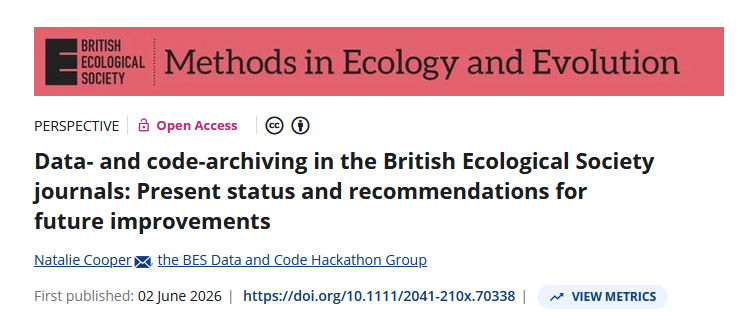

## What is this lecture series?

### Scientific workflows: Tools and Tips :hammer_and_wrench:

::: nonincremental

:date: Every 3rd Thursday :clock4: 4-5 p.m. :round_pushpin: Webex

-   One topic from the world of scientific workflows
-   Material provided [online](https://selinazitrone.github.io/tools_and_tips/)
-   If you don't want to miss a lecture
    -   [Subscribe to the mailing list](https://lists.fu-berlin.de/listinfo/toolsAndTips)

:::

## Code sharing in Ecology

{fig-alt="Cover of Cooper et al. 2026, Methods in Ecology and Evolution, with the title 'Data- and code-archiving in the British Ecological Society journals: Present status and recommendations for future improvements'."}

1861 ecology papers from 7 journals (2017-2024)

## Sharing code is still the exception

, *Methods in Ecology and Evolution*](images/2026_07_16_code-sharing/cooper-2026-figure.png){fig-alt="Bar chart from Cooper et al. 2026: nearly all papers that used data archived it, but only about a third of papers that used code archived the code."}

## Readmes are often insufficient

Only 61% of archived code had a README and quality was often low.

, *Methods in Ecology and Evolution*](images/2026_07_16_code-sharing/cooper-2026-figure-readme.png){fig-alt="Bar chart from Cooper et al. 2026: the quality of READMEs in archived code, rated on a scale from 1 to 10."}

## Why isn't code sharing the standard?

- Time pressure
- Not sure how to do it properly
- Journals often don't require it
- Code is not part of peer review

## Why code sharing is worth it

- Open science creates trust
- Reproducibility: Results can be verified
- Reusability: Others (including future you) can build on your work
- Visibility: Credit, collaborations
- A portfolio of your coding skills

## Today

Shareable ≠ perfect: checklist for most important practices.

::: {.nonincremental}

1.  **Structure & orientation** - Can someone understand it?
2.  **Running the code** - Can someone rerun it?
3.  **Data** - Can someone understand the data situation?
4.  **Licence & citation** - Can someone legally reuse and cite it?
5.  **Archive & publish** - Can someone find the exact version you used?

:::

+ How AI tool can help

## Today

- Focus on data analysis projects, not research software
- **Language-agnostic**, with short R and Python hints
- More about project structure not about code 

## Our example project

Your paper is submitted: *"Temperature and antibiotic resistance in soil bacteria"*. This is the analysis folder:

:::{.callout-note}
Adapt this to the final version
:::

::: {.fragment}

```
temperature-resistance/
├── clean_data.R
├── fit_models.R
├── make_figures.R
├── growth_assay.csv
└── figures/
```

:::

# Structure & orientation {.inverse}
> Can someone understand it?

## Use a conventional folder structure

::: {.columns}

::: {.column width="50%"}

- Separate your files into folders
- Most important: separate data, code, and output
- You can follow templates or use your own structure as long as it is clear and consistent

:::{callout-note}
Add some links to templates
:::

:::

::: {.column width="50%"}

::: {.fragment}

```
temperature-resistance/
├── data/
│   └── growth_assay.csv
├── analysis/
│   ├── 01_clean-data.R
│   ├── 02_fit-models.R
│   └── 03_make-figures.R
└── output/
    ├── figures/
    └── tables/
```

:::

:::

:::

## Use informative file names

- Human readable: reveal the content
- Machine readable: no spaces, no special characters
- Work with default ordering: left-padded numbers or YYYY-MM-DD dates first

. . .

::: {.columns}

::: {.column width="50%"}

#### Bad names

::: {.nonincremental}

:page_facing_up: `temp.R`
:page_facing_up: `analysis final.R`
:page_facing_up: `data.csv`

:::

:::

::: {.column width="50%"}

::: {.fragment}

#### Good names

::: {.nonincremental}

:page_facing_up: `01_clean-data.R`
:page_facing_up: `02_fit-models.R`
:page_facing_up: `2024-03-11_growth-assay.csv`

:::

:::

:::

:::

::: aside
More on naming: [Jenny Bryan's talk](https://speakerdeck.com/jennybc/how-to-name-files) on how to name files
:::

## Add a thorough README


::: {.columns}

::: {.column}

- README's are the entry point to your project
- A README should be a simple text format (plain text or Markdown)


:::

::: {.column}

```
temperature-resistance/
├── README.md          <- new
├── data/
│   └── growth_assay.csv
├── R/
│   ├── 01_clean-data.R
│   ├── 02_fit-models.R
│   └── 03_make-figures.R
└── output/
    ├── figures/
    └── tables/
```

:::

:::

## What a README should do

At minimum, a README should answer:

::: {.nonincremental}

- **What** the project is, and which **paper** it belongs to
- **How to run it** (how to install, which order to run the scripts)
- **What the scripts are** (what they do, what is the input and output)
- **What the data are** (format, columns, etc.)
- **How to cite** it
- **Who to ask** when it breaks

:::

:::{callout-note}
work on this
:::

## A README skeleton you can copy

```markdown
# Temperature and antibiotic resistance in soil bacteria

Code and data for: Baldauf et al. (2026), *Journal*, doi:10.xxxx/xxxxx

## What is in here
- `R/`      analysis scripts, run in numerical order
- `data/`   the growth-assay measurements
- `output/` figures and tables produced by the scripts

## How to run
1. Restore the environment: `renv::restore()`
2. Run `R/00_main.R`, which runs everything in order.

## Data, citation and licence
See `data/README.md`. Code: MIT. Data: CC-BY-4.0. Cite via `CITATION.cff`.

## Contact
selina.baldauf@fu-berlin.de
```

## Some examples of good README files

::: {.callout-note}
## IMAGE PLACEHOLDER: `readme-good-example.png`

Screenshot of a **real, published** repository's README on GitHub, with a few annotations pointing to: the one-line purpose and paper link, the "how to run" section, the data note, and the citation/licence block.

Sources for a real example: the [CODECHECK register](https://codecheck.org.uk/register), the [ReproHack Hub](https://www.reprohack.org/), or a compendium from your own field.

:::

## Write good code

Well written and organized code is essential:

- Comment your code well
- Name your variables properly
- Split large scripts
- Use automatic code formatting for consistent style

Not the focus of today. Have a look at the lecture [R code that lasts](https://selinazitrone.github.io/tools_and_tips/sessions/10_r-code-that-lasts.html) for tips on good practice R.

# Running it {.inverse}
> Can someone rerun it?

## Make the run order obvious

**Level 1**: Number your scripts `01_`, `02_`, etc. and add this to the "How to run" section in the README.

## Make the run order obvious

**Level 2**: Create a main script that runs everything in order, so this is the only file someone needs to open.


::: {.columns}

::: {.column}

::: {.panel-tabset}

### main.R

```r
# main.R: reproduces all results and figures

# Step 1: Clean the data
source("analysis/01_clean-data.R")
# Step 2: Fit the models and produce table 1
source("analysis/02_fit-models.R")
# Step 3: Make all manuscript figures
source("analysis/03_make-figures.R")
```

### main.py

:::{.callout-note}
Check if this is good practice and correct
:::

```python
# main.py: reproduces all results and figures
import clean_data
import fit_models
import make_figures
```

:::

:::

::: {.column}

```
temperature-resistance/
├── README.md          
├── main.R          
├── data/
│   └── growth_assay.csv
├── analysis/
│   ├── 01_clean-data.R
│   ├── 02_fit-models.R
│   └── 03_make-figures.R
└── output/
    ├── figures/
    └── tables/
```


:::

:::

## Make the run order obvious

**Level 3**: Use workflow tools like [targets](https://books.ropensci.org/targets/) (R) or [snakemake](https://snakemake.readthedocs.io/en/stable/)
(Python and more) to define complex workflows and automatically run the scripts in the right order and only rerun what changed.

](images/2026_07_16_code-sharing/targets-workflow.png){fig-alt="A workflow diagram from the targets package, showing how the scripts depend on each other and which outputs they produce."}

:::{.callout-note}
Check if snakemake is only for python or also other languages. Also check if the text I wrote on the slide is correct
:::

## Record all dependencies and versions

**Level 1**: Paste dependencies into the README. Easy, but less convenient for people who need to install the software.

How to get a list of all dependencies

::: {.panel-tabset}

### R

Run `devtools::session_info()` and paste the output into the README. Double-check the list and also include the R version.

:::{.callout-note}
Should I really leave all this in there? I wanted to demo the output, but session info also gives path to quarto etc. These should be removed right
:::

```{r}
#| echo: true
# Note: Delete irrelevant rows (e.g. Quarto path) before pasting to the readme
devtools::session_info()
```

### Python

Run `pip freeze` and paste the output into the README. Double check the list and also include the Python version.

:::

## Record all dependencies and versions

**Level 2**: Record dependencies in an installable way so users can install them automatically into a project library.

::: {.panel-tabset}

### R

::: {.nonincremental}

-   **What you need:** a `DESCRIPTION` file. Add packages with
    `usethis::use_package("dplyr")`, install them with `pak::local_install_deps()`.
-   **Exact versions:** `renv::snapshot()` writes an `renv.lock`; a collaborator
    runs `renv::restore()`.

renv videos
- https://www.youtube.com/watch?v=Oen9xhEh8PY

:::

### Python

::: {.nonincremental}

-   **What you need:** `requirements.txt`, install with `pip install -r requirements.txt`.
-   **Exact versions:** a pinned `requirements.txt` or an `environment.yml`
    (`conda env create -f environment.yml`).

:::

:::


## Paths that work on other machines

::: {.columns}

::: {.column width="50%"}

#### Bad

```r
setwd("C:/Users/selina/PhD/")
read.csv(
  "C:/Users/selina/PhD/data.csv"
)
```

Works once, on one computer.

:::

::: {.column width="50%"}

::: {.fragment}

#### Good

```r
read.csv(
  "data/growth_assay.csv"
)
```

Relative to the project root: works everywhere.

:::

:::

:::

. . .

::: {.panel-tabset}

### R

Use an RStudio Project, and the `here` package for paths:
`here("data", "growth_assay.csv")`.

### Python

Run from the project root and build paths with `pathlib`. For the same
project-root anchoring as R's `here`, use `pyprojroot`:
`here("data/growth_assay.csv")`.

:::

## Record what your code needs

| | Solution |
|---|---------------------------------------------|
| Minimum | Paste your versions into the README: `sessionInfo()` (R) or `pip freeze` (Python) |
| Better | A dependency file (see tabs below) |
| If you outgrow it | Containers (Docker); e.g. the [Rocker](https://rocker-project.org/) images for R |

. . .

::: {.panel-tabset}

### R

::: {.nonincremental}

-   **What you need:** a `DESCRIPTION` file. Add packages with
    `usethis::use_package("dplyr")`, install them with `pak::local_install_deps()`.
-   **Exact versions:** `renv::snapshot()` writes an `renv.lock`; a collaborator
    runs `renv::restore()`.

:::

### Python

::: {.nonincremental}

-   **What you need:** `requirements.txt`, install with `pip install -r requirements.txt`.
-   **Exact versions:** a pinned `requirements.txt` or an `environment.yml`
    (`conda env create -f environment.yml`).

:::

:::

. . .

Whichever level: include the **language version** (R 4.4.1, Python 3.12).

## Two quick ones before we move on

::: {.panel-tabset}

### Seeds

Anything random (bootstrap, permutation, simulation) needs a fixed seed:

```r
# R
set.seed(42)
```

```python
# Python: use this, not np.random.seed()
rng = np.random.default_rng(42)
```

### Code quality

Refactoring is **not** a sharing gate. You do not need clean code to publish.

If you want cleaner code anyway, that is a separate topic:
[*Write R code that lasts*](https://selinazitrone.github.io/tools_and_tips/).

:::

## Where our repository stands

```
temperature-resistance/
├── README.md          (+ how to run)   <- new
├── DESCRIPTION                         <- new
├── renv.lock                           <- new
├── data/
│   └── growth_assay.csv
├── R/
│   ├── 00_main.R                       <- new
│   ├── 01_clean-data.R  (relative paths now)
│   ├── 02_fit-models.R
│   └── 03_make-figures.R
└── output/
```

::: {.callout-tip}
## Practical check

Copy the repo to a different folder, or a different computer, and run it from scratch. Whatever breaks is what a stranger hits first.
:::

# 3. Data {background-color="#2c3e50"}

### Can someone understand the data situation?

## A code lecture. Why talk about data?

Because the first thing anyone who downloads your code asks is:

. . .

<br>

> "Where do I get the data to run this?"

<br>

. . .

The goal is not to teach data sharing. It is one narrow thing:

**your repository states, in one place, what the data situation is.**

## Three honest paths

Whatever your situation, one of these fits. Each becomes a line in your README.

```{mermaid}
%%| echo: false
flowchart TD
    Q{Can the data be shared?}
    Q -->|Yes, freely| A[Open]
    Q -->|Only under conditions| B[Restricted]
    Q -->|No| C[Cannot be shared]
    A --> A1[Data in the repo, or in a<br>data repository with a DOI]
    B --> B1[A statement: where and how<br>to request access]
    C --> C1[Synthetic example data<br>+ the code that made it]
```

. . .

**"I can't share my data" is not a dead end.** Path 3 is a valid, publishable repository.

## What each path looks like in the README

::: {.nonincremental}

-   **Open**
    > Raw data is in `data/`. It is also archived at https://doi.org/10.xxxx/xxxxx.

-   **Restricted** (the one people struggle to write)
    > The clinical measurements cannot be shared publicly. Qualified researchers can request access from the X Data Access Committee at [link]. `data/README.md` describes the variables so the code is reviewable without the data.

-   **Cannot be shared**
    > Real patient data cannot be published. `data/synthetic/` holds simulated data with the same structure, made by `R/00_make-synthetic-data.R`, so the pipeline runs end to end.

:::

## A codebook: the README for your data

Even a reviewer who cannot get your data can judge the analysis if they know what the columns mean.

::: {.fragment}

| Variable | Meaning | Unit / coding |
|----------|---------|---------------|
| `sample_id` | Unique sample identifier | text |
| `temp` | Incubation temperature | °C |
| `resistant` | Grew on antibiotic plate | 0 = no, 1 = yes |
| `mic` | Minimum inhibitory concentration | mg/L |

:::

. . .

::: {.nonincremental}

-   A small table in `data/README.md` is enough
-   Save data in **open formats**: `.csv`, not `.xlsx`; a PDF is not data
-   Keep **raw data separate and read-only**; processed data is regenerated by the code

:::

## Where our repository stands

```
temperature-resistance/
├── README.md          (+ data statement)   <- new
├── DESCRIPTION
├── renv.lock
├── data-raw/          (read-only)          <- new
│   └── growth_assay.csv
├── data/
│   └── README.md      (codebook)           <- new
├── R/
└── output/
```

::: aside
Sharing data *well* (repositories, metadata, embargoes) is its own lecture. Maybe a future one.
:::

# 4. Licence & citation {background-color="#2c3e50"}

### Can someone legally reuse and cite it?

## Readable, runnable, data is clear. Done?

A colleague finds the repo, it runs, they want to build on it. Two questions they still cannot answer:

::: {.nonincremental}

-   **Am I allowed to use this?**
-   **How do I give you credit?**

:::

. . .

<br>

Both are fixed by two small files in the repo root.

## No licence means "all rights reserved"

::: {.callout-important}
## The most common mistake

A public repo with **no LICENSE file** is *not* free to use. By default nobody may legally reuse your code, even though they can see it.
:::

. . .

The fix is one file. Two things worth knowing:

::: {.nonincremental}

-   Even the permissive **MIT** licence requires people to **keep your name** on it (attribution).
-   No licence can force anyone to *cite* you. That is a scholarly norm, and it is what the citation part below is for.

:::

## Which licence?

The one choice that matters:

| Type | Means | Examples |
|------|-------|----------|
| **Permissive** | anyone may reuse, must keep your notice | **MIT**, BSD, Apache-2.0 |
| **Copyleft** | derivatives must stay open under the same licence | GPL-3 |

. . .

**If unsure, MIT** (unless your group, funder, or institution says otherwise). It is the default across scientific tooling (NumPy, pandas, ...). Browse the rest at [choosealicense.com](https://choosealicense.com).

## Code and data need different licences

A common trap: one `CC-BY` on the whole repo. Creative Commons themselves say CC licences are **not for software**.

::: {.fragment}

| What | Licence |
|------|---------|
| **Code** (scripts, functions) | MIT, Apache-2.0, GPL |
| **Data, text, figures** | CC0, CC-BY |

:::

. . .

So a repo with both usually carries **two** licences. State each in the README (e.g. *Code: MIT. Data: CC-BY-4.0*).

## The whole MIT licence fits on one slide

```text
MIT License

Copyright (c) 2026 Selina Baldauf

Permission is hereby granted, free of charge, to any person obtaining
a copy of this software and associated documentation files (the
"Software"), to deal in the Software without restriction, including
without limitation the rights to use, copy, modify, merge, publish,
distribute, sublicense, and/or sell copies of the Software ...

THE SOFTWARE IS PROVIDED "AS IS", WITHOUT WARRANTY OF ANY KIND ...
```

. . .

That is the whole thing. GitHub adds it for you: **Add file → Create new file → name it `LICENSE` → "Choose a license template".**

## Make your code citable

**Minimum** (always fine): a "How to cite" section in the README.

```markdown
## Citation
Baldauf, S. (2026). Temperature and antibiotic resistance in
soil bacteria [Software]. https://doi.org/10.xxxx/xxxxx
```

. . .

**Upgrade** (5 minutes): a `CITATION.cff` file.

::: {.nonincremental}

-   A small YAML file; fill in the [`cffinit`](https://citation-file-format.github.io/cff-initializer-javascript/) web form, no YAML by hand
-   GitHub then shows a **"Cite this repository"** button with ready-made APA / BibTeX
-   Zenodo reads it when it archives your release (section 5), so the credit is correct automatically
-   Add your **ORCID** so the credit points at *you*, not just your name

:::

## The "Cite this repository" button

::: {.callout-note}
## IMAGE PLACEHOLDER: `github-cite-button.png`

Screenshot of a GitHub repo with the **"Cite this repository"** button open (right sidebar), showing the APA / BibTeX dropdown. Ideally the same real repo used for the README screenshot in section 1.

Optional: `cffinit-form.png`, the cffinit web form partly filled in, to show it is just a form.
:::

## Where our repository stands

```
temperature-resistance/
├── README.md          (+ how to cite)      <- new
├── LICENSE            (MIT, for the code)   <- new
├── CITATION.cff       (+ ORCID)            <- new
├── DESCRIPTION
├── renv.lock
├── data-raw/
├── data/
│   └── README.md      (+ CC-BY note)        <- new
├── R/
└── output/
```

# 5. Archive & publish {background-color="#2c3e50"}

### Can someone find the exact version you used?

## Isn't GitHub enough?

GitHub is where your code **lives**. An archive is where it is **frozen**.

::: {.fragment}

| | GitHub | Archive (Zenodo) |
|---|--------|------------------|
| The code | keeps changing | exact snapshot, forever |
| The link | breaks if you rename or delete | a DOI, permanent by design |
| Journals | usually not accepted as "archived" | this is what they mean |

:::

. . .

[Zenodo](https://zenodo.org) is free, run by CERN, and made exactly for this.

. . .

No Git skills required: uploading files through the GitHub **web browser** is a fine start. (Git is still worth learning: see the Git sessions on the series website.)

## From repo to DOI: four steps, in this order

::: {.callout-important}
## The order matters

Turn the Zenodo switch **on before** you create the release. Zenodo only archives releases made **after** the switch is on; it does not go back for old ones.
:::

. . .

::: {.nonincremental}

1.  Metadata files are in the repo: `README`, `LICENSE`, `CITATION.cff` (done)
2.  On Zenodo: log in with GitHub, then flip the switch for your repo to **ON**
3.  On GitHub: **Releases → Draft a new release**, tag it `v1.0`, publish
4.  Done. Zenodo archives the snapshot and **mints the DOI automatically**

:::

. . .

::: aside
Step-by-step with screenshots: [GitHub Docs, "Referencing and citing content"](https://docs.github.com/en/repositories/archiving-a-github-repository/referencing-and-citing-content). Your repo must be public.
:::

## Steps 2 and 3, as you will see them

::: {.callout-note}
## IMAGE PLACEHOLDER: `zenodo-github-toggle.png` + `github-release-form.png`

Two screenshots:

1. The Zenodo **GitHub page** with the toggle for the example repo switched **ON**. Annotate: "before the release!"
2. GitHub's **"Draft a new release"** form with tag `v1.0` and the green "Publish release" button.

Best captured while actually archiving the companion repo, so the DOI on the next slide is real.
:::

## What you get, and where to put it

::: {.callout-note}
## IMAGE PLACEHOLDER: `zenodo-record-doi.png` + `readme-doi-badge.png`

1. The **Zenodo record**: title and authors (from `CITATION.cff`), the version, and the DOI badge.
2. The repo README with the **DOI badge** at the top.
:::

. . .

Put the DOI in two places:

::: {.nonincremental}

-   the **README** (Zenodo gives you a copy-paste badge)
-   the **manuscript**: "Code and data are archived at https://doi.org/10.5281/zenodo.xxxxx (v1.0)."

:::

. . .

Zenodo gives you an **all-versions DOI** (put it in the README) and a **version DOI** (put it in the paper, so reviewers see exactly what you saw).

## No GitHub? No problem

::: {.nonincremental}

-   You can **upload a zip directly to Zenodo**, or to a domain repository your field uses.
-   Same result: a frozen snapshot, a DOI, citable.

:::

## Our repository, publishable

::: {.columns}

::: {.column width="46%"}

Where we started:

```
temperature-resistance/
├── clean_data.R
├── fit_models.R
├── make_figures.R
├── growth_assay.csv
└── figures/
```

:::

::: {.column width="54%"}

::: {.fragment}

Archived as `v1.0`, with a DOI:

```
temperature-resistance/
├── README.md      (+ DOI badge)  <- new
├── LICENSE
├── CITATION.cff
├── DESCRIPTION
├── renv.lock
├── data-raw/
├── data/
│   └── README.md
├── R/
│   ├── 00_main.R
│   ├── 01_clean-data.R
│   ├── 02_fit-models.R
│   └── 03_make-figures.R
└── output/
```

:::

:::

:::

# Before you hit publish {background-color="#2c3e50"}

## The one test that catches everything

::: {.callout-tip}
## Ask a colleague

Send the repo link to a colleague and ask them to **run it from scratch on their machine**, using only the README.

Whatever they stumble over, a reviewer and a stranger will stumble over too.
:::

. . .

This is not just my advice, it is what *Nature* recommends before you submit. And it costs you a coffee.

::: aside
Editorial: "But is the code (re)usable?", *Nature Computational Science* (2021), doi:10.1038/s43588-021-00109-9
:::

## The whole thing, as a checklist

::: {style="font-size: 65%;"}

::: {.columns}

::: {.column width="50%"}

**1. Structure & orientation**

::: {.nonincremental}
-   [ ] Data, code, output in separate folders
-   [ ] File names say what files do or contain
-   [ ] README: what, how to run, who to ask
:::

**2. Running it**

::: {.nonincremental}
-   [ ] Run order obvious (numbers, README, or main script)
-   [ ] No absolute paths, no `setwd()`
-   [ ] Dependencies + versions recorded (incl. language)
-   [ ] Seeds set for anything random
:::

**3. Data**

::: {.nonincremental}
-   [ ] README states the situation (open / restricted / synthetic)
-   [ ] Codebook: variables, units, coding
-   [ ] Open formats; raw data separate and read-only
-   [ ] Last look: no unintended sensitive data, no junk
:::

:::

::: {.column width="50%"}

**4. Licence & citation**

::: {.nonincremental}
-   [ ] A `LICENSE` file exists
-   [ ] Code and data licensed separately
-   [ ] Citable: README section, ideally `CITATION.cff`
:::

**5. Archive & publish**

::: {.nonincremental}
-   [ ] Release/tag marks the paper's version
-   [ ] Archived with a DOI (switch on **before** the release)
-   [ ] DOI in README and manuscript
:::

**Final test**

::: {.nonincremental}
-   [ ] A colleague ran it from scratch
:::

:::

:::

:::

. . .

You do not have to memorise this. It is on the session page to download and cross off.

# AI can run this checklist for you {background-color="#2c3e50"}

## A helper, not a replacement

AI tools are genuinely good at this kind of work: **reading a whole repository and spotting what is missing**. Two ways it helps.

. . .

First, the ground rules:

::: {.nonincremental}

-   The AI needs **access to your repo**: an IDE assistant (Claude Code, Copilot), ChatGPT via Codex, or a browser upload.
-   Treat every finding as a **suggestion**, not a verdict. You know your project; the AI does not.

:::

## Way 1: draft the README

AI is good at the tedious part: listing your files, what each does, their inputs and outputs.

. . .

You supply a good prompt describing how the README should look. It supplies the first draft, which you then correct.

. . .

::: {.callout-note}
## IMAGE PLACEHOLDER (optional): a README draft being generated

A still of an AI assistant producing a README from a repo. The ready-to-use prompt is on the session page.
:::

## Way 2: audit the repo against the checklist

Point the AI at your repo and ask it to check today's five questions.

. . .

Honest about the limits:

::: {.nonincremental}

-   **Not** great at deterministic checks ("is a licence file present?"): a script does that better.
-   **Good** at judgement calls: "is this README enough?", "what is missing before I publish?"

:::

. . .

Use it **together with the checklist and your own judgement**.

## A tool we are building for exactly this

Point it at your repository. It checks against criteria like today's checklist and writes a **plain-language, prioritised report**:

::: {.nonincremental}

-   what is missing or unclear, sorted by what to fix first
-   every finding points at the **file or line** it came from

:::

. . .

Usable as a copy-paste prompt or an AI agent skill.

Honest caveat: **work in progress**. It will be linked on the session page when it is ready to try.

::: {.callout-note}
## IMAGE PLACEHOLDER: `reviewer-report.png` (or stills from a screen recording)

One real run showing: the input repo, **one finding with its evidence**, **one recommendation**, and **one limitation** (something it could not verify), so it clearly does not bluff.
:::

## You do not need our tool to start

Any AI assistant that can read files can run a lite version **today**:

```text
You are reviewing a research code repository for publication readiness.
Check it against these criteria and nothing else:
1. Orientation: README with purpose, run instructions, contact?
2. Rerunnability: clear run order? dependencies with versions? absolute paths?
3. Data: is the data situation stated? is there a codebook?
4. Legal: licence file? citation information?
5. Archive: a release or archived version with a DOI?
For each problem: name the file (or what is missing), why it matters,
and the smallest fix. Sort by priority. Do not invent files you have not seen.
```

. . .

This is the short version. The **full prompt** is on the session page, ready to copy.

# Take-aways {background-color="#2c3e50"}

## If you remember three things

. . .

**1. Shareable ≠ perfect.** Understandable, rerunnable, documented, safe. That is the bar.

. . .

**2. The README is the front door.** One file, two minutes to read, missing from a third of papers. Start there.

. . .

**3. Progress over perfection.** Pick three checklist items and do them this week. The rest can come with the next paper.

## Your take-homes

All on the session page:

::: {.nonincremental}

1.  The **one-page checklist**
2.  A **README-drafting prompt** and a **portable audit prompt** (any AI tool)
3.  A **resources list**: guides, tools, and everything cited today

:::

::: {.callout-note}
## IMAGE PLACEHOLDER: `qr-session-page.png`

QR code to the session page (generate once the page URL exists).
:::

. . .

By the way, what you did today has a name: **FAIR for research software**. If a reviewer asks, you are already doing it.

## Next lecture

<!-- TODO Selina: confirm date/topic of the next session (3rd Thursday), or a summer-break note -->

:date: Topic and date t.b.a. :clock4: 4-5 p.m. :round_pushpin: Webex

::: {.nonincremental}

-   For topic suggestions or feedback, [send me an email](mailto:selina.baldauf@fu-berlin.de)
-   [Subscribe to the mailing list](https://lists.fu-berlin.de/listinfo/toolsAndTips)

:::

# Thank you for your attention :)

Questions?

## References & resources

::: {style="font-size: 78%;"}

::: {.nonincremental}

-   [Cooper et al. (2026)](https://doi.org/10.1111/2041-210X.70338) Data- and code-archiving in the British Ecological Society journals. *Methods in Ecology and Evolution*
-   ["But is the code (re)usable?"](https://www.nature.com/articles/s43588-021-00109-9) *Nature Computational Science* editorial (2021)
-   [BES Guide to Reproducible Code](https://bes-guide.github.io/reproducible-code/), same society as the opening figure
-   [The Turing Way](https://book.the-turing-way.org/): community handbook for reproducible research
-   [choosealicense.com](https://choosealicense.com) · [cffinit](https://citation-file-format.github.io/cff-initializer-javascript/) · [GitHub → Zenodo guide](https://docs.github.com/en/repositories/archiving-a-github-repository/referencing-and-citing-content)
-   [CODECHECK register](https://codecheck.org.uk/register) and [ReproHack Hub](https://www.reprohack.org/): repositories whose code someone else actually ran
-   [Rocker project](https://rocker-project.org/) (Docker for R) · [pyprojroot](https://pypi.org/project/pyprojroot/) (the Python `here`)
-   [fair-software.eu](https://fair-software.eu): five simple first steps towards FAIR software
-   [reproai.org](https://reproai.org) <!-- TODO Selina: verify rigor.me manually, then add it here or drop it -->
-   [How to name files](https://speakerdeck.com/jennybc/how-to-name-files), talk by Jenny Bryan

:::

:::
